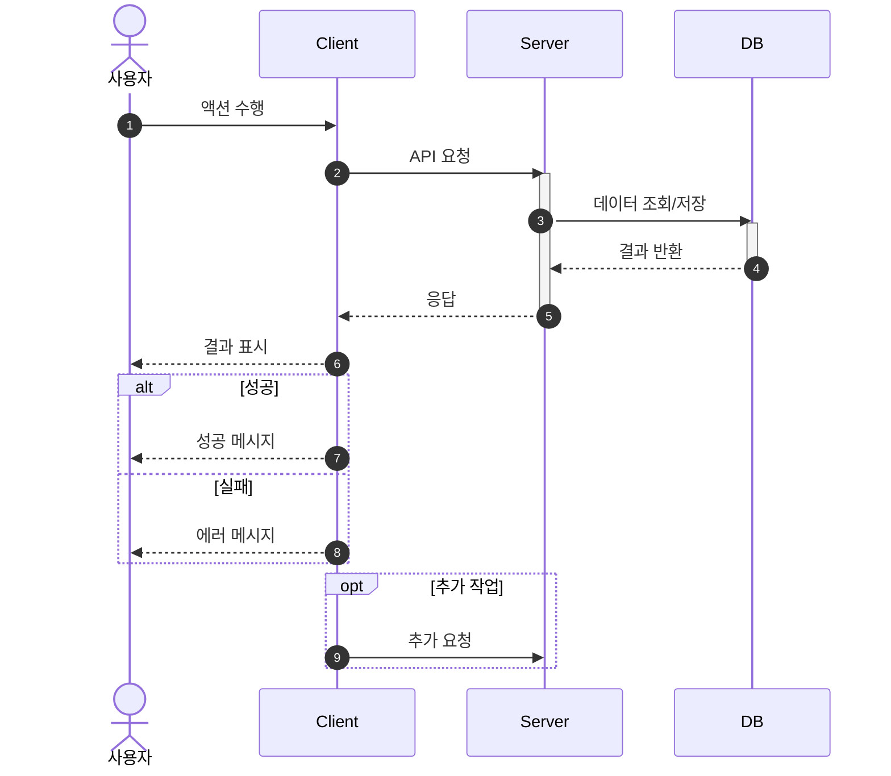

# 시퀀스 다이어그램 템플릿

## description.md 형식

```markdown
# {Flow Name} - 시퀀스 설명

## 개요

{흐름에 대한 간단한 설명}

## 참여자 (Actors)

| Actor | 설명 |
|-------|------|
| Client | 프론트엔드 (웹/앱) |
| Server | 백엔드 API 서버 |
| DB | PostgreSQL 데이터베이스 |

## 흐름 설명

### 1. {단계명}
- {상세 설명}

### 2. {단계명}
- {상세 설명}

## 예외 처리

| 조건 | 처리 |
|------|------|
| {예외 상황} | {처리 방법} |

## 관련 API

| Method | Endpoint | 설명 |
|--------|----------|------|
| POST | /api/v1/... | ... |
```

## diagram.md 형식

````markdown
# {Flow Name} - 시퀀스 다이어그램


````

## Mermaid 문법 참고

### 화살표 종류
- `->>`  : 실선 화살표 (요청)
- `-->>`  : 점선 화살표 (응답)
- `-x`   : 실선 X (실패)
- `--x`  : 점선 X (실패 응답)

### 활성화/비활성화
- `activate {participant}` : 활성화 시작
- `deactivate {participant}` : 활성화 종료

### 조건부/반복
- `alt/else/end` : 조건 분기
- `opt/end` : 선택적 실행
- `loop/end` : 반복
- `par/and/end` : 병렬 실행

### 노트
- `Note over A,B: 텍스트` : 참여자 위 노트
- `Note right of A: 텍스트` : 오른쪽 노트
- `Note left of A: 텍스트` : 왼쪽 노트

### 그룹화
```
rect rgb(200, 220, 240)
    Note over Client,Server: 인증 영역
    Client->>Server: 로그인 요청
end
```
