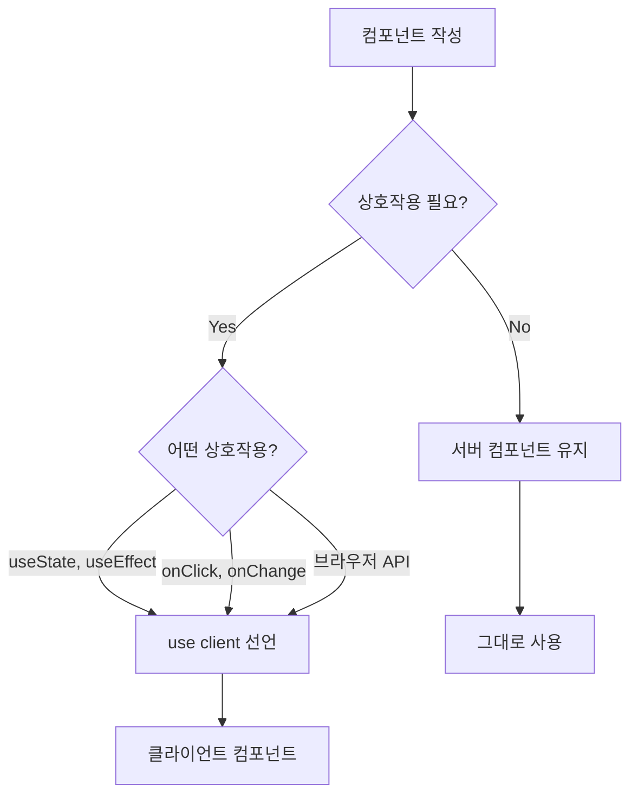

# 02. 컴포넌트 규칙

> 서버/클라이언트 컴포넌트 구분, shadcn/ui 사용 규칙

---

## 1. 서버 컴포넌트 vs 클라이언트 컴포넌트

### 1.1 기본 원칙

Next.js App Router에서는 **서버 컴포넌트가 기본**입니다.



### 1.2 클라이언트 컴포넌트가 필요한 경우

| 상황 | 필요 여부 |
|------|----------|
| `useState`, `useReducer` 사용 | ✅ 필요 |
| `useEffect` 사용 | ✅ 필요 |
| 이벤트 핸들러 (`onClick`, `onChange`) | ✅ 필요 |
| 브라우저 전용 API (`window`, `document`) | ✅ 필요 |
| Custom Hooks (상태/이펙트 포함) | ✅ 필요 |
| 단순 데이터 표시 | ❌ 불필요 |
| Props만 받아서 렌더링 | ❌ 불필요 |

### 1.3 규칙

```typescript
// ❌ 불필요한 "use client" 선언
"use client";  // 상호작용 없는데 왜?

export function StaticCard({ title }: { title: string }) {
  return <div>{title}</div>;
}
```

```typescript
// ✅ 서버 컴포넌트로 유지
export function StaticCard({ title }: { title: string }) {
  return <div>{title}</div>;
}
```

```typescript
// ✅ 클라이언트 컴포넌트가 필요한 경우
"use client";

import { useState } from 'react';

export function Counter() {
  const [count, setCount] = useState(0);
  return (
    <button onClick={() => setCount(c => c + 1)}>
      Count: {count}
    </button>
  );
}
```

---

## 2. 컴포넌트 분류별 규칙

### 2.1 Layout 컴포넌트 (`components/layout/`)

```typescript
// src/components/layout/Header.tsx
export function Header() {
  return (
    <header className="border-b bg-background">
      <nav>{/* 네비게이션 */}</nav>
    </header>
  );
}
```

**규칙:**
- ✅ 전역 공용 레이아웃 컴포넌트
- ✅ 순수 UI만 담당
- ❌ 도메인 로직 금지
- ❌ API 호출 금지

### 2.2 UI 컴포넌트 (`components/ui/`)

shadcn/ui 기반 재사용 컴포넌트

```typescript
// src/components/ui/button.tsx
import { cn } from '@/lib/utils';

interface ButtonProps extends React.ButtonHTMLAttributes<HTMLButtonElement> {
  variant?: 'default' | 'outline' | 'ghost';
}

export function Button({ className, variant = 'default', ...props }: ButtonProps) {
  return (
    <button
      className={cn(
        'rounded-md px-4 py-2',
        variant === 'default' && 'bg-primary text-primary-foreground',
        variant === 'outline' && 'border border-input',
        className
      )}
      {...props}
    />
  );
}
```

**규칙:**
- ✅ UI 로직만 담당
- ✅ 스타일은 Tailwind 기반
- ✅ `cn()` 유틸리티로 클래스 병합
- ❌ 비즈니스 로직 금지
- ❌ API 호출 금지
- ❌ 전역 상태 접근 금지

### 2.3 Feature 컴포넌트 (`features/{domain}/components/`)

도메인 특화 컴포넌트

```typescript
// src/features/cart/components/CartList.tsx
"use client";

import { useCartQuery } from '../hooks/useCartQuery';
import { CartItem } from './CartItem';

export function CartList() {
  const { data: cartItems, isLoading } = useCartQuery();

  if (isLoading) return <div>Loading...</div>;

  return (
    <ul>
      {cartItems?.map(item => (
        <CartItem key={item.id} item={item} />
      ))}
    </ul>
  );
}
```

**규칙:**
- ✅ 도메인 로직 포함 가능
- ✅ 도메인 훅 사용
- ✅ 해당 feature 폴더 내에만 위치
- ❌ 다른 feature 직접 import 지양

---

## 3. Root Layout 규칙

### 3.1 Provider 순서

```typescript
// src/app/layout.tsx
export default function RootLayout({ children }: { children: React.ReactNode }) {
  return (
    <html lang="ko">
      <body className="bg-background text-foreground font-Pretendard">
        <QueryClientProviderWrapper>
          <Header />
          <main>{children}</main>
          <Footer />
          <Toaster />
        </QueryClientProviderWrapper>
      </body>
    </html>
  );
}
```

**필수 순서:**
1. `QueryClientProviderWrapper`
2. `Header`
3. `children`
4. `Footer`
5. `Toaster`

### 3.2 금지 사항

- ❌ 페이지 내부에서 Header/Footer 중복 렌더링
- ❌ 페이지 내부에서 Toaster 재생성
- ❌ Layout에서 비즈니스 로직/데이터 패칭
- ❌ `lang="ko"` 변경
- ❌ html/body 태그를 컴포넌트에서 재사용

---

## 4. 컴포넌트 작성 체크리스트

```
□ "use client"가 정말 필요한가?
□ 적절한 폴더에 위치하는가?
  - 전역 UI → components/ui/
  - 전역 레이아웃 → components/layout/
  - 도메인 특화 → features/{domain}/components/
□ UI 컴포넌트에 비즈니스 로직이 없는가?
□ TailwindCSS 토큰을 사용하는가?
□ Props 타입이 명시되어 있는가?
```
