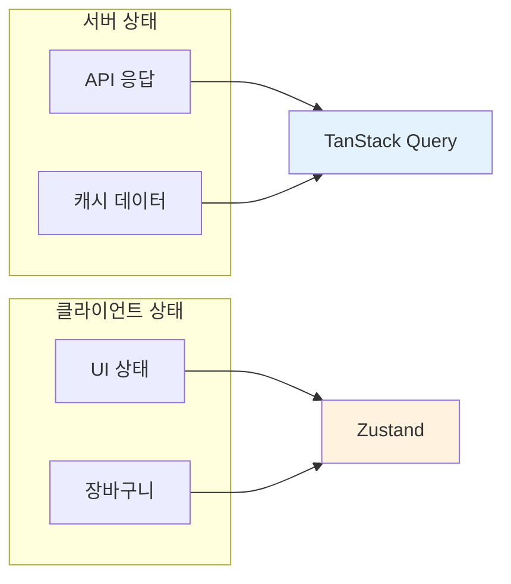

# 03. 상태 관리

> TanStack Query (서버 상태) vs Zustand (클라이언트 상태) 분리 원칙

---

## 1. 상태 분리 원칙

### 1.1 핵심 규칙



| 상태 유형 | 도구 | 예시 |
|----------|------|------|
| **서버 상태** | TanStack Query | API 응답, 캐시 데이터, 사용자 정보 |
| **클라이언트 상태** | Zustand | UI 상태, 모달 열림/닫힘, 장바구니 |

### 1.2 금지 사항

```typescript
// ❌ 서버 응답 데이터를 Zustand에 저장
const useStore = create((set) => ({
  users: [],  // API 응답은 TanStack Query로!
  setUsers: (users) => set({ users }),
}));

// ❌ API 캐시를 수동으로 관리
const [data, setData] = useState(null);
useEffect(() => {
  api.get('/users').then(res => setData(res.data));
}, []);
```

```typescript
// ✅ 서버 상태는 TanStack Query
const { data: users } = useQuery({
  queryKey: ['users'],
  queryFn: () => api.get('/users').then(res => res.data),
});

// ✅ 클라이언트 상태는 Zustand
const useUIStore = create((set) => ({
  isModalOpen: false,
  openModal: () => set({ isModalOpen: true }),
  closeModal: () => set({ isModalOpen: false }),
}));
```

---

## 2. TanStack Query 규칙

### 2.1 QueryClient 설정

```typescript
// src/providers/query-client-provider.tsx
"use client";

import { QueryClient, QueryClientProvider } from '@tanstack/react-query';
import { useState } from 'react';

export function QueryClientProviderWrapper({ children }: { children: React.ReactNode }) {
  const [queryClient] = useState(() => new QueryClient({
    defaultOptions: {
      queries: {
        staleTime: 5000,           // 5초
        gcTime: 180000,            // 3분 (구 cacheTime)
        retry: 1,
        refetchOnWindowFocus: false,
      },
    },
  }));

  return (
    <QueryClientProvider client={queryClient}>
      {children}
    </QueryClientProvider>
  );
}
```

**기본 옵션:**
| 옵션 | 값 | 설명 |
|------|-----|------|
| `staleTime` | 5000 (5초) | 데이터가 stale 상태가 되기까지의 시간 |
| `gcTime` | 180000 (3분) | 미사용 데이터가 캐시에서 제거되기까지의 시간 |
| `retry` | 1 | 실패 시 재시도 횟수 |
| `refetchOnWindowFocus` | false | 윈도우 포커스 시 자동 리패치 비활성화 |

### 2.2 Query Key 규칙

```typescript
// ✅ 배열 형태 사용 (권장)
const { data } = useQuery({
  queryKey: ['cart', userId],
  queryFn: () => fetchCart(userId),
});

// ❌ 문자열 단독 사용 (지양)
const { data } = useQuery({
  queryKey: 'cart',  // 비추천
  queryFn: () => fetchCart(),
});
```

**네이밍 패턴:**
```typescript
// 리스트
['users']
['products', { category: 'electronics' }]

// 단일 항목
['user', userId]
['product', productId]

// 중첩 리소스
['cart', userId, 'items']
```

### 2.3 Query Hook 작성 예시

```typescript
// src/features/cart/hooks/useCartQuery.ts
import { useQuery } from '@tanstack/react-query';
import { api } from '@/lib/axios';
import type { CartItem } from '../types';

export function useCartQuery(userId: string) {
  return useQuery({
    queryKey: ['cart', userId],
    queryFn: async () => {
      const { data } = await api.get<CartItem[]>(`/cart/${userId}`);
      return data;
    },
    enabled: !!userId,  // userId가 있을 때만 실행
  });
}
```

### 2.4 Mutation Hook 작성 예시

```typescript
// src/features/cart/hooks/useAddToCart.ts
import { useMutation, useQueryClient } from '@tanstack/react-query';
import { api } from '@/lib/axios';
import type { AddToCartRequest } from '../types';

export function useAddToCart() {
  const queryClient = useQueryClient();

  return useMutation({
    mutationFn: async (data: AddToCartRequest) => {
      const response = await api.post('/cart/items', data);
      return response.data;
    },
    onSuccess: (_, variables) => {
      // 캐시 무효화
      queryClient.invalidateQueries({ queryKey: ['cart', variables.userId] });
    },
    // ❌ onError에서 toast 호출 금지 (인터셉터에서 처리)
  });
}
```

### 2.5 금지 사항

- ❌ 페이지/컴포넌트 내부에서 새 QueryClient 생성
- ❌ QueryClientProvider 중첩 사용
- ❌ queryFn 내부에서 toast 호출 (인터셉터에서 처리)
- ❌ staleTime: 0 설정 (캐싱 전략 붕괴)

### 2.6 로딩 상태 완전성 체크

병렬 쿼리 사용 시 **모든 쿼리의 로딩 상태**를 확인합니다.

```typescript
// ❌ 잘못된 예: 일부 쿼리의 로딩 상태 누락
const { data: org, isLoading: isOrgLoading } = useOrgQuery(orgId)
const { data: courses = [] } = useCoursesQuery(orgId)  // isLoading 없음!

if (isOrgLoading) return <Loading />  // courses 로딩 중에도 빈 배열 표시

// ✅ 올바른 예: 모든 쿼리의 로딩 상태 통합
const { data: org, isLoading: isOrgLoading } = useOrgQuery(orgId)
const { data: courses = [], isLoading: isCoursesLoading } = useCoursesQuery(orgId)

const isLoading = isOrgLoading || isCoursesLoading

if (isLoading) return <Loading />  // 둘 다 완료될 때까지 로딩
```

**로딩 상태 종류:**
| 상태 | 의미 |
|------|------|
| `isLoading` | 최초 로딩 (캐시 없음) |
| `isFetching` | 백그라운드 리패치 포함 |
| `isPending` | v5: isLoading과 동일 |

**규칙:**
- ✅ 병렬 쿼리 시 모든 isLoading 상태 통합
- ✅ 기본값(`= []`)과 로딩 상태를 함께 사용
- ❌ isLoading 없이 기본값만 사용 금지

---

## 3. Zustand 규칙

### 3.1 Store 작성 예시

```typescript
// src/store/cart.store.ts
import { create } from 'zustand';
import { persist } from 'zustand/middleware';

interface CartUIState {
  isCartOpen: boolean;
  selectedItems: string[];
  openCart: () => void;
  closeCart: () => void;
  toggleItem: (itemId: string) => void;
}

export const useCartUIStore = create<CartUIState>()(
  persist(
    (set) => ({
      isCartOpen: false,
      selectedItems: [],
      openCart: () => set({ isCartOpen: true }),
      closeCart: () => set({ isCartOpen: false }),
      toggleItem: (itemId) => set((state) => ({
        selectedItems: state.selectedItems.includes(itemId)
          ? state.selectedItems.filter(id => id !== itemId)
          : [...state.selectedItems, itemId],
      })),
    }),
    {
      name: 'cart-ui-storage',  // localStorage key
    }
  )
);
```

### 3.2 적합한 사용 사례

| 적합 ✅ | 부적합 ❌ |
|---------|----------|
| 모달 열림/닫힘 상태 | API 응답 데이터 |
| 사이드바 토글 | 사용자 정보 |
| 장바구니 UI 상태 (선택 항목) | 상품 목록 |
| 테마 설정 | 주문 내역 |
| 폼 임시 데이터 | 서버에서 가져온 설정 |

### 3.3 금지 사항

```typescript
// ❌ 서버 데이터를 Zustand에 저장
const useStore = create((set) => ({
  products: [],  // 서버 데이터!
  fetchProducts: async () => {
    const data = await api.get('/products');
    set({ products: data });  // 이러면 안 됨
  },
}));

// ❌ 과도한 비즈니스 로직
const useStore = create((set) => ({
  // 복잡한 계산 로직은 별도 유틸리티로 분리
  calculateTotal: () => { /* 복잡한 로직 */ },
  applyDiscount: () => { /* 복잡한 로직 */ },
}));
```

---

## 4. 상태 관리 체크리스트

```
□ 이 데이터는 서버에서 오는가? → TanStack Query
□ 이 상태는 UI 인터랙션용인가? → Zustand
□ 여러 컴포넌트에서 공유해야 하는가?
  - 서버 데이터 → TanStack Query (자동 캐시 공유)
  - UI 상태 → Zustand
□ localStorage에 저장해야 하는가? → Zustand + persist
□ Query/Zustand를 혼합해서 쓰고 있지 않은가?
□ 병렬 쿼리 시 모든 isLoading 상태를 통합했는가?
□ 기본값(= [])과 isLoading을 함께 사용하고 있는가?
```
