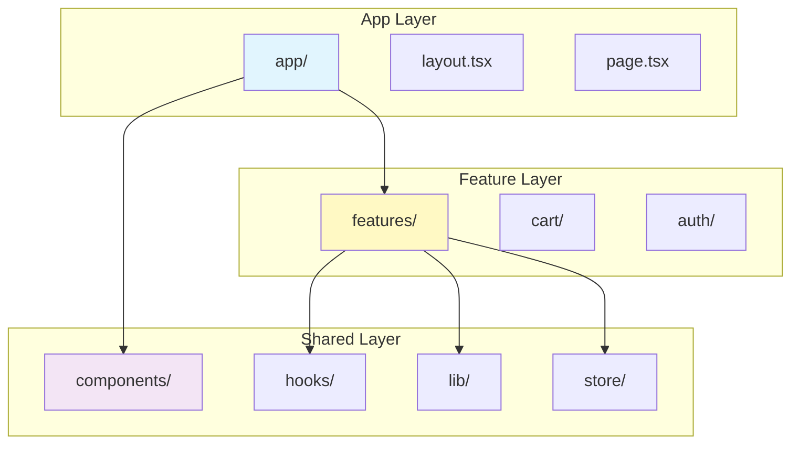

# SW Campus Front - Code Rules

> Frontend (Next.js) 코드 규칙 문서

---

## ⚠️ 핵심 아키텍처 원칙

> **Feature-Sliced Architecture + App Router 원칙을 반드시 준수하십시오.**



**금지 사항:**
- ❌ 컴포넌트 내부에서 직접 API 호출 (`api.get()` 직접 사용)
- ❌ 서버 상태를 Zustand에 저장
- ❌ 페이지에서 Header/Footer 중복 렌더링
- ❌ TailwindCSS 토큰 대신 하드코딩 색상/radius 사용

---

## 📚 문서 목록

| 번호 | 문서 | 설명 |
|:----:|------|------|
| 01 | [프로젝트 구조](./01-project-structure.md) | App Router, Feature-Sliced 디렉토리 구조 |
| 02 | [컴포넌트 규칙](./02-component-rules.md) | 서버/클라이언트 컴포넌트, shadcn/ui 규칙 |
| 03 | [상태 관리](./03-state-management.md) | TanStack Query vs Zustand 분리 원칙 |
| 04 | [API 통신](./04-api-communication.md) | Axios 인스턴스, 에러 처리 규칙 |
| 05 | [스타일링 규칙](./05-styling-rules.md) | TailwindCSS 4, 전역 토큰 시스템 |
| 06 | [ESLint 규칙](./06-eslint-rules.md) | TypeScript, 코드 스타일 규칙 |

---

## 🛠️ 기술 스택

- **Framework**: Next.js 16 (App Router)
- **Language**: TypeScript
- **Styling**: TailwindCSS 4 + shadcn/ui
- **Server State**: TanStack Query
- **Client State**: Zustand
- **HTTP Client**: Axios
- **Package Manager**: pnpm

---

## 🏗️ 프로젝트 구조

```
sw-campus-client/
├── src/
│   ├── app/                    # App Router (페이지, 레이아웃)
│   ├── components/
│   │   ├── layout/             # Header, Footer
│   │   └── ui/                 # shadcn/ui 컴포넌트
│   ├── features/               # 도메인별 기능
│   │   └── {domain}/
│   │       ├── components/
│   │       ├── hooks/
│   │       ├── types/
│   │       └── index.ts
│   ├── hooks/                  # 공용 Custom Hooks
│   ├── lib/                    # 유틸리티 (axios, env, utils)
│   ├── providers/              # 전역 Provider
│   └── store/                  # Zustand 스토어
└── ...
```

---

## 🔑 핵심 원칙

1. **Feature-Sliced Architecture 준수** ⭐
2. **서버 컴포넌트 우선** - 불필요한 `"use client"` 금지
3. **상태 분리** - 서버 상태(Query) / 클라이언트 상태(Zustand)
4. **TailwindCSS 토큰 사용** - 하드코딩 색상/radius 금지
5. **Axios 인스턴스 사용** - 직접 axios import 금지

---

## 🤖 AI 코드 생성 시 주의사항

코드 생성 전 반드시 확인:
- [ ] 해당 코드가 어느 레이어에 위치해야 하는가? (app/features/shared)
- [ ] 서버 컴포넌트로 충분한가? `"use client"` 가 필요한가?
- [ ] API 호출은 feature hooks에서 하고 있는가?
- [ ] 서버 상태를 Zustand에 넣지 않았는가?
- [ ] TailwindCSS 토큰을 사용하고 있는가?
