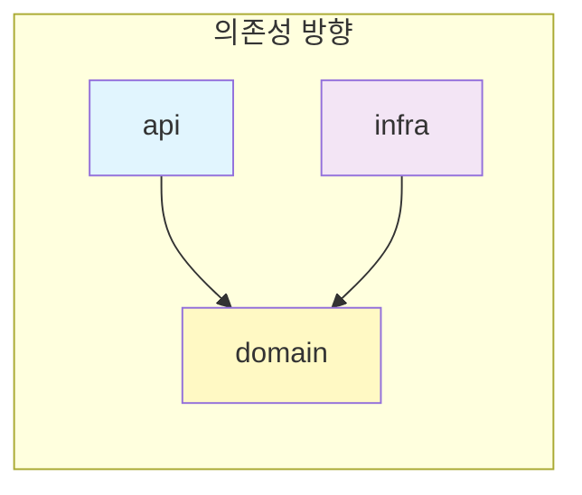

# SW Campus Server - Code Rules

> Backend (Spring Boot) 코드 규칙 문서

---

## ⚠️ 핵심 아키텍처 원칙

> **Multi Module + Layer Architecture 원칙을 반드시 준수하십시오.**



**금지 사항:**
- ❌ `api → infra` 직접 의존
- ❌ `domain → api` 또는 `domain → infra` 의존
- ❌ Controller에 비즈니스 로직 작성
- ❌ Domain 모듈에 JPA Entity 배치

---

## 📚 문서 목록

| 번호 | 문서 | 설명 |
|:----:| ---- | ---- |
| 01 | [모듈 구조](./01-module-structure.md) | api, domain, infra, shared 모듈 역할 및 패키지 구조 |
| 02 | [네이밍 컨벤션](./02-naming-convention.md) | 클래스, 메서드, 변수 네이밍 규칙 |
| 03 | [의존성 규칙](./03-dependency-rules.md) | 모듈 간 의존성 방향 및 build.gradle 설정 |
| 04 | [API 설계](./04-api-design.md) | REST API URL, HTTP Method, Status Code 규칙 |
| 05 | [예외 처리](./05-exception-handling.md) | 예외 계층 구조, 에러 코드, 전역 핸들러 |
| 06 | [설계 원칙](./06-design-principles.md) | YAGNI, 중복 허용, 예광탄, 테스트 전략 |
| 07 | [Swagger 문서](./07-swagger-documentation.md) | API 문서화 규칙 |

---

## 🛠️ 기술 스택

- **Framework**: Spring Boot 3.x
- **Language**: Java 17
- **Database**: PostgreSQL
- **Build Tool**: Gradle Multi-Module
- **Architecture**: Multi Module + Layer Architecture

---

## 🏗️ 모듈 구조

```
sw-campus-server/
├── sw-campus-api/        # Presentation Layer (Controller, DTO)
├── sw-campus-domain/     # Business Logic Layer (Service, Domain, Repository Interface)
├── sw-campus-infra/      # Infrastructure Layer
│   ├── db-postgres/      # JPA Entity, Repository 구현체
│   ├── oauth/            # OAuth Client
│   └── s3/               # File Storage
└── sw-campus-shared/     # Cross-cutting Concerns (Logging)
```

---

## 🔑 핵심 원칙

1. **Multi Module + Layer Architecture 준수** ⭐
2. **레이어 분리**: `api → domain ← infra`
3. **YAGNI**: 현재 필요한 것만 구현
4. **네이밍 컨벤션 준수**
5. **Domain 레이어 테스트 권장**

---

## 🤖 AI 코드 생성 시 주의사항

코드 생성 전 반드시 확인:
- [ ] 해당 코드가 어느 모듈에 위치해야 하는가?
- [ ] 의존성 방향이 올바른가? (`api → domain ← infra`)
- [ ] Controller에 비즈니스 로직이 포함되지 않았는가?
- [ ] JPA Entity가 domain 모듈에 없는가?
