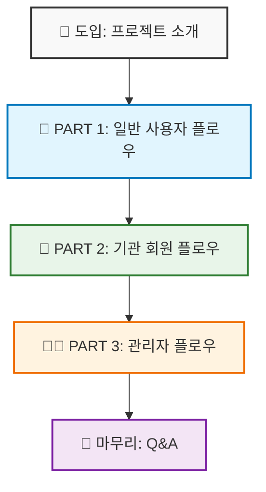

# 🎬 SW Campus 시연 시나리오

> **발표 시간:** 15-20분  
> **대상:** 수업 발표, 클라이언트 데모  
> **흐름:** 일반 사용자 → 기관 회원 → 관리자

---

## 📋 프로젝트 개요

|      항목       | 내용                                                                            |
| :-------------: | :------------------------------------------------------------------------------ |
| **프로젝트명**  | SW Campus                                                                       |
| **한 줄 소개**  | SW 교육 강의 정보를 한눈에 비교하고, 신뢰할 수 있는 수강 후기를 제공하는 플랫폼 |
| **타겟 사용자** | 개인 수강생(PERSONAL), 교육 기관(ORGANIZATION), 관리자(ADMIN)                   |

---

## 🗺️ 시연 흐름 요약

---

## 🎯 PART 1: 일반 사용자 플로우 (약 5분)

|  순서   | 화면          | 행동                                                       | 핵심 포인트        |
| :-----: | :------------ | :--------------------------------------------------------- | :----------------- |
| **1-1** | 🔐 로그인     | Google OAuth 로그인 클릭 → 로그인 완료                     | 소셜 로그인 연동   |
| **1-2** | 🏠 메인       | 배너, 추천 강의, 최신 강의 섹션 확인                       | 메인 UI 애니메이션 |
| **1-3** | 🔍 검색       | 카테고리 선택 → 키워드 검색 → 결과 확인                    | 필터/검색 기능     |
| **1-4** | 📄 강의 상세  | 강의 정보 스크롤 → **AI 리뷰 요약** 보여주기               | **AI 리뷰 요약**   |
| **1-5** | 🛒 장바구니   | 강의 여러 개 담기 → **AI 비교 분석** 버튼 클릭             | **AI 강의 비교**   |
| **1-6** | 📝 리뷰 작성  | **수료증 이미지 업로드** → OCR 스캔 애니메이션 → 리뷰 등록 | **OCR 인증**       |
| **1-7** | 👤 마이페이지 | 내 정보, 작성 리뷰 목록 확인                               | 개인화 기능        |
| **1-8** | 👋 회원 탈퇴  | 탈퇴 버튼 클릭 → OAuth 연결 해제 안내 화면 확인            | 스마트 탈퇴 플로우 |

---

## 🏢 PART 2: 기관 회원 플로우 (약 4분)

|  순서   | 화면          | 행동                                                   | 핵심 포인트    |
| :-----: | :------------ | :----------------------------------------------------- | :------------- |
| **2-1** | � 로그인      | 로그인 → "승인 대기 중" 메시지 확인                    | 승인 대기 상태 |
| **2-2** | 🔄 계정 전환  | 승인된 기관 계정으로 로그인                            | 승인/반려 연계 |
| **2-3** | 🏢 마이페이지 | 기관 정보 관리 화면 확인                               | 기관 전용 UI   |
| **2-4** | ➕ 강의 등록  | **새 강의 등록** - 제목, 설명, 커리큘럼, 이미지 업로드 | 강의 등록 기능 |
| **2-5** | ✏️ 강의 수정  | 등록된 강의 선택 → 정보 **수정** 후 저장               | 강의 수정 기능 |
| **2-6** | 📊 강의 관리  | 등록된 강의 목록, 승인 상태 확인                       | 기관 대시보드  |
| **2-7** | 💬 리뷰 관리  | 해당 기관 강의들의 리뷰 목록 확인                      | 피드백 관리    |

---

## 👨‍💼 PART 3: 관리자 플로우 (약 5분)

|  순서   | 화면         | 행동                                            | 핵심 포인트    |
| :-----: | :----------- | :---------------------------------------------- | :------------- |
| **3-1** | 🔐 로그인    | 관리자 계정으로 로그인 → 관리 페이지 자동 진입  | 권한 분리      |
| **3-2** | 📊 대시보드  | **GA4 통계** 확인 - 방문자 수, 인기 강의 그래프 | **GA4 연동**   |
| **3-3** | 👥 회원 관리 | 일반 회원 목록 조회, 검색                       | 회원 관리      |
| **3-4** | ✅ 기관 승인 | 기관 회원 승인/반려 버튼 클릭                   | 기관 승인 처리 |
| **3-5** | 📚 강의 관리 | 전체 강의 목록 조회, 상태 변경                  | 컨텐츠 관리    |
| **3-6** | ⚖️ 리뷰 관리 | 수료증 인증 리뷰 승인/거절 클릭                 | 품질 관리      |
| **3-7** | 🖼️ 배너 관리 | 배너 생성 → 이미지 업로드 → 저장                | 마케팅 기능    |

---

## 🔥 핵심 기술 스택 & 차별점

| 기능                      | 기술                     | 설명                                  | 시연 타이밍    |
| :------------------------ | :----------------------- | :------------------------------------ | :------------- |
| 🤖 **AI 리뷰 요약**       | GEMINI                   | 강의별 리뷰를 AI가 자동 요약          | PART 1-4       |
| 🔄 **AI 강의 비교**       | GEMINI                   | 장바구니 강의들의 장단점 비교 분석    | PART 1-5       |
| 📄 **수료증 OCR 인증**    | OCR + 텍스트 분석        | 문서 스캔 → 텍스트 추출 → 검증        | PART 1-6       |
| 🏢 **기관 인증 체계**     | 파일 업로드 + 승인       | 재직증명서 업로드 → 관리자 승인       | PART 2-1 → 3-4 |
| 📊 **GA4 대시보드**       | Google Analytics 4       | 실시간 방문자/인기 강의 데이터 시각화 | PART 3-2       |
| 🔐 **소셜 로그인**        | OAuth 2.0                | Google, GitHub 연동 로그인            | PART 1-1       |
| 🏗️ **Clean Architecture** | Spring Boot Multi-module | API → Domain ← Infra 계층 분리        | 전체           |

---

## 📌 사전 준비 체크리스트

### 1. 계정 준비

- [ ] **개인 회원 (Google OAuth)**: 리뷰 작성 시연용
- [ ] **기관 회원 (승인 대기)**: 승인/반려 시연용 (사전 가입 필요)
- [ ] **기관 회원 (승인됨)**: 강의 등록/수정 시연용
- [ ] **관리자 계정**: `admin` 권한 계정

### 2. 데이터 준비

- [ ] **강의 데이터**: 메인/검색 화면이 풍부하게 보이도록 10개 이상
- [ ] **리뷰 데이터**: AI 요약이 생성되어 있는 강의 준비
- [ ] **장바구니 데이터**: AI 비교 시연용 강의 2-3개 미리 담기
- [ ] **수료증 이미지**: OCR 인증 시연용 수료증 파일

### 3. 환경 점검

- [ ] **서버 정상 동작**: 백엔드 API, DB 연결 확인
- [ ] **프론트엔드 빌드**: 로컬 또는 스테이징 환경 확인
- [ ] **브라우저 캐시 클리어**: 로그인 상태 초기화
- [ ] **인터넷 연결**: OAuth, GA4 연동을 위한 네트워크 확인
- [ ] **GA4 통계**: 대시보드 그래프가 정상 출력되는지 확인

---
