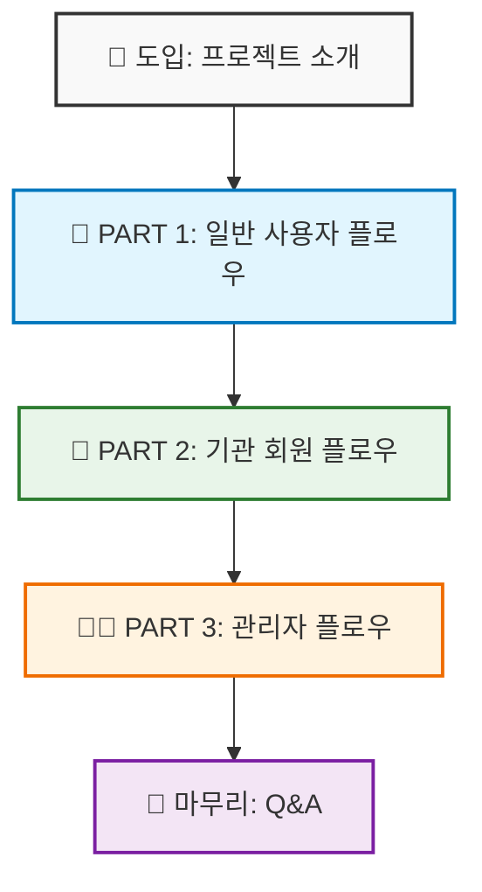

# 🎬 SW Campus 통합 시연 시나리오

> **발표 시간:** 15-20분  
> **대상:** 수업 발표, 클라이언트 데모  
> **청중:** 심사위원 (기술적 관점 + 서비스 기획 관점 모두 고려)

---

## 📋 프로젝트 개요

|      항목       | 내용                                                                            |
| :-------------: | :------------------------------------------------------------------------------ |
| **프로젝트명**  | SW Campus                                                                       |
| **한 줄 소개**  | SW 교육 강의 정보를 한눈에 비교하고, 신뢰할 수 있는 수강 후기를 제공하는 플랫폼 |
| **타겟 사용자** | 개인 수강생(PERSONAL), 교육 기관(ORGANIZATION), 관리자(ADMIN)                   |

---

## �️ 시연 흐름 요약



---

## � 도입부 발표 멘트 (1분)

> 🗣️ **[슬라이드 1: 프로젝트 소개]**
>
> "안녕하세요, **SW Campus** 프로젝트를 소개해 드리겠습니다.
>
> SW Campus는 **SW 교육 강의 정보를 한눈에 비교하고, 신뢰할 수 있는 수강 후기를 제공**하는 플랫폼입니다.
>
> 요즘 SW 교육 시장이 급성장하면서 다양한 강의들이 쏟아지고 있지만, **어떤 강의가 나에게 맞는지, 수강 후기는 진짜인지** 판단하기 어렵습니다.
>
> SW Campus는 이 문제를 해결하기 위해 **AI 기반 리뷰 요약**, **수료증 OCR 인증**, **강의 비교 분석** 기능을 제공합니다.
>
> 오늘은 실제 사용 시나리오에 맞춰 **수강생, 교육기관, 관리자** 순서로 시연을 진행하겠습니다."

---

## �🎯 PART 1: 일반 사용자 플로우 (약 5분)

> 🗣️ **"교육 강의를 찾는 수강생의 입장에서 서비스를 살펴보겠습니다."**

### 📍 상세 시연 단계

|  순서   | 화면          | 시연 내용                            | 발표 멘트                                                                                                    | 핵심 포인트      |
| :-----: | :------------ | :----------------------------------- | :----------------------------------------------------------------------------------------------------------- | :--------------- |
| **1-1** | 🔐 로그인     | **Google OAuth 로그인**              | "소셜 로그인을 통해 간편하게 가입할 수 있습니다. Google 계정으로 로그인해 보겠습니다."                       | OAuth 2.0 연동   |
| **1-2** | 🏠 메인       | 배너 & 강의 섹션 확인                | "메인 페이지에서는 추천 강의와 최신 강의를 한눈에 볼 수 있습니다."                                           | 애니메이션 효과  |
| **1-3** | 🔍 검색       | 카테고리 필터링, 키워드 검색         | "원하는 분야의 강의를 카테고리별로 필터링하거나 키워드로 검색할 수 있습니다."                                | 필터/검색 기능   |
| **1-4** | 📄 상세       | 강의 정보 + **AI 리뷰 요약** ⭐      | "강의 상세 페이지입니다. 여기서 주목할 점은 **AI가 자동으로 리뷰를 요약**해준다는 것입니다."                 | **AI 리뷰 요약** |
| **1-5** | 🛒 장바구니   | 비교하기 + **AI 비교** ⭐            | "관심 있는 강의들을 장바구니에 담고, **AI가 강의들을 비교 분석**해줍니다."                                   | **AI 비교 분석** |
| **1-6** | 📝 리뷰       | **수료증 스캔 인증** → 리뷰 등록 ⭐  | "리뷰를 작성하려면 **수료증 OCR 인증**이 필요합니다. 실제 수강생만 리뷰를 남길 수 있어 신뢰성을 확보합니다." | **OCR 인증**     |
| **1-7** | 👤 마이페이지 | 내 정보, 작성 리뷰 확인              | "마이페이지에서 내 정보와 작성한 리뷰들을 확인할 수 있습니다."                                               | 개인화           |
| **1-8** | 👋 탈퇴       | **회원 탈퇴** + OAuth 연결 해제 안내 | "회원 탈퇴 시 **OAuth 연결 해제 가이드**까지 제공하여 완전한 탈퇴를 지원합니다."                             | 스마트 탈퇴      |

### 💡 PART 1 핵심 강조 포인트

```
✅ AI 리뷰 요약: 여러 리뷰를 한눈에 파악
✅ AI 강의 비교: 여러 강의의 장단점 비교
✅ OCR 수료증 인증: 실제 수강생 검증으로 리뷰 신뢰성 확보
```

---

## 🏢 PART 2: 기관 회원 플로우 (약 4분)

> 🗣️ **"이번에는 교육 기관 담당자의 입장에서 살펴보겠습니다."**

### 📍 상세 시연 단계

|  순서   | 화면          | 시연 내용                                      | 발표 멘트                                                                                                          | 핵심 포인트     |
| :-----: | :------------ | :--------------------------------------------- | :----------------------------------------------------------------------------------------------------------------- | :-------------- |
| **2-1** | 📝 가입       | 기관 정보 입력 + **재직증명서 업로드**         | "기관 회원으로 가입하려면 **재직증명서를 업로드**해야 합니다. 이를 통해 실제 교육 기관임을 검증합니다."            | 기관 인증 로직  |
| **2-2** | ⏳ 대기       | "승인 대기 중" 상태 확인                       | "가입 후 관리자 승인을 기다리는 상태입니다. **관리자가 재직증명서를 확인** 후 승인하면 강의를 등록할 수 있습니다." | 승인 체계 설명  |
| **2-3** | 🏢 마이페이지 | 기관 정보 관리 화면 _(사전 승인된 계정)_       | "승인된 기관 계정으로 로그인하면 **기관 전용 마이페이지**를 확인할 수 있습니다."                                   | 기관 전용 UI    |
| **2-4** | ➕ 강의 등록  | **새 강의 등록** (정보 입력, 이미지 업로드) ⭐ | "이제 **새 강의를 등록**해 보겠습니다. 강의명, 설명, 커리큘럼, 이미지 등을 입력합니다."                            | 강의 등록 기능  |
| **2-5** | ✏️ 강의 수정  | 등록된 강의 정보 **수정** ⭐                   | "등록된 강의 정보를 **수정**할 수도 있습니다."                                                                     | 강의 수정 기능  |
| **2-6** | 📊 관리       | 등록된 강의 현황                               | "기관이 등록한 모든 강의의 **현황을 대시보드 형태**로 확인할 수 있습니다."                                         | 기관별 대시보드 |
| **2-7** | 💬 리뷰       | 해당 기관 강의들의 리뷰 모음                   | "기관의 강의들에 달린 **리뷰들을 모아서 확인**할 수 있어 피드백 관리가 용이합니다."                                | 피드백 관리     |

### 💡 PART 2 핵심 강조 포인트

```
✅ 재직증명서 업로드: 검증된 교육 기관만 강의 등록 가능
✅ 기관 전용 대시보드: 강의 현황 및 리뷰 관리
✅ 역할 기반 접근 제어: ORGANIZATION 권한 분리
```

---

## 👨‍💼 PART 3: 관리자 플로우 (약 5분)

> 🗣️ **"마지막으로 플랫폼 관리자의 관점에서 보겠습니다."**

### 📍 상세 시연 단계

|  순서   | 화면         | 시연 내용                           | 발표 멘트                                                                                                                           | 핵심 포인트  |
| :-----: | :----------- | :---------------------------------- | :---------------------------------------------------------------------------------------------------------------------------------- | :----------- |
| **3-1** | 🔐 로그인    | 관리자 계정 접속                    | "관리자 계정으로 로그인하면 **전용 관리 페이지**에 접근할 수 있습니다."                                                             | 권한 분리    |
| **3-2** | 📊 대시보드  | **GA4 통계** - 방문자, 인기 강의 ⭐ | "대시보드에서는 **Google Analytics 4와 연동된 실시간 통계**를 확인할 수 있습니다. 방문자 수, 인기 강의 등을 시각화해서 보여줍니다." | **GA4 연동** |
| **3-3** | 👥 회원 관리 | 일반 회원 목록 조회                 | "일반 회원들의 목록을 확인하고 관리할 수 있습니다."                                                                                 | 회원 관리    |
| **3-4** | ✅ 기관 승인 | **기관 회원 승인/거절** ⭐          | "아까 PART 2에서 가입한 기관을 **승인 또는 거절**할 수 있습니다. 재직증명서를 확인 후 승인합니다."                                  | (2-1) 연계   |
| **3-5** | 📚 강의 관리 | 전체 강의 목록, 상태 관리           | "플랫폼에 등록된 **모든 강의를 관리**할 수 있습니다."                                                                               | 컨텐츠 관리  |
| **3-6** | ⚖️ 리뷰 관리 | **신규 리뷰/수료증 승인** ⭐        | "수료증 OCR로 제출된 리뷰를 **검토하고 승인**합니다. 부적절한 리뷰는 거절할 수 있습니다."                                           | 품질 관리    |
| **3-7** | 🖼️ 배너 관리 | 배너 생성/수정/삭제                 | "메인 페이지에 노출될 **배너를 관리**할 수 있습니다."                                                                               | 마케팅 기능  |

### 💡 PART 3 핵심 강조 포인트

```
✅ GA4 대시보드: 실시간 방문자/인기 강의 데이터 시각화
✅ 기관 승인 시스템: 재직증명서 검토 후 승인
✅ 리뷰 품질 관리: OCR 인증 리뷰 승인/거절
```

---

## 🔥 핵심 기술 스택 & 차별점

| 기능                      | 기술                     | 설명                                  | 시연 타이밍    |
| :------------------------ | :----------------------- | :------------------------------------ | :------------- |
| **🤖 AI 리뷰 요약**       | OpenAI GPT               | 강의별 리뷰를 AI가 자동 요약하여 제공 | PART 1-4       |
| **� AI 강의 비교**        | OpenAI GPT               | 장바구니 강의들의 장단점 비교 분석    | PART 1-5       |
| **� 수료증 OCR 인증**     | OCR + 텍스트 분석        | 문서 스캔 → 텍스트 추출 → 검증        | PART 1-6       |
| **🏢 기관 인증 체계**     | 파일 업로드 + 승인       | 재직증명서 업로드 → 관리자 승인       | PART 2-1 → 3-4 |
| **📊 GA4 대시보드**       | Google Analytics 4       | 실시간 방문자/인기 강의 데이터 시각화 | PART 3-2       |
| **🔐 소셜 로그인**        | OAuth 2.0                | Google, GitHub 연동 로그인            | PART 1-1       |
| **🏗️ Clean Architecture** | Spring Boot Multi-module | API → Domain ← Infra 계층 분리        | 전체           |

---

## 📌 사전 준비 체크리스트

### 1. 계정 준비

- [ ] **개인 회원 (Google OAuth)**: 리뷰 작성 시연용
- [ ] **기관 회원 (승인됨)**: 강의 등록/수정 시연용
- [ ] **기관 회원 (신규 가입용)**: 새 이메일 + 재직증명서 파일
- [ ] **관리자 계정**: `admin` 권한 계정

### 2. 데이터 준비

- [ ] **강의 데이터**: 메인/검색 화면이 풍부하게 보이도록 10개 이상
- [ ] **리뷰 데이터**: AI 요약이 생성되어 있는 강의 준비
- [ ] **장바구니 데이터**: AI 비교 시연용 강의 2-3개 미리 담기
- [ ] **수료증 이미지**: OCR 인증 시연용 수료증 파일

### 3. 환경 점검

- [ ] **서버 정상 동작**: 백엔드 API, DB 연결 확인
- [ ] **프론트엔드 빌드**: 로컬 또는 스테이징 환경 확인
- [ ] **브라우저 캐시 클리어**: 로그인 상태 초기화
- [ ] **인터넷 연결**: OAuth, GA4 연동을 위한 네트워크 확인
- [ ] **GA4 통계**: 대시보드 그래프가 정상 출력되는지 확인

### 4. 발표 장비

- [ ] **화면 해상도**: 1920x1080 또는 발표 환경에 맞게 조정
- [ ] **브라우저 확대/축소**: 청중이 잘 볼 수 있는 크기로 설정
- [ ] **마이크/스피커**: 오디오 확인

---

## 🎤 발표 스크립트

### [시작 - 1분]

> "안녕하세요, **SW Campus** 프로젝트를 소개해 드리겠습니다.
>
> SW Campus는 **SW 교육 강의 정보를 한눈에 비교하고, 신뢰할 수 있는 수강 후기를 제공**하는 플랫폼입니다.
>
> 오늘은 실제 사용 시나리오에 맞춰 **수강생, 교육기관, 관리자** 순서로 시연을 진행하겠습니다."

### [PART 1 시작 - 5분]

> "먼저 교육 강의를 찾는 **일반 수강생의 입장**에서 서비스를 살펴보겠습니다."

### [PART 2 시작 - 4분]

> "이번에는 **교육 기관 담당자의 입장**에서 강의를 등록하고 관리하는 과정을 살펴보겠습니다."

### [PART 3 시작 - 5분]

> "마지막으로 **플랫폼 관리자의 관점**에서 전체 서비스를 관리하는 모습을 보여드리겠습니다."

### [종료 - 1분]

> "지금까지 SW Campus의 주요 기능들을 살펴보았습니다.
>
> 특히 **AI 기반 리뷰 요약**, **OCR 수료증 인증**, **GA4 데이터 분석** 기능을 통해
> 정보의 신뢰성과 관리의 효율성을 모두 확보했습니다.
>
> 기술적으로는 **Clean Architecture 기반의 Spring Boot Multi-module** 구조와
> **Next.js App Router**를 활용하여 유지보수성과 확장성을 고려했습니다.
>
> 이상으로 발표를 마치겠습니다. 감사합니다."

---

## ⏱️ 시간 배분 요약

| 파트                   | 예상 시간 | 누적 시간 |
| :--------------------- | :-------: | :-------: |
| 📢 도입부              |    1분    |    1분    |
| 👤 PART 1: 일반 사용자 |    5분    |    6분    |
| 🏢 PART 2: 기관 회원   |    4분    |   10분    |
| 👨‍💼 PART 3: 관리자      |    5분    |   15분    |
| 🏁 마무리              |    1분    |   16분    |
| ❓ Q&A                 |   3-4분   |  19-20분  |

---

## 🚨 비상 대응 시나리오

| 상황              | 대응 방법                                              |
| :---------------- | :----------------------------------------------------- |
| **로그인 실패**   | 미리 로그인된 다른 브라우저 탭 준비                    |
| **API 오류**      | 스크린샷/녹화본 백업 준비                              |
| **AI 응답 지연**  | "AI가 분석 중입니다" 멘트 후 미리 생성된 결과 보여주기 |
| **네트워크 문제** | 로컬 환경에서 시연 가능하도록 준비                     |
