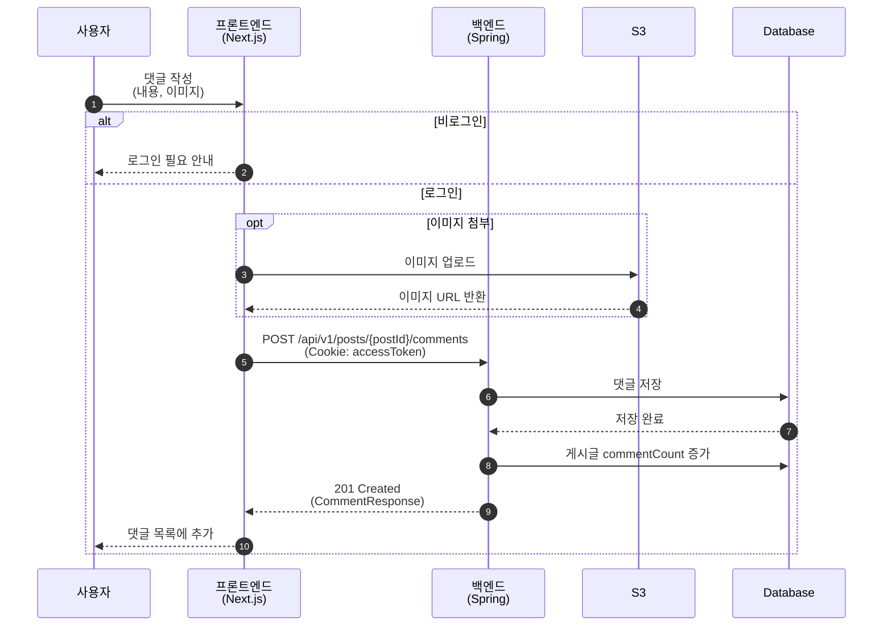
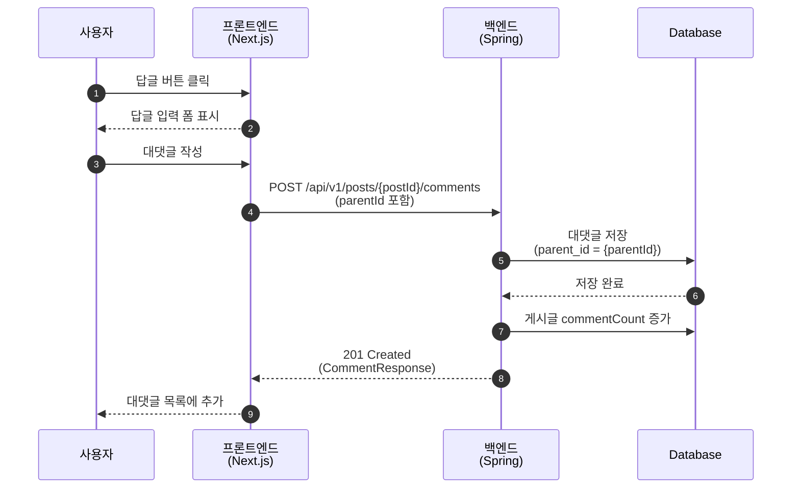
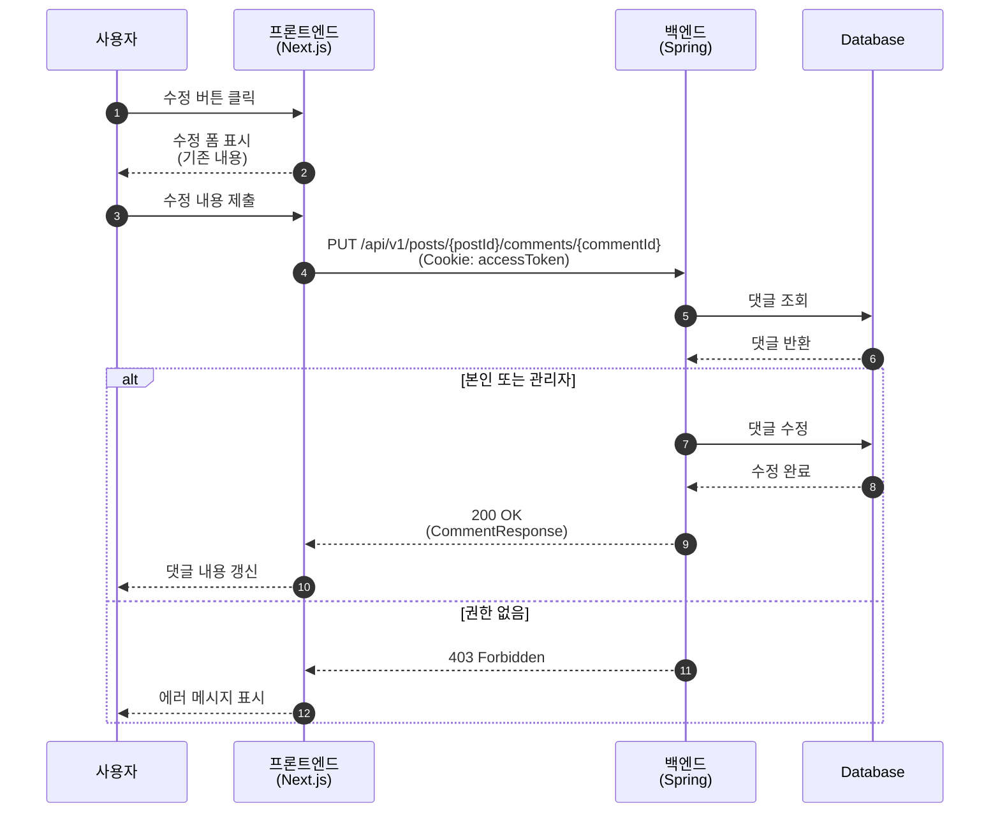
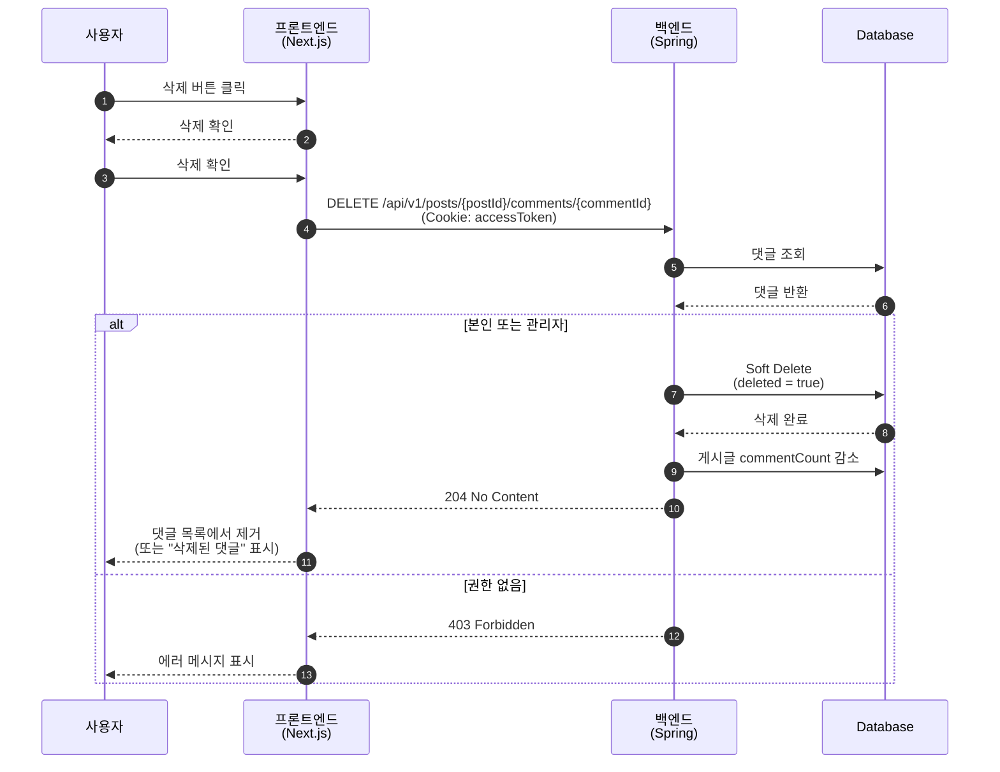
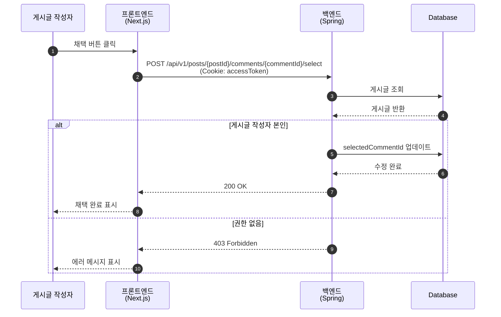

# 댓글 CRUD Sequence Diagrams

## 1. 댓글 작성

```mermaid
sequenceDiagram
    autonumber
    participant User as 사용자
    participant Frontend as 프론트엔드<br/>(Next.js)
    participant Backend as 백엔드<br/>(Spring)
    participant S3 as S3
    participant DB as Database

    User->>Frontend: 댓글 작성<br/>(내용, 이미지)

    alt 비로그인
        Frontend-->>User: 로그인 필요 안내
    else 로그인
        opt 이미지 첨부
            Frontend->>S3: 이미지 업로드
            S3-->>Frontend: 이미지 URL 반환
        end

        Frontend->>Backend: POST /api/v1/posts/{postId}/comments<br/>(Cookie: accessToken)
        Backend->>DB: 댓글 저장
        DB-->>Backend: 저장 완료
        Backend->>DB: 게시글 commentCount 증가
        Backend-->>Frontend: 201 Created<br/>(CommentResponse)
        Frontend-->>User: 댓글 목록에 추가
    end
```

---

## 2. 대댓글 작성

```mermaid
sequenceDiagram
    autonumber
    participant User as 사용자
    participant Frontend as 프론트엔드<br/>(Next.js)
    participant Backend as 백엔드<br/>(Spring)
    participant DB as Database

    User->>Frontend: 답글 버튼 클릭
    Frontend-->>User: 답글 입력 폼 표시
    User->>Frontend: 대댓글 작성
    Frontend->>Backend: POST /api/v1/posts/{postId}/comments<br/>(parentId 포함)
    Backend->>DB: 대댓글 저장<br/>(parent_id = {parentId})
    DB-->>Backend: 저장 완료
    Backend->>DB: 게시글 commentCount 증가
    Backend-->>Frontend: 201 Created<br/>(CommentResponse)
    Frontend-->>User: 대댓글 목록에 추가
```

---

## 3. 댓글 수정

```mermaid
sequenceDiagram
    autonumber
    participant User as 사용자
    participant Frontend as 프론트엔드<br/>(Next.js)
    participant Backend as 백엔드<br/>(Spring)
    participant DB as Database

    User->>Frontend: 수정 버튼 클릭
    Frontend-->>User: 수정 폼 표시<br/>(기존 내용)
    User->>Frontend: 수정 내용 제출
    Frontend->>Backend: PUT /api/v1/posts/{postId}/comments/{commentId}<br/>(Cookie: accessToken)
    Backend->>DB: 댓글 조회
    DB-->>Backend: 댓글 반환

    alt 본인 또는 관리자
        Backend->>DB: 댓글 수정
        DB-->>Backend: 수정 완료
        Backend-->>Frontend: 200 OK<br/>(CommentResponse)
        Frontend-->>User: 댓글 내용 갱신
    else 권한 없음
        Backend-->>Frontend: 403 Forbidden
        Frontend-->>User: 에러 메시지 표시
    end
```

---

## 4. 댓글 삭제

```mermaid
sequenceDiagram
    autonumber
    participant User as 사용자
    participant Frontend as 프론트엔드<br/>(Next.js)
    participant Backend as 백엔드<br/>(Spring)
    participant DB as Database

    User->>Frontend: 삭제 버튼 클릭
    Frontend-->>User: 삭제 확인
    User->>Frontend: 삭제 확인
    Frontend->>Backend: DELETE /api/v1/posts/{postId}/comments/{commentId}<br/>(Cookie: accessToken)
    Backend->>DB: 댓글 조회
    DB-->>Backend: 댓글 반환

    alt 본인 또는 관리자
        Backend->>DB: Soft Delete<br/>(deleted = true)
        DB-->>Backend: 삭제 완료
        Backend->>DB: 게시글 commentCount 감소
        Backend-->>Frontend: 204 No Content
        Frontend-->>User: 댓글 목록에서 제거<br/>(또는 "삭제된 댓글" 표시)
    else 권한 없음
        Backend-->>Frontend: 403 Forbidden
        Frontend-->>User: 에러 메시지 표시
    end
```

---

## 5. 댓글 채택 (Q&A)

```mermaid
sequenceDiagram
    autonumber
    participant Author as 게시글 작성자
    participant Frontend as 프론트엔드<br/>(Next.js)
    participant Backend as 백엔드<br/>(Spring)
    participant DB as Database

    Author->>Frontend: 채택 버튼 클릭
    Frontend->>Backend: POST /api/v1/posts/{postId}/comments/{commentId}/select<br/>(Cookie: accessToken)
    Backend->>DB: 게시글 조회
    DB-->>Backend: 게시글 반환

    alt 게시글 작성자 본인
        Backend->>DB: selectedCommentId 업데이트
        DB-->>Backend: 수정 완료
        Backend-->>Frontend: 200 OK
        Frontend-->>Author: 채택 완료 표시
    else 권한 없음
        Backend-->>Frontend: 403 Forbidden
        Frontend-->>Author: 에러 메시지 표시
    end
```
