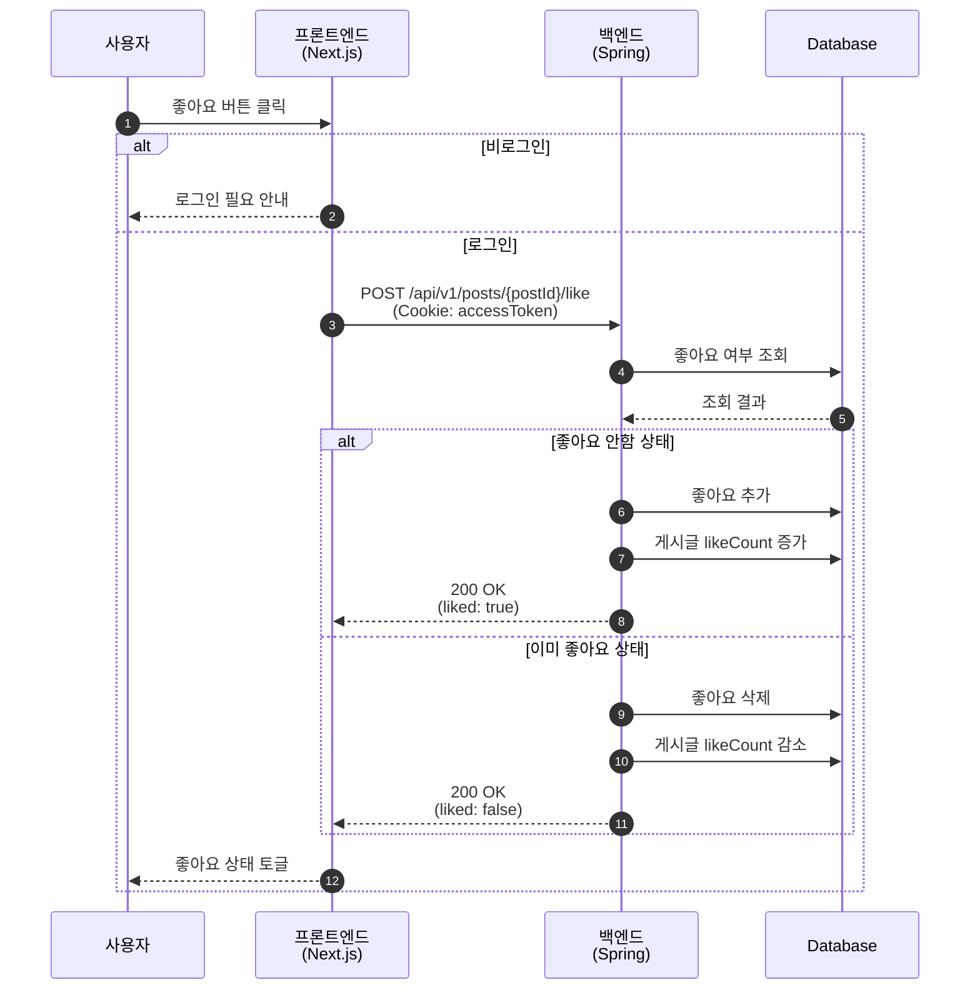
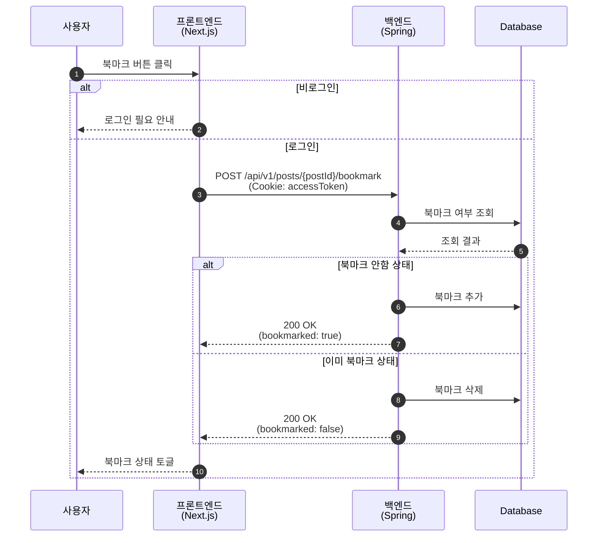
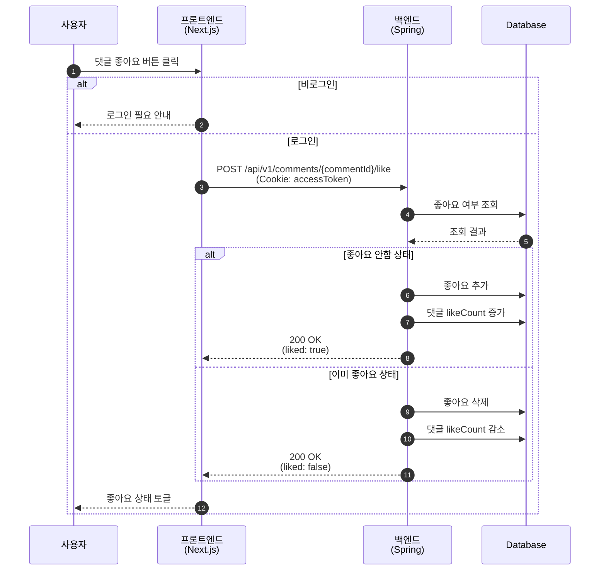
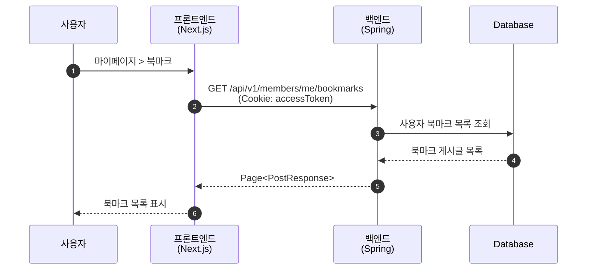

# 좋아요/북마크 Sequence Diagrams

## 1. 게시글 좋아요

```mermaid
sequenceDiagram
    autonumber
    participant User as 사용자
    participant Frontend as 프론트엔드<br/>(Next.js)
    participant Backend as 백엔드<br/>(Spring)
    participant DB as Database

    User->>Frontend: 좋아요 버튼 클릭

    alt 비로그인
        Frontend-->>User: 로그인 필요 안내
    else 로그인
        Frontend->>Backend: POST /api/v1/posts/{postId}/like<br/>(Cookie: accessToken)
        Backend->>DB: 좋아요 여부 조회
        DB-->>Backend: 조회 결과

        alt 좋아요 안함 상태
            Backend->>DB: 좋아요 추가
            Backend->>DB: 게시글 likeCount 증가
            Backend-->>Frontend: 200 OK<br/>(liked: true)
        else 이미 좋아요 상태
            Backend->>DB: 좋아요 삭제
            Backend->>DB: 게시글 likeCount 감소
            Backend-->>Frontend: 200 OK<br/>(liked: false)
        end

        Frontend-->>User: 좋아요 상태 토글
    end
```

---

## 2. 게시글 북마크

```mermaid
sequenceDiagram
    autonumber
    participant User as 사용자
    participant Frontend as 프론트엔드<br/>(Next.js)
    participant Backend as 백엔드<br/>(Spring)
    participant DB as Database

    User->>Frontend: 북마크 버튼 클릭

    alt 비로그인
        Frontend-->>User: 로그인 필요 안내
    else 로그인
        Frontend->>Backend: POST /api/v1/posts/{postId}/bookmark<br/>(Cookie: accessToken)
        Backend->>DB: 북마크 여부 조회
        DB-->>Backend: 조회 결과

        alt 북마크 안함 상태
            Backend->>DB: 북마크 추가
            Backend-->>Frontend: 200 OK<br/>(bookmarked: true)
        else 이미 북마크 상태
            Backend->>DB: 북마크 삭제
            Backend-->>Frontend: 200 OK<br/>(bookmarked: false)
        end

        Frontend-->>User: 북마크 상태 토글
    end
```

---

## 3. 댓글 좋아요

```mermaid
sequenceDiagram
    autonumber
    participant User as 사용자
    participant Frontend as 프론트엔드<br/>(Next.js)
    participant Backend as 백엔드<br/>(Spring)
    participant DB as Database

    User->>Frontend: 댓글 좋아요 버튼 클릭

    alt 비로그인
        Frontend-->>User: 로그인 필요 안내
    else 로그인
        Frontend->>Backend: POST /api/v1/comments/{commentId}/like<br/>(Cookie: accessToken)
        Backend->>DB: 좋아요 여부 조회
        DB-->>Backend: 조회 결과

        alt 좋아요 안함 상태
            Backend->>DB: 좋아요 추가
            Backend->>DB: 댓글 likeCount 증가
            Backend-->>Frontend: 200 OK<br/>(liked: true)
        else 이미 좋아요 상태
            Backend->>DB: 좋아요 삭제
            Backend->>DB: 댓글 likeCount 감소
            Backend-->>Frontend: 200 OK<br/>(liked: false)
        end

        Frontend-->>User: 좋아요 상태 토글
    end
```

---

## 4. 내 북마크 목록 조회

```mermaid
sequenceDiagram
    autonumber
    participant User as 사용자
    participant Frontend as 프론트엔드<br/>(Next.js)
    participant Backend as 백엔드<br/>(Spring)
    participant DB as Database

    User->>Frontend: 마이페이지 > 북마크
    Frontend->>Backend: GET /api/v1/members/me/bookmarks<br/>(Cookie: accessToken)
    Backend->>DB: 사용자 북마크 목록 조회
    DB-->>Backend: 북마크 게시글 목록
    Backend-->>Frontend: Page<PostResponse>
    Frontend-->>User: 북마크 목록 표시
```
