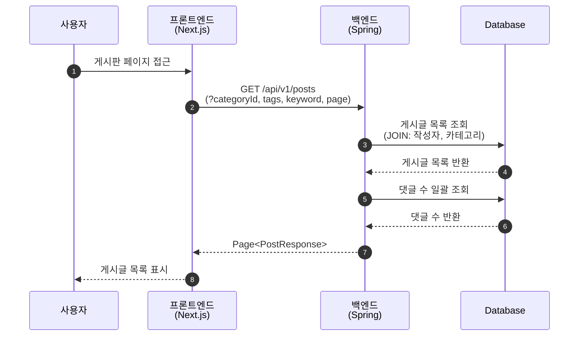
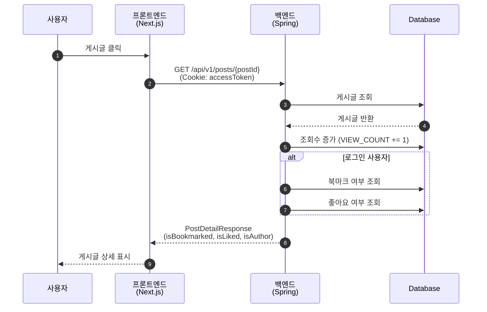
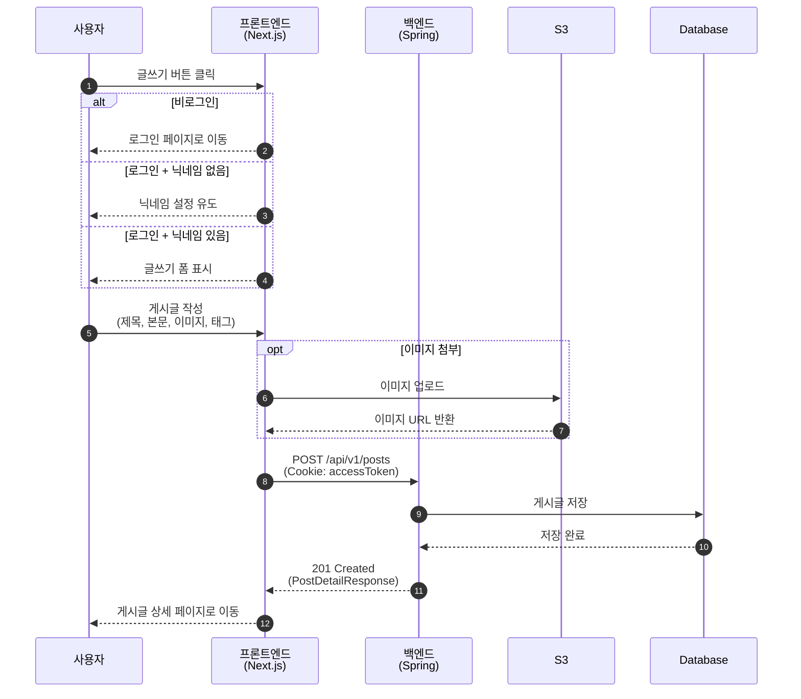
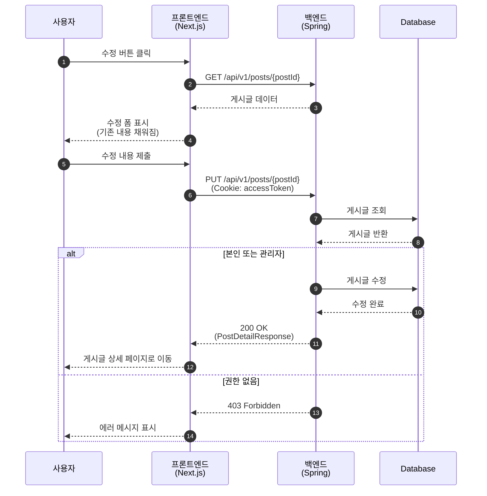
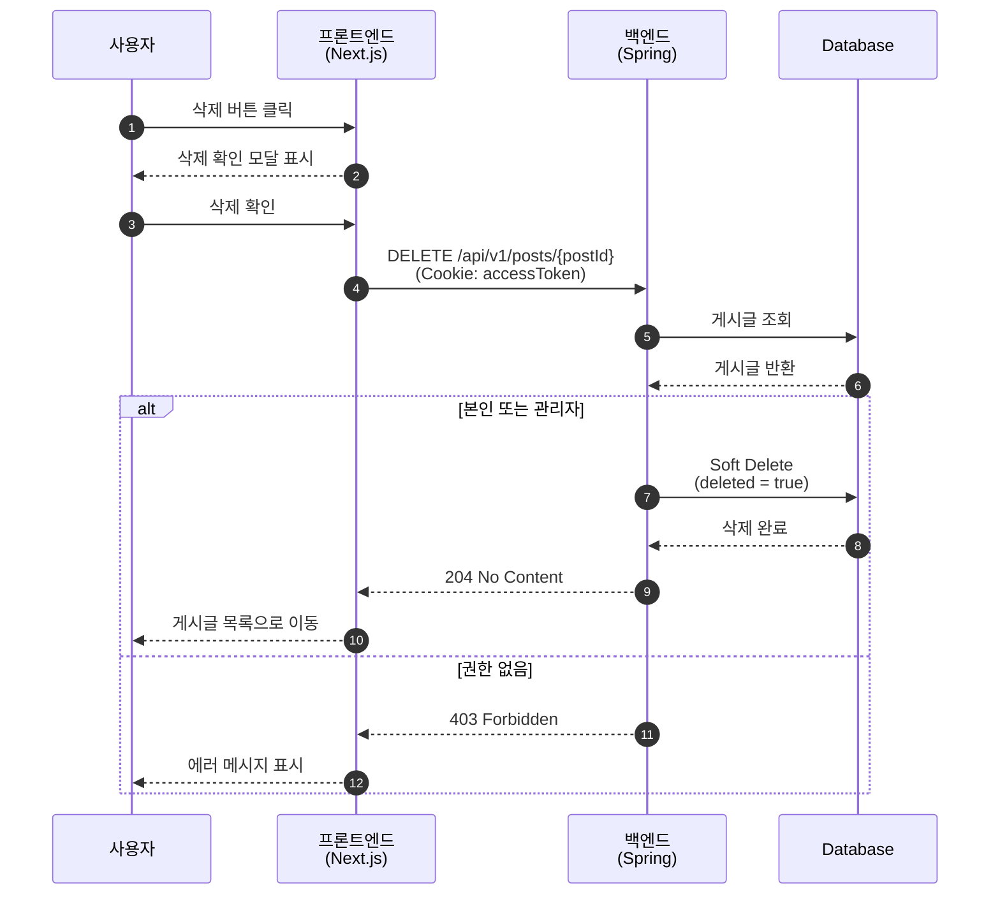
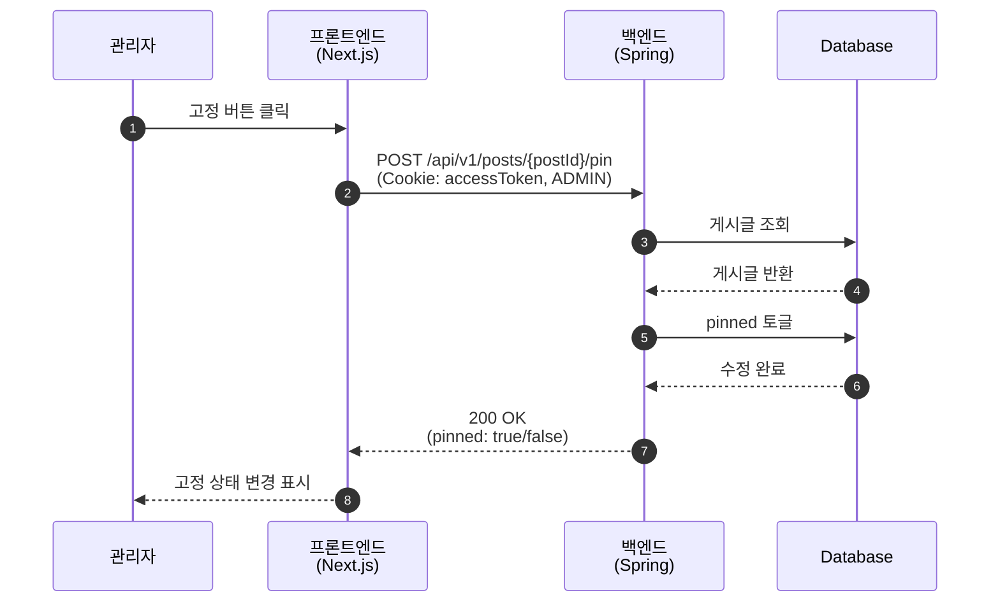

# 게시글 CRUD Sequence Diagrams

## 1. 게시글 목록 조회

```mermaid
sequenceDiagram
    autonumber
    participant User as 사용자
    participant Frontend as 프론트엔드<br/>(Next.js)
    participant Backend as 백엔드<br/>(Spring)
    participant DB as Database

    User->>Frontend: 게시판 페이지 접근
    Frontend->>Backend: GET /api/v1/posts<br/>(?categoryId, tags, keyword, page)
    Backend->>DB: 게시글 목록 조회<br/>(JOIN: 작성자, 카테고리)
    DB-->>Backend: 게시글 목록 반환
    Backend->>DB: 댓글 수 일괄 조회
    DB-->>Backend: 댓글 수 반환
    Backend-->>Frontend: Page<PostResponse>
    Frontend-->>User: 게시글 목록 표시
```

---

## 2. 게시글 상세 조회

```mermaid
sequenceDiagram
    autonumber
    participant User as 사용자
    participant Frontend as 프론트엔드<br/>(Next.js)
    participant Backend as 백엔드<br/>(Spring)
    participant DB as Database

    User->>Frontend: 게시글 클릭
    Frontend->>Backend: GET /api/v1/posts/{postId}<br/>(Cookie: accessToken)
    Backend->>DB: 게시글 조회
    DB-->>Backend: 게시글 반환
    Backend->>DB: 조회수 증가 (VIEW_COUNT += 1)

    alt 로그인 사용자
        Backend->>DB: 북마크 여부 조회
        Backend->>DB: 좋아요 여부 조회
    end

    Backend-->>Frontend: PostDetailResponse<br/>(isBookmarked, isLiked, isAuthor)
    Frontend-->>User: 게시글 상세 표시
```

---

## 3. 게시글 작성

```mermaid
sequenceDiagram
    autonumber
    participant User as 사용자
    participant Frontend as 프론트엔드<br/>(Next.js)
    participant Backend as 백엔드<br/>(Spring)
    participant S3 as S3
    participant DB as Database

    User->>Frontend: 글쓰기 버튼 클릭

    alt 비로그인
        Frontend-->>User: 로그인 페이지로 이동
    else 로그인 + 닉네임 없음
        Frontend-->>User: 닉네임 설정 유도
    else 로그인 + 닉네임 있음
        Frontend-->>User: 글쓰기 폼 표시
    end

    User->>Frontend: 게시글 작성<br/>(제목, 본문, 이미지, 태그)

    opt 이미지 첨부
        Frontend->>S3: 이미지 업로드
        S3-->>Frontend: 이미지 URL 반환
    end

    Frontend->>Backend: POST /api/v1/posts<br/>(Cookie: accessToken)
    Backend->>DB: 게시글 저장
    DB-->>Backend: 저장 완료
    Backend-->>Frontend: 201 Created<br/>(PostDetailResponse)
    Frontend-->>User: 게시글 상세 페이지로 이동
```

---

## 4. 게시글 수정

```mermaid
sequenceDiagram
    autonumber
    participant User as 사용자
    participant Frontend as 프론트엔드<br/>(Next.js)
    participant Backend as 백엔드<br/>(Spring)
    participant DB as Database

    User->>Frontend: 수정 버튼 클릭
    Frontend->>Backend: GET /api/v1/posts/{postId}
    Backend-->>Frontend: 게시글 데이터
    Frontend-->>User: 수정 폼 표시<br/>(기존 내용 채워짐)

    User->>Frontend: 수정 내용 제출
    Frontend->>Backend: PUT /api/v1/posts/{postId}<br/>(Cookie: accessToken)
    Backend->>DB: 게시글 조회
    DB-->>Backend: 게시글 반환

    alt 본인 또는 관리자
        Backend->>DB: 게시글 수정
        DB-->>Backend: 수정 완료
        Backend-->>Frontend: 200 OK<br/>(PostDetailResponse)
        Frontend-->>User: 게시글 상세 페이지로 이동
    else 권한 없음
        Backend-->>Frontend: 403 Forbidden
        Frontend-->>User: 에러 메시지 표시
    end
```

---

## 5. 게시글 삭제

```mermaid
sequenceDiagram
    autonumber
    participant User as 사용자
    participant Frontend as 프론트엔드<br/>(Next.js)
    participant Backend as 백엔드<br/>(Spring)
    participant DB as Database

    User->>Frontend: 삭제 버튼 클릭
    Frontend-->>User: 삭제 확인 모달 표시
    User->>Frontend: 삭제 확인
    Frontend->>Backend: DELETE /api/v1/posts/{postId}<br/>(Cookie: accessToken)
    Backend->>DB: 게시글 조회
    DB-->>Backend: 게시글 반환

    alt 본인 또는 관리자
        Backend->>DB: Soft Delete<br/>(deleted = true)
        DB-->>Backend: 삭제 완료
        Backend-->>Frontend: 204 No Content
        Frontend-->>User: 게시글 목록으로 이동
    else 권한 없음
        Backend-->>Frontend: 403 Forbidden
        Frontend-->>User: 에러 메시지 표시
    end
```

---

## 6. 게시글 상단 고정 (관리자)

```mermaid
sequenceDiagram
    autonumber
    participant Admin as 관리자
    participant Frontend as 프론트엔드<br/>(Next.js)
    participant Backend as 백엔드<br/>(Spring)
    participant DB as Database

    Admin->>Frontend: 고정 버튼 클릭
    Frontend->>Backend: POST /api/v1/posts/{postId}/pin<br/>(Cookie: accessToken, ADMIN)
    Backend->>DB: 게시글 조회
    DB-->>Backend: 게시글 반환
    Backend->>DB: pinned 토글
    DB-->>Backend: 수정 완료
    Backend-->>Frontend: 200 OK<br/>(pinned: true/false)
    Frontend-->>Admin: 고정 상태 변경 표시
```
