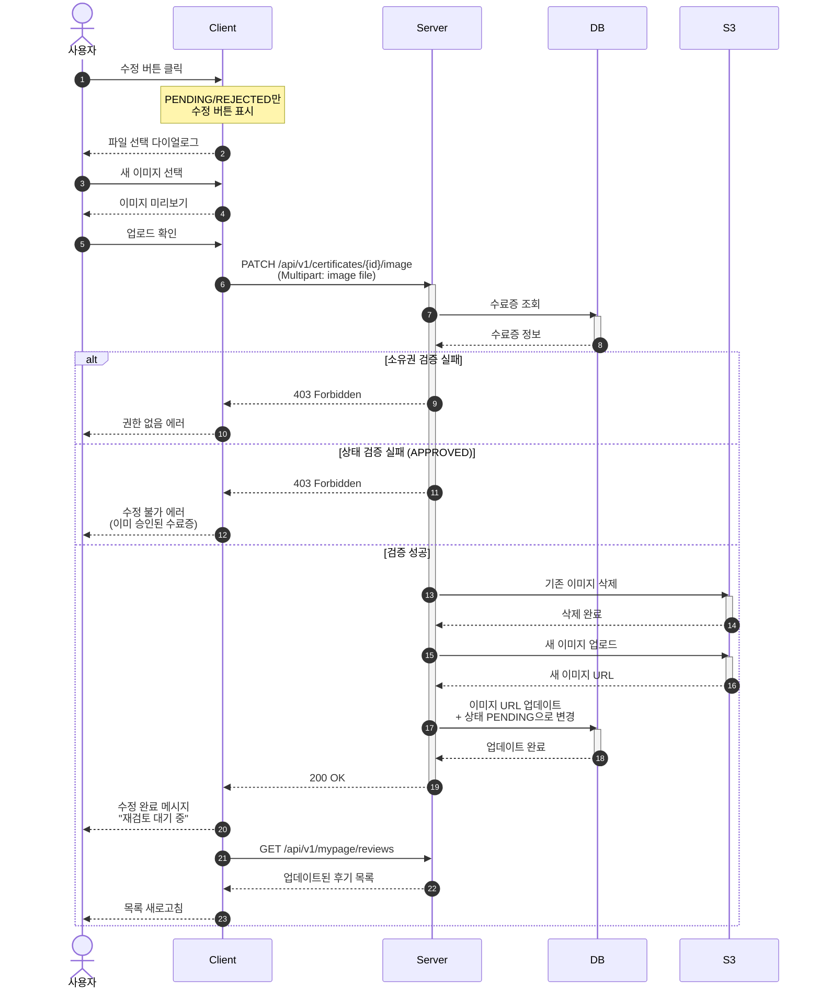

# 수료증 이미지 수정 - 시퀀스 다이어그램

```mermaid
sequenceDiagram
    autonumber

    actor User as 사용자
    participant Client as Client
    participant Server as Server
    participant DB as DB
    participant S3 as S3

    %% 수정 버튼 클릭
    User->>Client: 수정 버튼 클릭

    Note over Client: PENDING/REJECTED만<br/>수정 버튼 표시

    Client-->>User: 파일 선택 다이얼로그

    User->>Client: 새 이미지 선택
    Client-->>User: 이미지 미리보기

    User->>Client: 업로드 확인

    %% 서버 요청
    Client->>Server: PATCH /api/v1/certificates/{id}/image<br/>(Multipart: image file)
    activate Server

    %% 검증
    Server->>DB: 수료증 조회
    activate DB
    DB-->>Server: 수료증 정보
    deactivate DB

    alt 소유권 검증 실패
        Server-->>Client: 403 Forbidden
        Client-->>User: 권한 없음 에러
    else 상태 검증 실패 (APPROVED)
        Server-->>Client: 403 Forbidden
        Client-->>User: 수정 불가 에러<br/>(이미 승인된 수료증)
    else 검증 성공
        %% 기존 이미지 삭제
        Server->>S3: 기존 이미지 삭제
        activate S3
        S3-->>Server: 삭제 완료
        deactivate S3

        %% 새 이미지 업로드
        Server->>S3: 새 이미지 업로드
        activate S3
        S3-->>Server: 새 이미지 URL
        deactivate S3

        %% DB 업데이트
        Server->>DB: 이미지 URL 업데이트<br/>+ 상태 PENDING으로 변경
        activate DB
        DB-->>Server: 업데이트 완료
        deactivate DB

        Server-->>Client: 200 OK
        deactivate Server

        Client-->>User: 수정 완료 메시지<br/>"재검토 대기 중"

        %% 목록 새로고침
        Client->>Server: GET /api/v1/mypage/reviews
        Server-->>Client: 업데이트된 후기 목록
        Client-->>User: 목록 새로고침
    end
```
