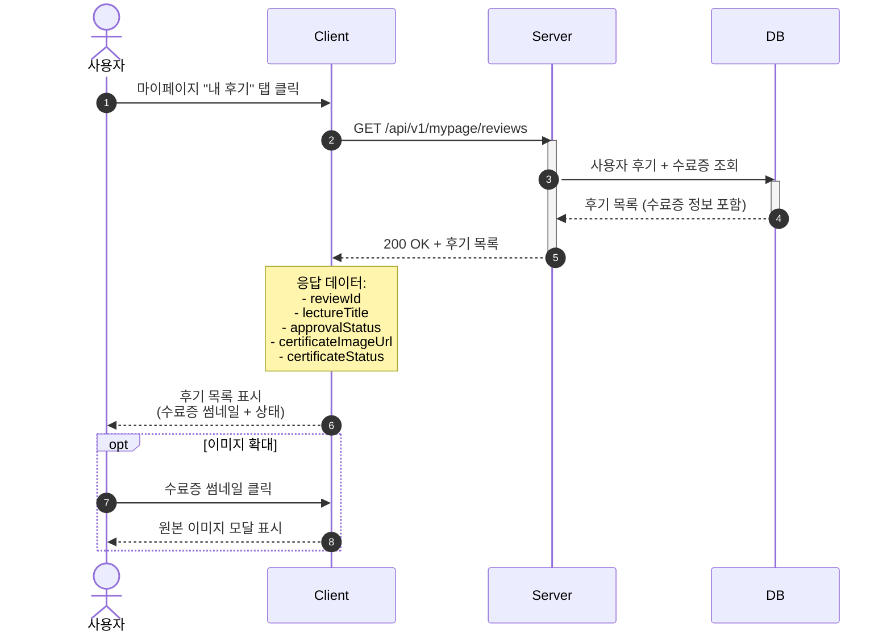

# 수료증 이미지 조회 - 시퀀스 다이어그램

```mermaid
sequenceDiagram
    autonumber

    actor User as 사용자
    participant Client as Client
    participant Server as Server
    participant DB as DB

    %% 마이페이지 후기 목록 조회
    User->>Client: 마이페이지 "내 후기" 탭 클릭
    Client->>Server: GET /api/v1/mypage/reviews
    activate Server

    Server->>DB: 사용자 후기 + 수료증 조회
    activate DB
    DB-->>Server: 후기 목록 (수료증 정보 포함)
    deactivate DB

    Server-->>Client: 200 OK + 후기 목록
    deactivate Server

    Note over Client: 응답 데이터:<br/>- reviewId<br/>- lectureTitle<br/>- approvalStatus<br/>- certificateImageUrl<br/>- certificateStatus

    Client-->>User: 후기 목록 표시<br/>(수료증 썸네일 + 상태)

    %% 이미지 확대 보기
    opt 이미지 확대
        User->>Client: 수료증 썸네일 클릭
        Client-->>User: 원본 이미지 모달 표시
    end
```
