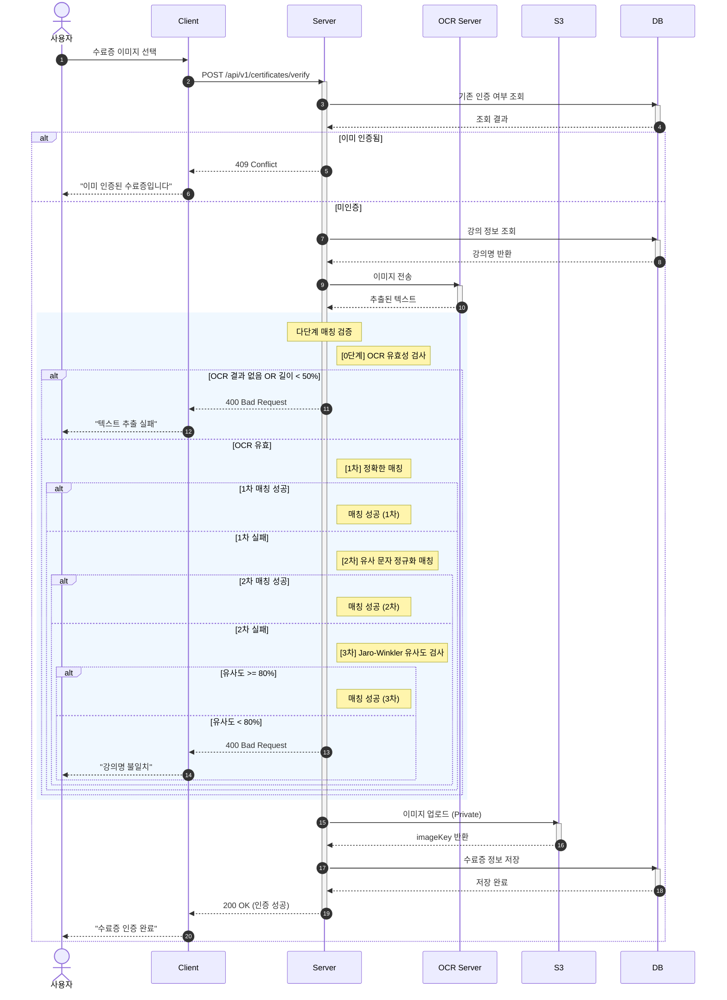

# 수료증 검증 - 시퀀스 다이어그램

```mermaid
sequenceDiagram
    autonumber

    actor User as 사용자
    participant Client as Client
    participant Server as Server
    participant OCR as OCR Server
    participant S3 as S3
    participant DB as DB

    %% 1. 수료증 업로드
    User->>Client: 수료증 이미지 선택
    Client->>Server: POST /api/v1/certificates/verify
    activate Server

    %% 2. 중복 인증 확인
    Server->>DB: 기존 인증 여부 조회
    activate DB
    DB-->>Server: 조회 결과
    deactivate DB

    alt 이미 인증됨
        Server-->>Client: 409 Conflict
        Client-->>User: "이미 인증된 수료증입니다"
    else 미인증
        %% 3. 강의 정보 조회
        Server->>DB: 강의 정보 조회
        activate DB
        DB-->>Server: 강의명 반환
        deactivate DB

        %% 4. OCR 텍스트 추출
        Server->>OCR: 이미지 전송
        activate OCR
        OCR-->>Server: 추출된 텍스트
        deactivate OCR

        %% 5. 다단계 매칭 검증
        rect rgb(240, 248, 255)
            Note over Server: 다단계 매칭 검증

            %% 0단계: OCR 유효성 검사
            Note right of Server: [0단계] OCR 유효성 검사

            alt OCR 결과 없음 OR 길이 < 50%
                Server-->>Client: 400 Bad Request
                Client-->>User: "텍스트 추출 실패"
            else OCR 유효
                %% 1차: 정확한 매칭
                Note right of Server: [1차] 정확한 매칭

                alt 1차 매칭 성공
                    Note right of Server: 매칭 성공 (1차)
                else 1차 실패
                    %% 2차: 유사 문자 정규화 매칭
                    Note right of Server: [2차] 유사 문자 정규화 매칭

                    alt 2차 매칭 성공
                        Note right of Server: 매칭 성공 (2차)
                    else 2차 실패
                        %% 3차: 유사도 매칭
                        Note right of Server: [3차] Jaro-Winkler 유사도 검사

                        alt 유사도 >= 80%
                            Note right of Server: 매칭 성공 (3차)
                        else 유사도 < 80%
                            Server-->>Client: 400 Bad Request
                            Client-->>User: "강의명 불일치"
                        end
                    end
                end
            end
        end

        %% 6. 수료증 저장 (매칭 성공 시)
        Server->>S3: 이미지 업로드 (Private)
        activate S3
        S3-->>Server: imageKey 반환
        deactivate S3

        Server->>DB: 수료증 정보 저장
        activate DB
        DB-->>Server: 저장 완료
        deactivate DB

        Server-->>Client: 200 OK (인증 성공)
        deactivate Server
        Client-->>User: "수료증 인증 완료"
    end
```
