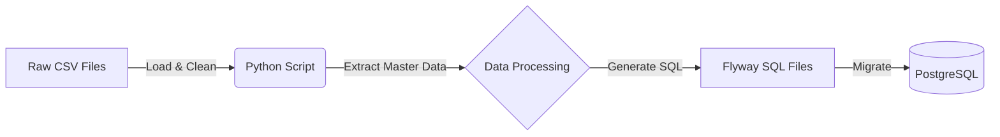

# Technical Specification: 초기 데이터 구축 및 마이그레이션

## 1. 시스템 아키텍처 (System Architecture)

### 1.1 데이터 흐름도 (Data Flow)



### 1.2 기술 스택
- **Language**: Python 3.x
- **Library**: Pandas (데이터 처리), SQLAlchemy (필요 시 검증용)
- **Migration Tool**: Flyway (Spring Boot 내장)

---

## 2. 데이터 처리 로직 (Data Processing Logic)

### 2.1 Step 0: 사전 데이터 준비 (Admin User)
- **Admin User 생성**: `organizations` 테이블의 `user_id` FK 제약조건 만족을 위해, ID 1번 관리자 계정을 생성하는 SQL을 최상단에 포함합니다.
- **로직**: `INSERT INTO swcampus.members (user_id, email, name, role, ...) VALUES (1, 'admin@swcampus.com', 'Admin', 'ADMIN', ...) ON CONFLICT DO NOTHING;`

### 2.2 Step 1: 데이터 로드 및 전처리
- **Encoding**: `utf-8` 또는 `cp949` (euc-kr) 자동 감지
- **Cleaning**:
    - 모든 문자열의 앞뒤 공백 제거 (`strip()`)
    - 금액 필드: `,` 제거 및 `int` 변환
    - 날짜 필드: `YYYYMMDD` → `YYYY-MM-DD` 변환
    - `NaN` 값 처리: 필드별 기본값 설정 (PRD 참조)

### 2.2 Step 2: 마스터 데이터 추출 (Normalization)
중복을 제거하고 고유 ID를 부여하여 정규화된 테이블 데이터를 생성합니다.

1.  **Categories (`categories`)**
    - 소스: `통합데이터.csv`의 `대분류` 컬럼 + `*.csv` 파일명
    - 로직: 고유한 대분류 추출 → ID 부여 (1부터 시작)

2.  **Organizations (`organizations`)**
    - 소스: `소프트웨어캠퍼스과정정보.csv`의 `교육기관명`
    - 로직: 고유한 기관명 추출 → ID 부여
    - **예외 처리**: '미상', '강사', 빈 값 등 식별 불가능한 데이터는 `teachers` 테이블에 적재하지 않고 **Skip** 합니다. (DB의 `NOT NULL` 제약조건 준수

3.  **Teachers (`teachers`)**
    - 소스: `소프트웨어캠퍼스과정정보.csv`의 `강사명`
    - 로직: 고유한 강사명 추출 → ID 부여 (단, '미상', '강사' 등 무의미한 데이터는 `NULL` 처리)

4.  **Curriculums (`curriculums`)**
    - 소스: 카테고리별 CSV 파일(`AI.csv`, `웹개발(백엔드).csv` 등)의 **2번째 행** (커리큘럼 항목명)
    - 로직:
        1. 각 카테고리 파일의 헤더에서 커리큘럼 항목명 추출
        2. `category_id`와 매핑하여 저장
    - 예시 (AI 카테고리):
        - Python 프로그래밍 및 AI 수학
        - 데이터 전처리 및 핸들링
        - 머신러닝/딥러닝 프레임워크 기초
        - ...

### 2.3 Step 3: 강좌 데이터 생성 (`lectures`)
- 소스: `소프트웨어캠퍼스과정정보.csv`
- 로직:
    - `교육기관명`으로 `org_id` 매핑
    - `강사명`은 별도 `lecture_teachers` 테이블로 분리 (N:M 관계 고려, 현재는 1:1 매핑 후 확장성 열어둠)
    - `과정명`을 Key로 사용하여 중복 제거

### 2.4 Step 4: 관계 데이터 매핑 (`lecture_curriculums`)
- 소스: `소프트웨어캠퍼스과정정보.csv` (과정명) + `통합데이터.csv` (훈련과정명)
- 로직:
    1.  두 파일의 `과정명`을 기준으로 **Inner Join**
    2.  `통합데이터.csv`의 각 커리큘럼 컬럼 값('기본', '심화', '없음')을 읽음
    3.  `lecture_id`, `curriculum_id`, `level` (ENUM) 형태의 데이터 생성

---

## 3. 상세 스키마 매핑 (Detailed Schema Mapping)

### 3.1 Categories
| DB Column | Source | Transformation |
|---|---|---|
| `category_id` | Auto | Sequence (1~) |
| `category_name` | `대분류` | Unique Value |
| `pid` | - | NULL (최상위) |
| `sort` | - | 임의 부여 |

### 3.2 Organizations
| DB Column | Source | Transformation |
|---|---|---|
| `org_id` | Auto | Sequence (1~) |
| `org_name` | `교육기관명` | Unique Value |
| `user_id` | - | 1 (Admin 계정 고정) |
| `approval_status` | - | 1 (승인됨) |

### 3.3 Lectures
| DB Column | Source | Transformation |
|---|---|---|
| `lecture_id` | Auto | Sequence (1~) |
| `lecture_name` | `과정명` | - |
| `org_id` | `교육기관명` | `organizations` 테이블 Lookup |
| `start_date` | `교육시작일자` | `YYYYMMDD` → Date |
| `end_date` | `교육종료일자` | `YYYYMMDD` → Date |
| `total_days` | `교육일수` | Integer 변환 |
| `total_times` | `교육시간` | Integer 변환 |
| `start_time` | - | 기본값 `09:00:00` |
| `end_time` | - | 기본값 `18:00:00` |
| `lecture_fee` | `수강료 합계` | Remove `,`, Convert to Numeric |
| `edu_subsidy` | `훈련수당(월)` | Remove `,`, Convert to Numeric |
| `subsidy` | `수강료 지원금` | Remove `,`, Convert to Numeric |
| `lecture_loc` | `온라인/오프라인` | '온라인'→`ONLINE`, '오프라인'→`OFFLINE`, 그외→`MIXED` |
| `recruit_type` | `내일배움카드...` | '유'→`CARD_REQUIRED`, '무'→`GENERAL` |
| `books` | `교재지원` | 'O'→`true`, 'X'→`false` |
| `equip_pc` | `장비` | 텍스트 → ENUM 매핑 (아래 표 참조) |
| `equip_merit` | `장점` | 텍스트 그대로 저장 |
| `employment_help` | `협력사 매칭` | 'O'→`true`, 그외→`false` |
| `resume` | `이력서/자소서` | 'O'→`true`, 그외→`false` |
| `mock_interview` | `모의면접` | 'O'→`true`, 그외→`false` |
| `goal` | `훈련목표` | 텍스트 그대로 저장 |
| `project_mentor` | `멘토링` | 'O'→`true`, 그외→`false` |
| `project_num` | `숫자` | Integer 변환 (프로젝트 횟수) |
| `project_time` | `기간` | Integer 변환 (프로젝트 기간) |
| `project_team` | `팀구성방식` | 텍스트 그대로 저장 |
| `project_tool` | `협업툴` | 텍스트 그대로 저장 |
| `location` | - | `NULL` (CSV에 상세 주소 없음) |
| `url` | - | `NULL` (CSV에 없음) |
| `max_capacity` | - | `NULL` (CSV에 없음) |
| `status` | - | `RECRUITING` (기본값) |
| `lecture_auth_status` | - | `APPROVED` (초기 데이터이므로 승인됨) |

**equip_pc 매핑 규칙:**
| CSV 값 | DB ENUM |
|---|---|
| `pc` | `PC` |
| `개인장비` | `PERSONAL` |
| `없음`, 빈값 | `NONE` |

### 3.4 Lecture Steps
| DB Column | Source | Transformation |
|---|---|---|
| `step_id` | Auto | Sequence (1~) |
| `lecture_id` | `과정명` | `lectures` 테이블 Lookup |
| `step_type` | `서류심사`, `면접`, `코딩테스트`, `사전학습과제` | 'O'인 컬럼만 추출 → ENUM 매핑 |
| `step_order` | Auto | 1, 2, 3... 순서 부여 |

**Step Type 매핑:**
| CSV 컬럼 | DB ENUM |
|---|---|
| `서류심사` | `DOCUMENT` |
| `면접` | `INTERVIEW` |
| `코딩테스트` | `CODING_TEST` |
| `사전학습과제` | `PRE_TASK` |

### 3.5 Lecture Quals
| DB Column | Source | Transformation |
|---|---|---|
| `qual_id` | Auto | Sequence (1~) |
| `lecture_id` | `과정명` | `lectures` 테이블 Lookup |
| `type` | `필수` / `우대` 컬럼 구분 | `REQUIRED` / `PREFERRED` |
| `text` | 해당 컬럼 값 | `,`로 파싱하여 각각 별도 Row 생성 |

**예시:**
- CSV `필수` 컬럼: "국민내일배움카드 발급자, 컴퓨터 관련 전공자, 졸업예정자"
- 생성되는 데이터:
    1. `type=REQUIRED`, `text=국민내일배움카드 발급자`
    2. `type=REQUIRED`, `text=컴퓨터 관련 전공자`
    3. `type=REQUIRED`, `text=졸업예정자`

### 3.6 Lecture Teachers
| DB Column | Source | Transformation |
|---|---|---|
| `id` | Auto | Sequence (1~) |
| `lecture_id` | `과정명` | `lectures` 테이블 Lookup |
| `teacher_id` | `강사명` | `teachers` 테이블 Lookup |

### 3.7 Lecture Adds (추가 혜택)
| DB Column | Source | Transformation |
|---|---|---|
| `add_id` | Auto | Sequence (1~) |
| `lecture_id` | `과정명` | `lectures` 테이블 Lookup |
| `add_name` | `추가혜택` | `,`로 파싱하여 각각 별도 Row 생성 |

**예시:**
- CSV `추가혜택` 컬럼: "식비 지원, 교통비 지원, 취업연계"
- 생성되는 데이터:
    1. `add_name=식비 지원`
    2. `add_name=교통비 지원`
    3. `add_name=취업연계`

### 3.8 Lecture Curriculums
| DB Column | Source | Transformation |
|---|---|---|
| `lecture_id` | `과정명` | `lectures` 테이블 Lookup |
| `curriculum_id` | `커리큘럼명` | `curriculums` 테이블 Lookup |
| `level` | `값(기본/심화)` | '기본'→`BASIC`, '심화'→`ADVANCED`, 그외→`NONE` |

---

## 4. 파일 구조 (File Structure)

```
sw-campus-server/
├── scripts/
│   └── data-migration/
│       ├── convert.py              # 메인 변환 스크립트
│       ├── requirements.txt        # pandas 등 의존성
│       ├── data/                   # 원본 CSV (Git Ignore 권장되나 초기 데이터라 포함 가능)
│       │   ├── 소프트웨어캠퍼스과정정보.csv
│       │   ├── 통합데이터.csv
│       │   └── ...
│       └── output/                 # 생성된 SQL 파일
│           ├── V2__seed_categories.sql
│           └── ...
```

---

## 5. 예외 처리 및 검증 (Validation)

### 5.1 데이터 정합성 체크
- **Join 실패**: `소프트웨어캠퍼스과정정보.csv`에는 있는데 `통합데이터.csv`에 없는 과정은 `lecture_curriculums` 데이터가 생성되지 않음 (로그 출력).
- **필수값 누락**: `과정명`, `기관명`, `시작일` 누락 시 해당 Row Skip.

### 5.2 SQL 생성 규칙
- **Idempotency**: `INSERT INTO ... ON CONFLICT DO NOTHING;`
- **Sequence Reset**: 모든 Insert 후 `SELECT setval(...)` 구문 추가.

---

## 6. 실행 계획 (Execution Plan)

1.  **스크립트 개발**: 로컬 환경에서 Python 스크립트 작성 및 테스트.
2.  **SQL 생성**: 로컬에서 스크립트 실행하여 SQL 파일 생성.
3.  **Flyway 적용**: 생성된 SQL 파일을 `src/main/resources/db/migration`으로 이동.
4.  **검증**: 로컬 DB(`docker-compose`) 기동하여 마이그레이션 성공 여부 및 데이터 확인.
5.  **PR & Merge**: 검증된 SQL 파일만 PR에 포함하여 Merge.
