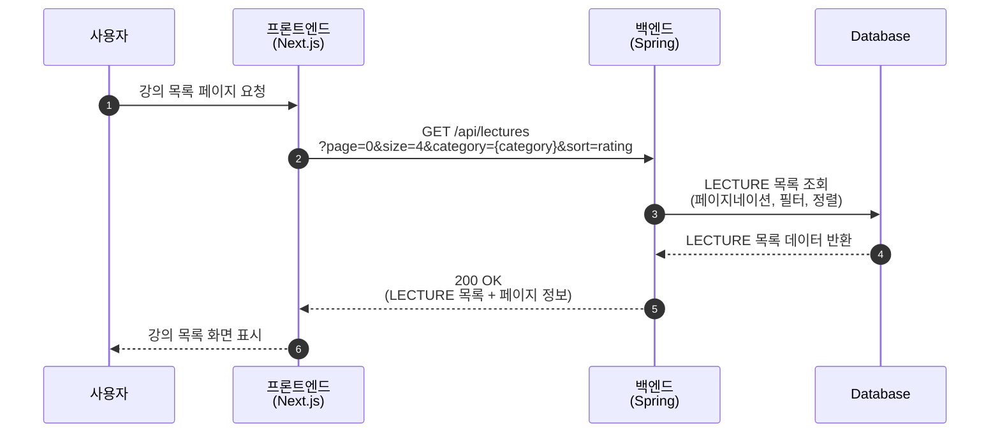
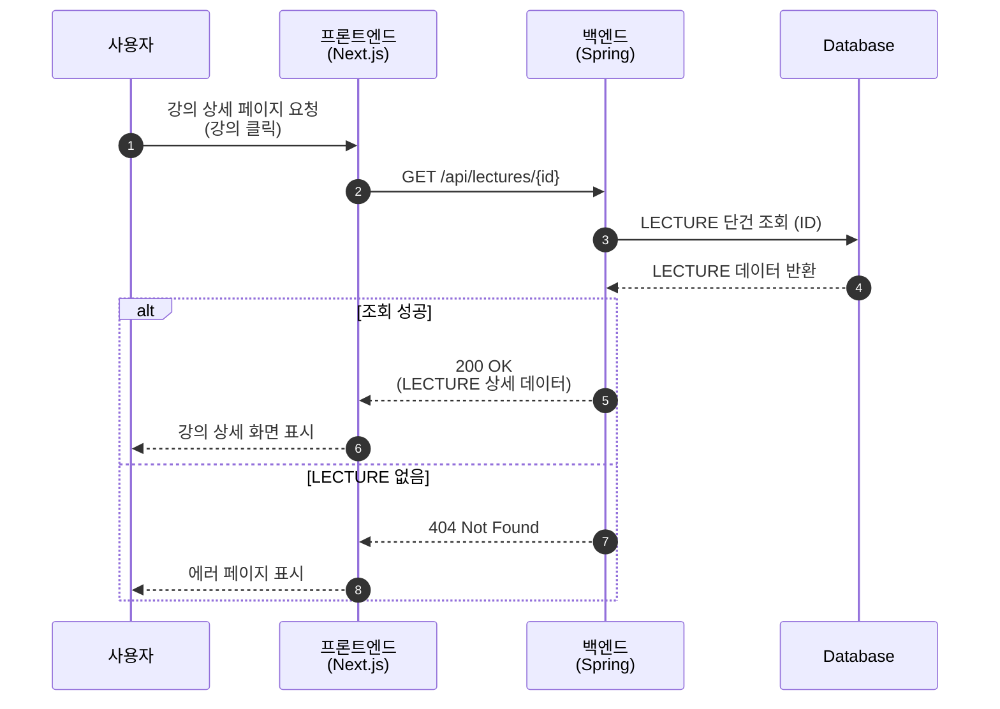
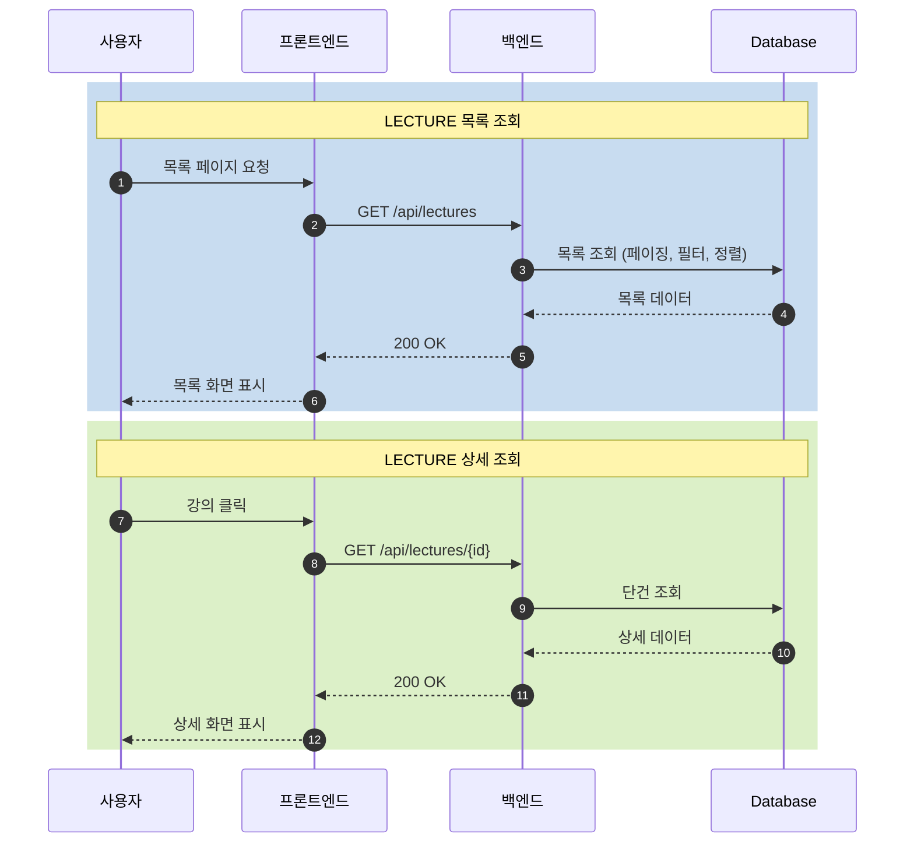

# LECTURE 조회 Sequence Diagrams

## 1. LECTURE 목록 조회

```mermaid
sequenceDiagram
    autonumber
    participant User as 사용자
    participant Frontend as 프론트엔드<br/>(Next.js)
    participant Backend as 백엔드<br/>(Spring)
    participant DB as Database

    User->>Frontend: 강의 목록 페이지 요청
    Frontend->>Backend: GET /api/lectures<br/>?page=0&size=4&category={category}&sort=rating
    Backend->>DB: LECTURE 목록 조회<br/>(페이지네이션, 필터, 정렬)
    DB-->>Backend: LECTURE 목록 데이터 반환
    Backend-->>Frontend: 200 OK<br/>(LECTURE 목록 + 페이지 정보)
    Frontend-->>User: 강의 목록 화면 표시
```

---

## 2. LECTURE 상세 조회

```mermaid
sequenceDiagram
    autonumber
    participant User as 사용자
    participant Frontend as 프론트엔드<br/>(Next.js)
    participant Backend as 백엔드<br/>(Spring)
    participant DB as Database

    User->>Frontend: 강의 상세 페이지 요청<br/>(강의 클릭)
    Frontend->>Backend: GET /api/lectures/{id}
    Backend->>DB: LECTURE 단건 조회 (ID)
    DB-->>Backend: LECTURE 데이터 반환

    alt 조회 성공
        Backend-->>Frontend: 200 OK<br/>(LECTURE 상세 데이터)
        Frontend-->>User: 강의 상세 화면 표시
    else LECTURE 없음
        Backend-->>Frontend: 404 Not Found
        Frontend-->>User: 에러 페이지 표시
    end
```

---

## 3. 전체 LECTURE 조회 흐름 요약

```mermaid
sequenceDiagram
    autonumber
    participant User as 사용자
    participant Frontend as 프론트엔드
    participant Backend as 백엔드
    participant DB as Database

    rect rgb(200, 220, 240)
        Note over User, DB: LECTURE 목록 조회
        User->>Frontend: 목록 페이지 요청
        Frontend->>Backend: GET /api/lectures
        Backend->>DB: 목록 조회 (페이징, 필터, 정렬)
        DB-->>Backend: 목록 데이터
        Backend-->>Frontend: 200 OK
        Frontend-->>User: 목록 화면 표시
    end

    rect rgb(220, 240, 200)
        Note over User, DB: LECTURE 상세 조회
        User->>Frontend: 강의 클릭
        Frontend->>Backend: GET /api/lectures/{id}
        Backend->>DB: 단건 조회
        DB-->>Backend: 상세 데이터
        Backend-->>Frontend: 200 OK
        Frontend-->>User: 상세 화면 표시
    end
```
