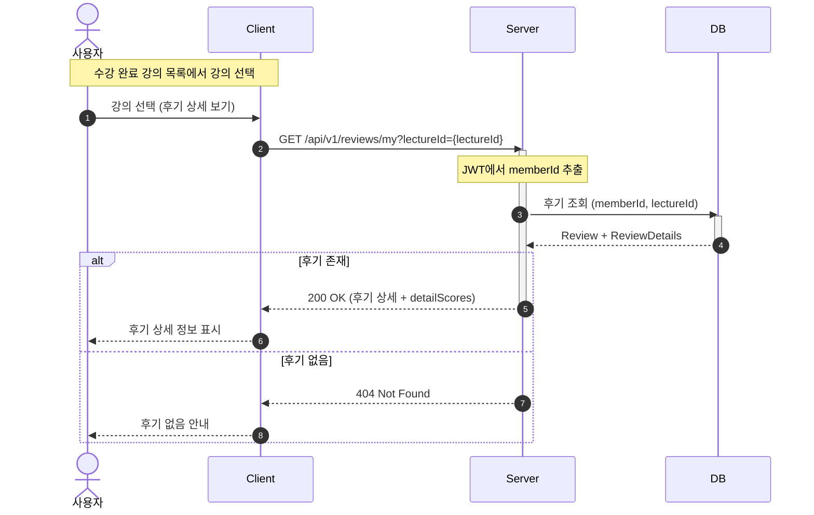

# 내 강의 후기 상세 조회 - 시퀀스 다이어그램



## 응답 예시

### 성공 (200 OK)

```json
{
  "review_id": 1,
  "lecture_id": 10,
  "nickname": "수강생A",
  "comment": "전체적으로 만족스러운 강의였습니다.",
  "average_score": 4.3,
  "approval_status": "APPROVED",
  "detail_scores": [
    { "category": "TEACHER", "score": 4.5, "comment": "강사님이 좋았습니다" },
    { "category": "CURRICULUM", "score": 4.0, "comment": "커리큘럼이 체계적입니다" },
    { "category": "MANAGEMENT", "score": 4.5, "comment": "행정 서비스가 좋았습니다" },
    { "category": "FACILITY", "score": 3.5, "comment": "시설은 보통입니다" },
    { "category": "PROJECT", "score": 5.0, "comment": "프로젝트가 유익했습니다" }
  ],
  "created_at": "2025-12-21T10:00:00",
  "updated_at": "2025-12-21T10:00:00"
}
```

### 실패 (404 Not Found)

```json
{
  "code": "REVIEW_NOT_FOUND",
  "message": "해당 강의에 대한 후기가 없습니다."
}
```
