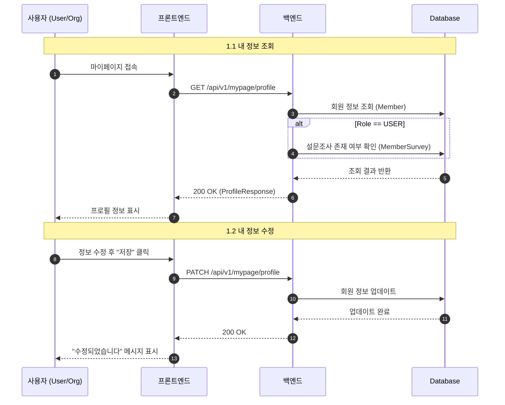
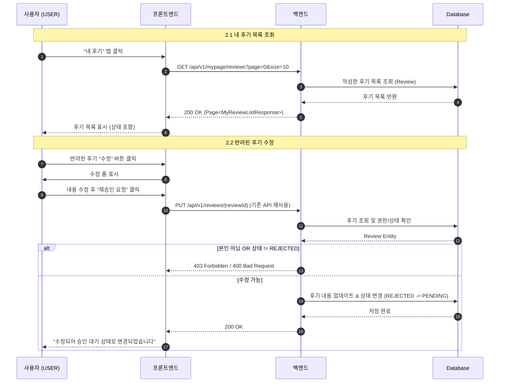
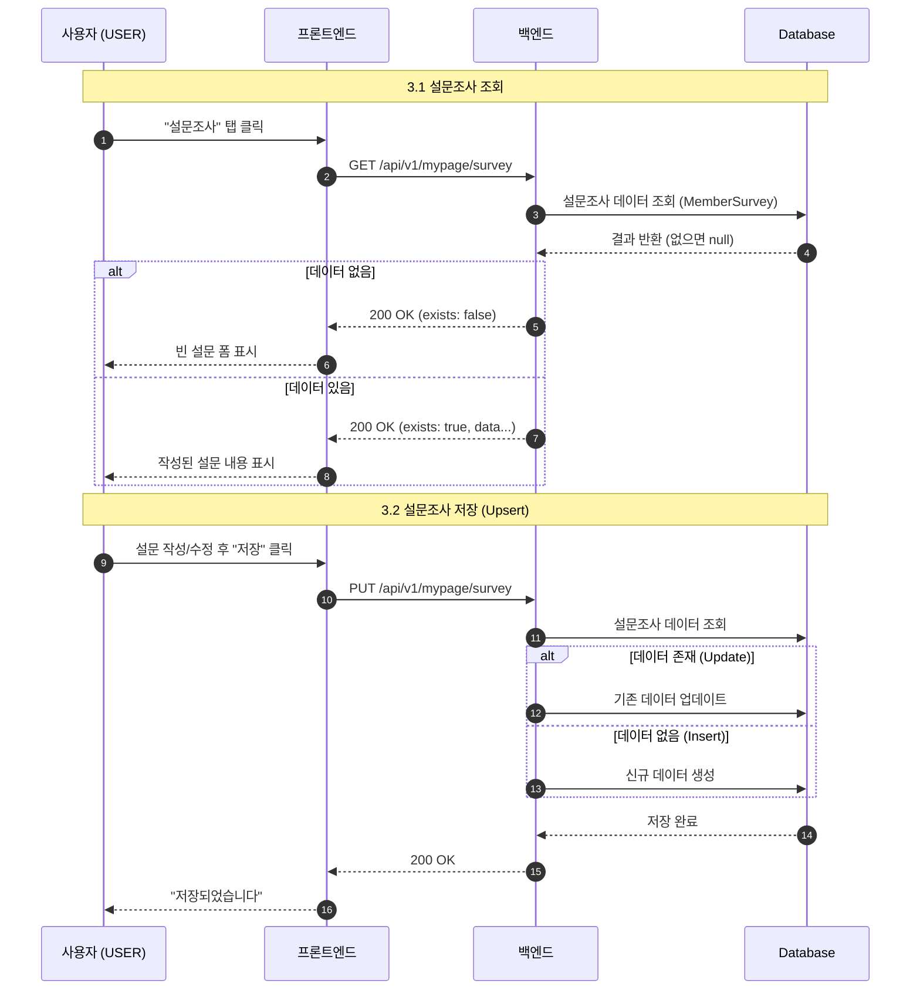
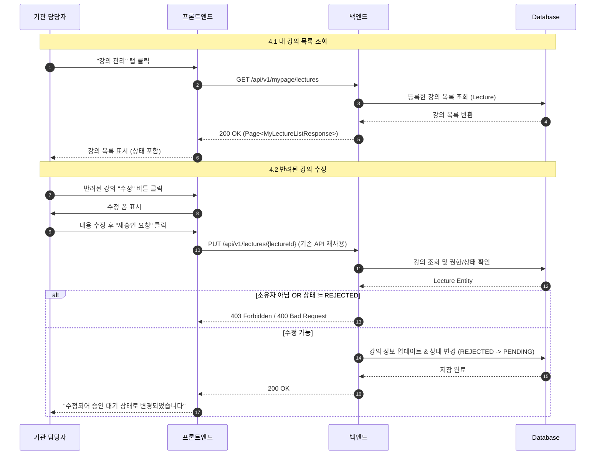

# 마이페이지 (Mypage) Sequence Diagrams

## 1. 내 정보 관리 (Profile Management)

---

## 2. 내 후기 관리 (User Review Management)

---

## 3. 설문조사 관리 (User Survey Management)

---

## 4. 내 강의 관리 (Organization Lecture Management)

