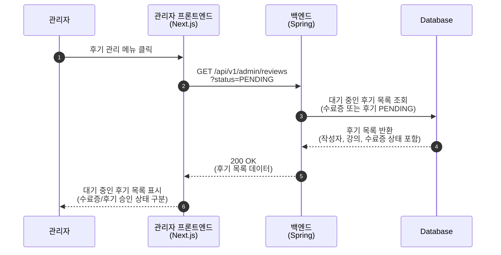
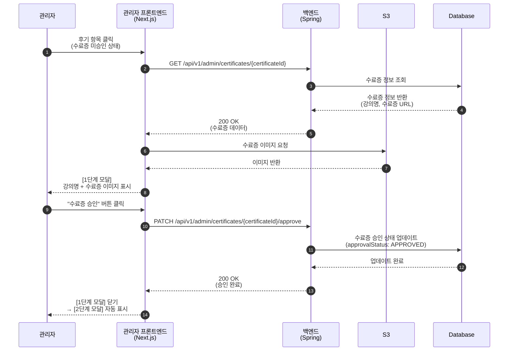
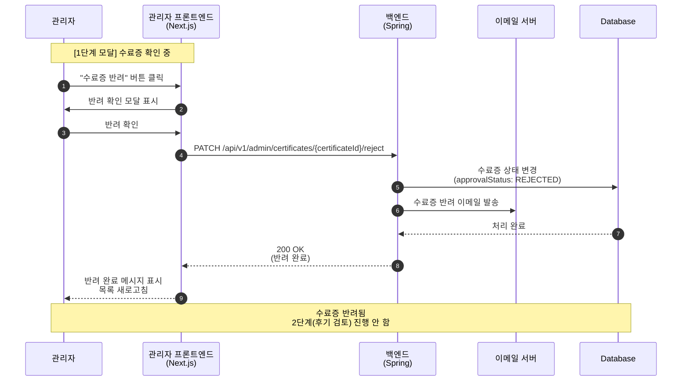
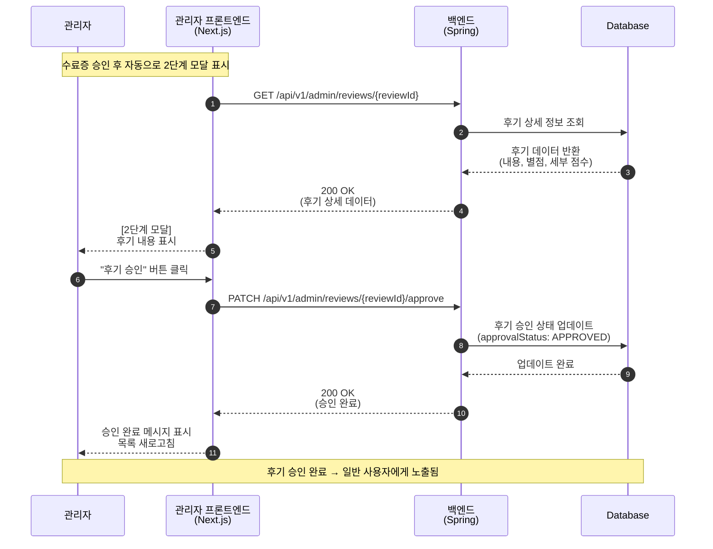
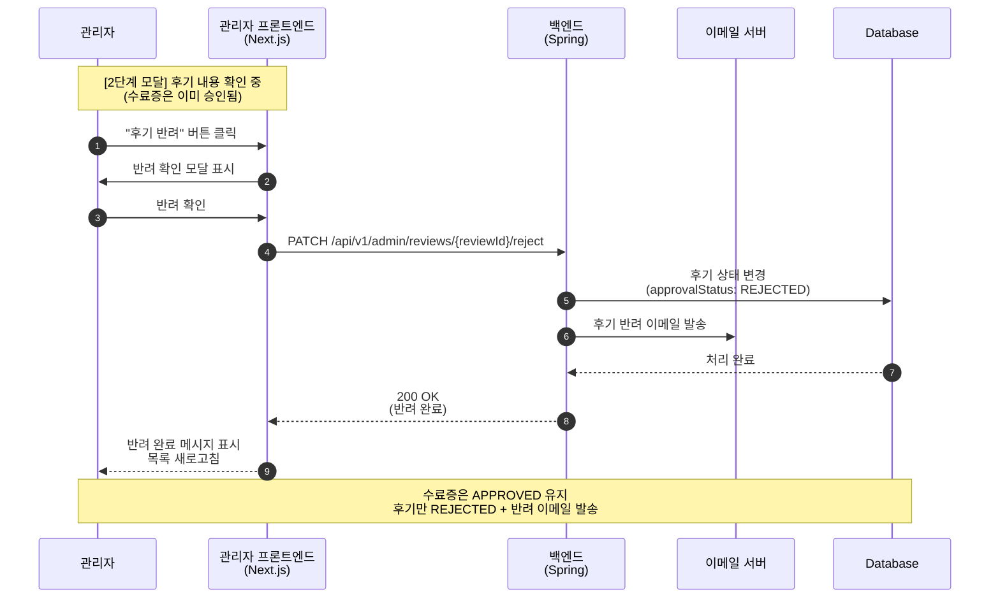
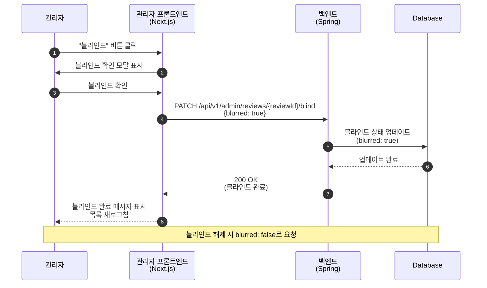
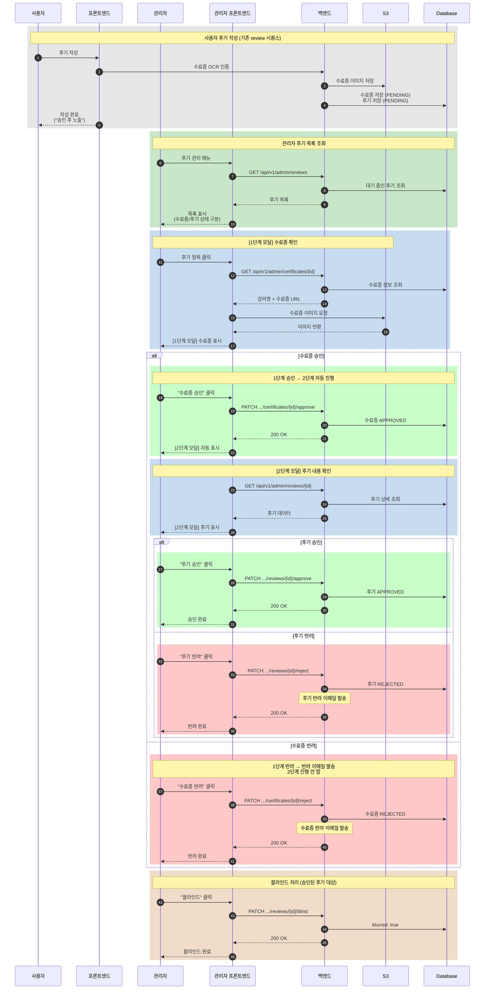
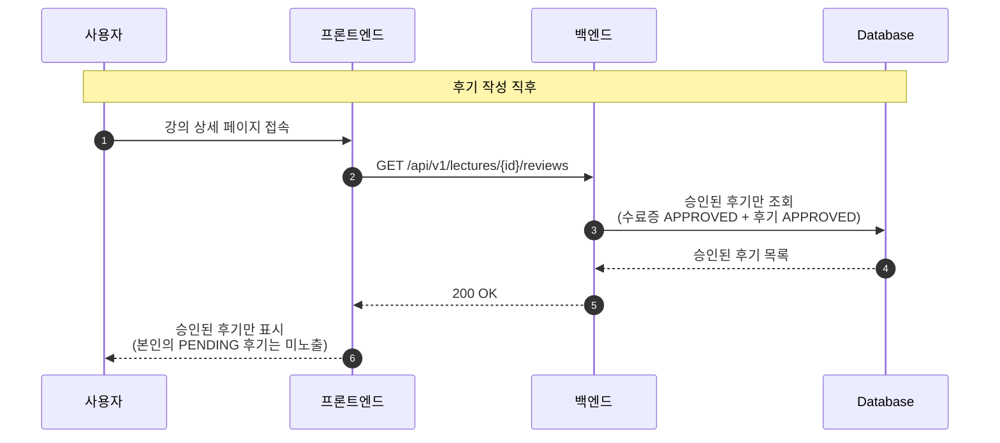

# 관리자 - 2단계 후기 검토 Sequence Diagrams

> ※ 사용자의 후기 작성 흐름은 기존 review 시퀀스 참고
> ※ 사용자는 OCR 통과 후 바로 후기 작성 가능 (관리자 사후 검토 방식)
> ※ **관리자는 2단계로 검토**: 1단계 수료증 → 2단계 후기 내용

## 1. 대기 중인 후기 목록 조회

---

## 2. [1단계 모달] 수료증 확인 및 승인

---

## 3. [1단계 모달] 수료증 반려

> **수료증 반려 시**: 반려 이메일 발송, 2단계(후기 검토)로 진행하지 않음

---

## 4. [2단계 모달] 후기 내용 확인 및 승인

---

## 5. [2단계 모달] 후기 반려

> **후기 반려**: 수료증은 이미 승인된 상태, 후기 반려 이메일 발송

---

## 6. 후기 블라인드 처리 (승인된 후기 대상)

> **블라인드**: 후기가 목록에 **표시됨** (UI 처리는 프론트엔드에서 결정)
> (반려(REJECTED)는 목록에 아예 표시되지 않음)

---

## 7. 전체 2단계 검토 흐름 요약

---

## 8. 사용자 후기 노출 상태 흐름

