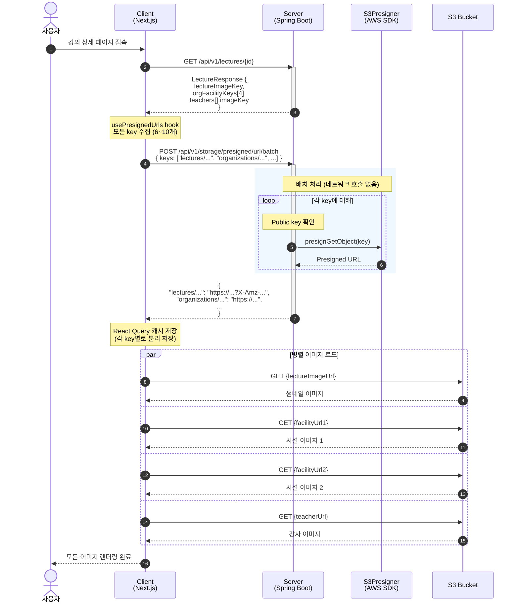
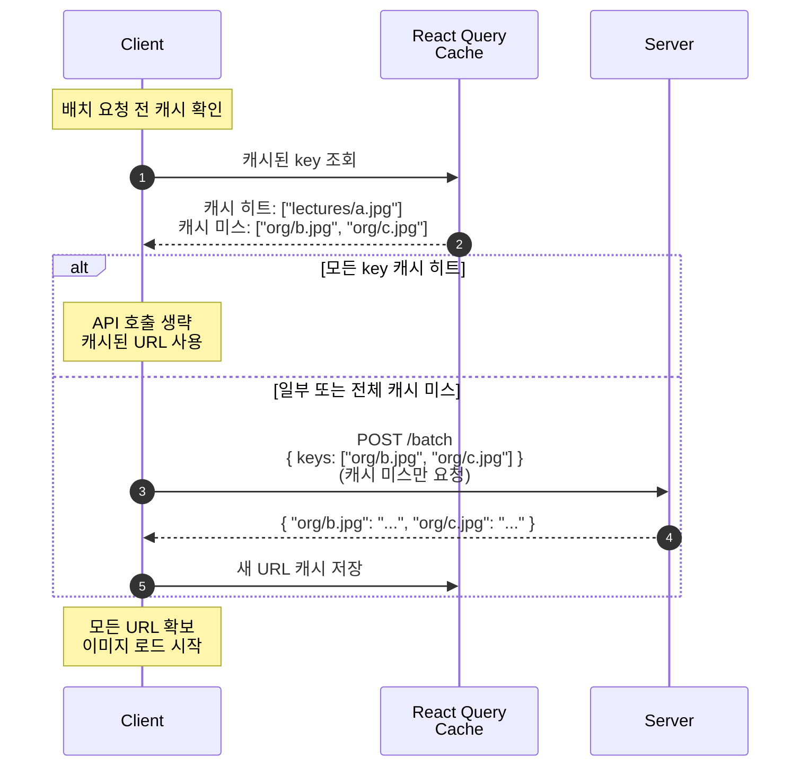
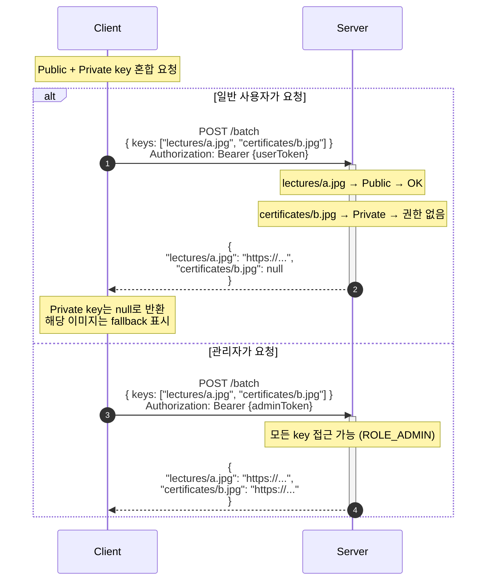

# 배치 Presigned URL 조회 - 시퀀스 다이어그램

## 캐시 최적화 흐름

## Private key 포함 시 처리

## 참고사항

- S3Presigner는 로컬에서 서명만 생성하므로 네트워크 호출 없음 (빠름)
- 배치 API는 N+1 문제 방지를 위해 필수
- Private key는 관리자만 URL 발급 가능, 일반 사용자는 null 반환
- 최대 50개까지 한 번에 요청 가능
