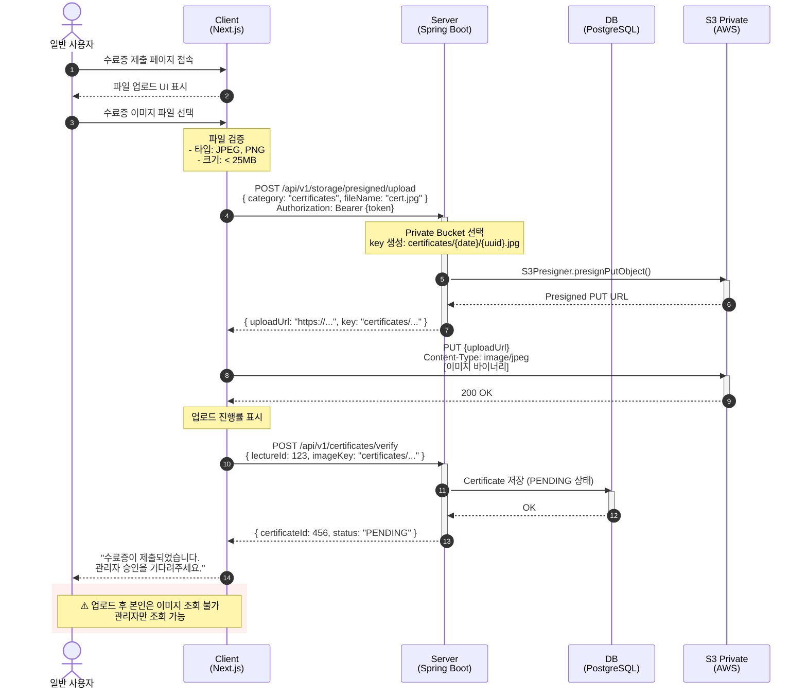
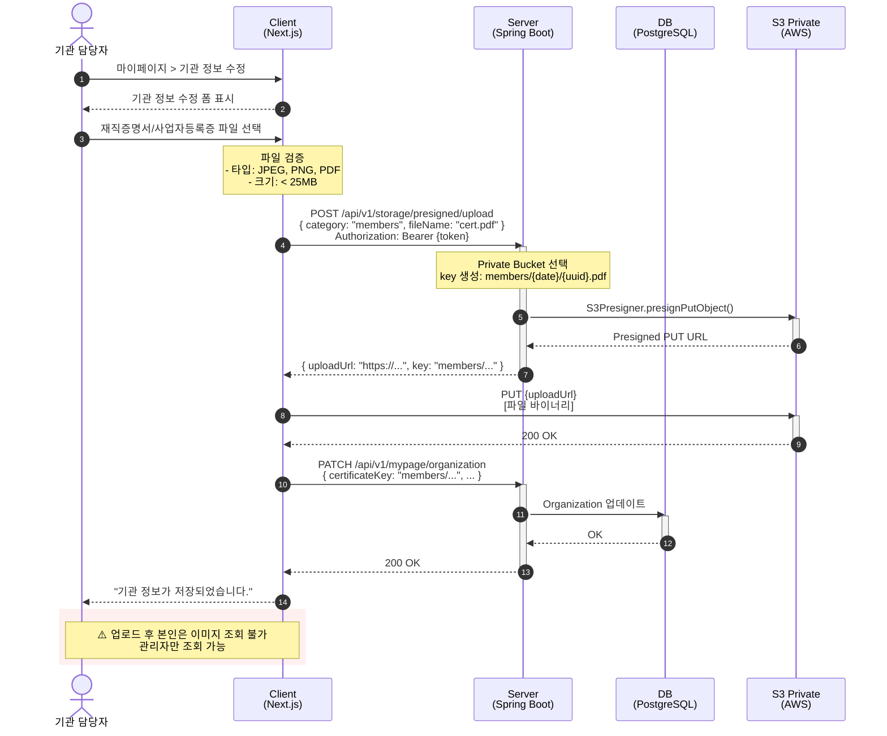

# Private 이미지 업로드 - 시퀀스 다이어그램

## USER 수료증 업로드 (US-2)

## ORGANIZATION 재직증명서 업로드 (US-3)

## 참고사항

- Private 파일은 반드시 Private Bucket에 업로드
- 업로드한 본인도 조회할 수 없음 (관리자만 가능)
- 수료증은 OCR 검증 후 PENDING 상태로 저장
- 재직증명서/사업자등록증은 기관 정보에 key만 저장
