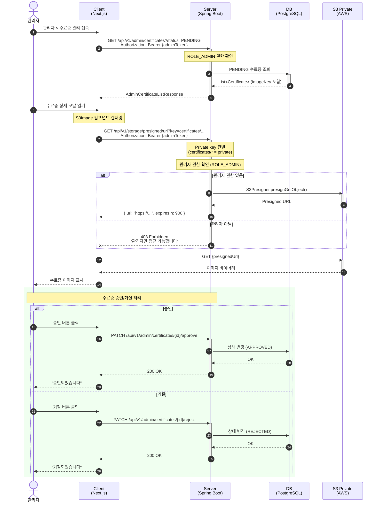
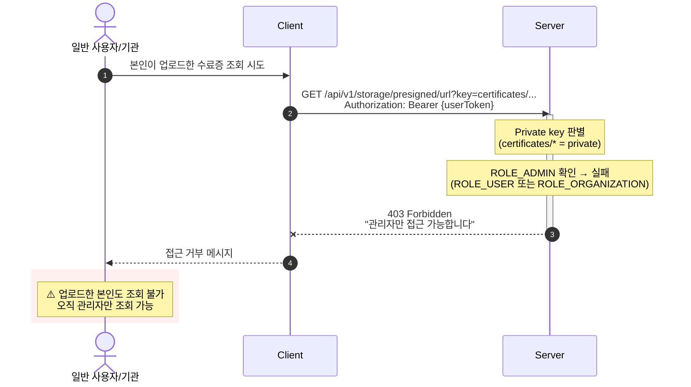

# Private 이미지 조회 (관리자) - 시퀀스 다이어그램

## 관리자 수료증 확인 및 승인 (US-4)

## 일반 사용자/기관의 Private 파일 접근 시도 (차단)

## 참고사항

- Private 파일 접근은 **관리자 전용** (ROLE_ADMIN)
- 수료증을 업로드한 USER도 조회 불가
- 재직증명서를 업로드한 ORGANIZATION도 조회 불가
- 권한 체크 실패 시 403 Forbidden 반환
- 수료증 상태: PENDING → APPROVED 또는 REJECTED
