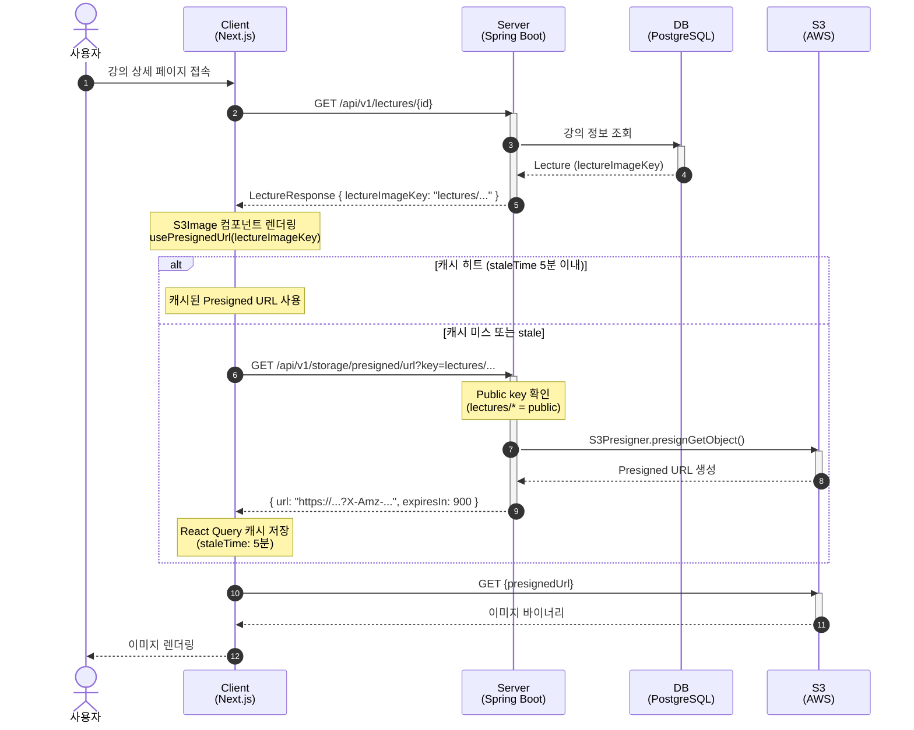

# Public 이미지 조회 - 시퀀스 다이어그램

## 참고사항

- Public 파일 (`lectures/*`, `organizations/*`, `banners/*`, `teachers/*`)은 인증 없이 접근 가능
- Presigned URL 만료(15분) 전에 React Query staleTime(5분)이 먼저 도래하여 자동 갱신
- S3에 직접 요청하므로 Server 부하 최소화
