# 설문조사 (Survey) - Sequence Diagram

## 1. 사용자 설문 흐름

### 1.1 기초 설문 작성 (Step 1)

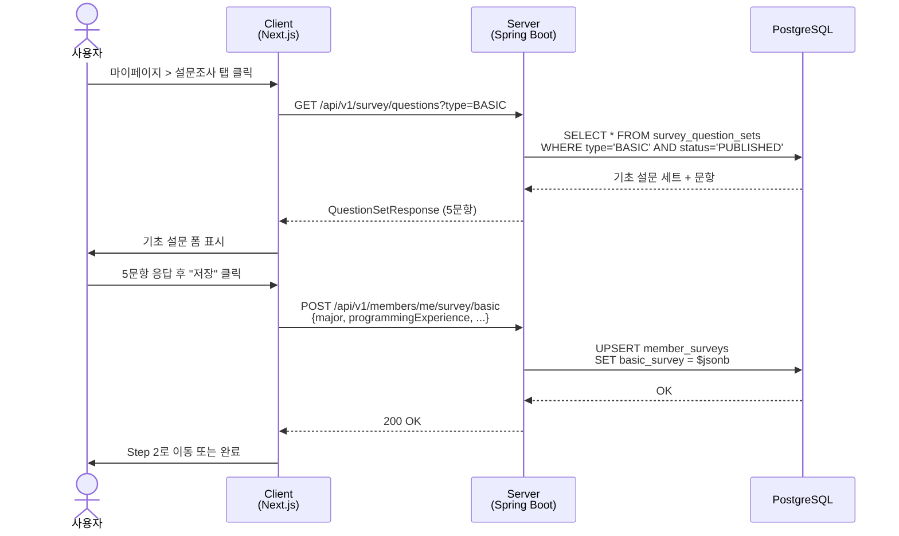

### 1.2 성향 테스트 응시 (Step 2)

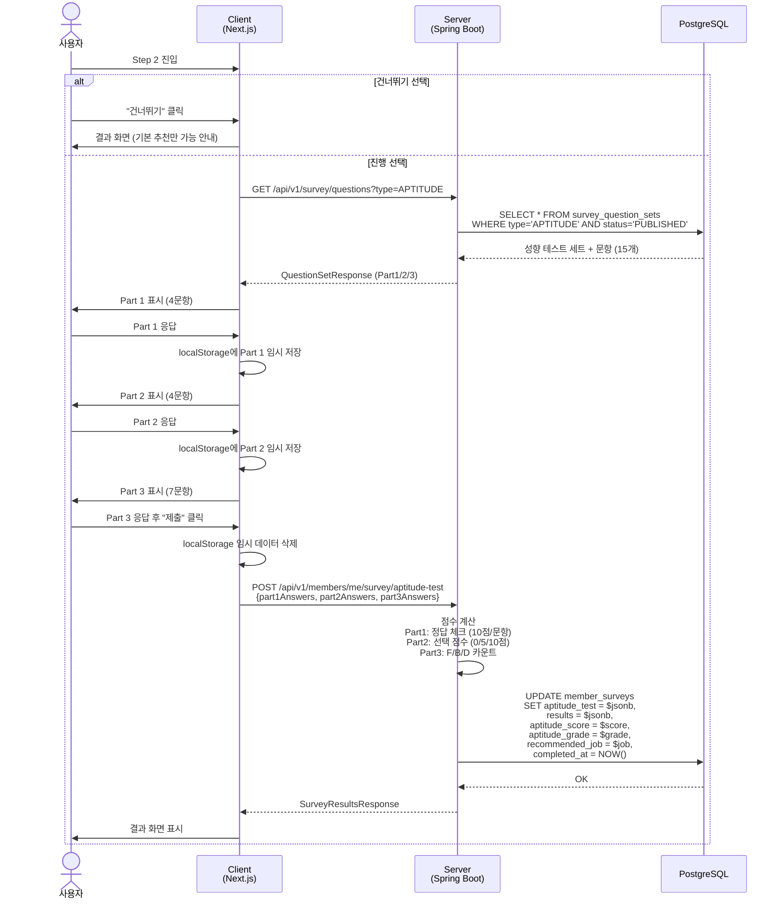

### 1.3 결과 확인 (Step 3)

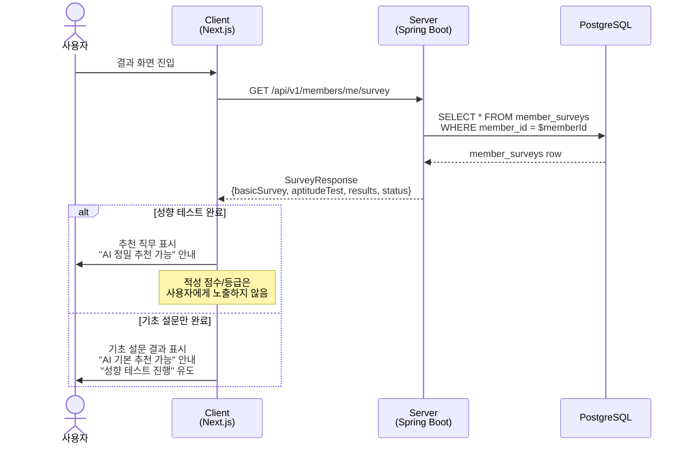

---

## 2. 어드민 문항 관리 흐름

### 2.1 문항 세트 생성 및 문항 추가

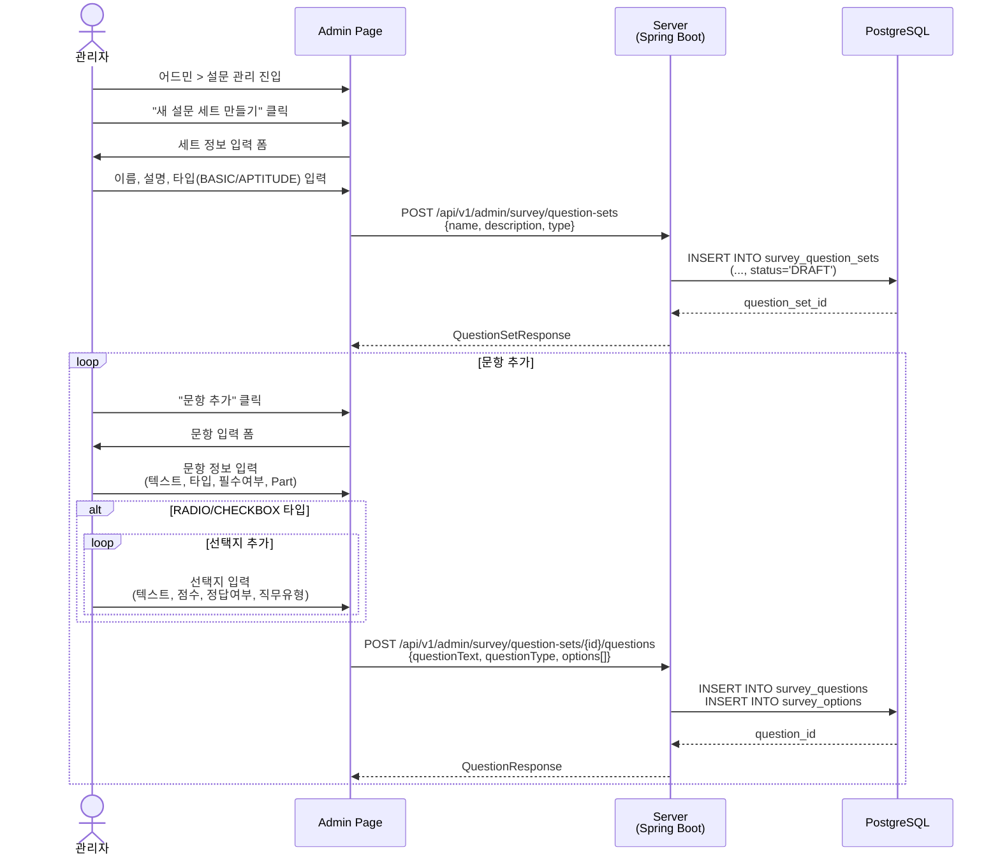

### 2.2 문항 세트 발행

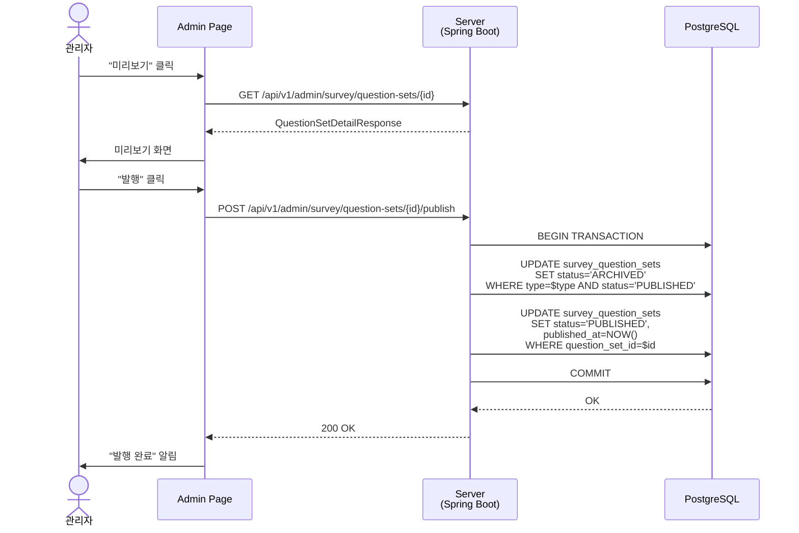

### 2.3 새 버전 생성

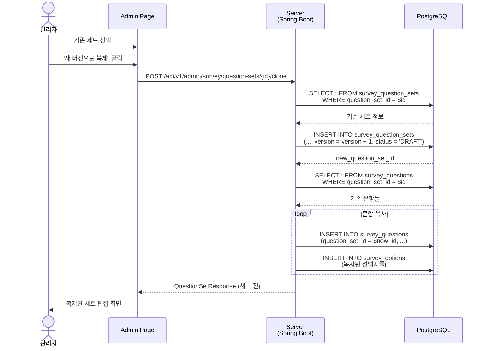

---

## 3. AI 추천 연동 흐름

### 3.1 기본 추천 (기초 설문만 완료)

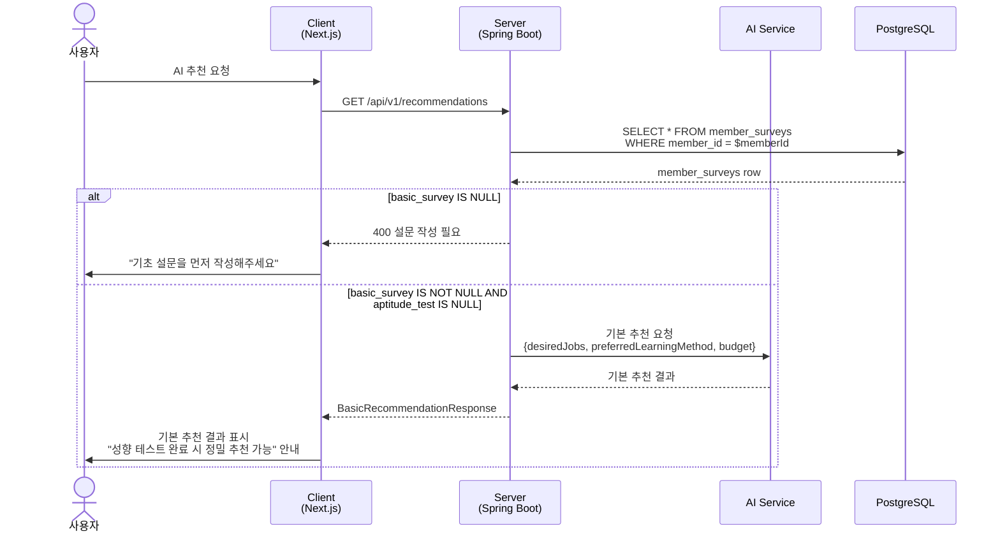

### 3.2 정밀 추천 (성향 테스트까지 완료)

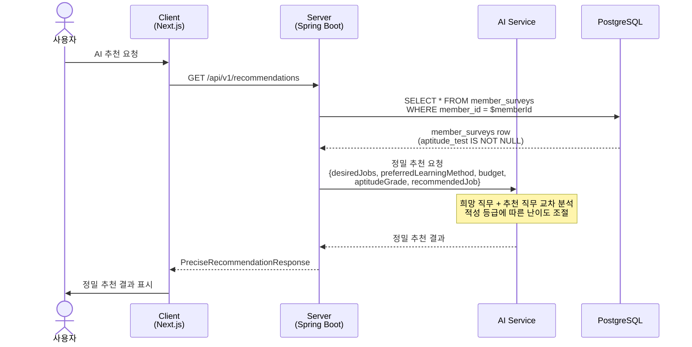

---

## 4. 점수 계산 흐름

### 4.1 성향 테스트 점수 계산 (서버 내부)

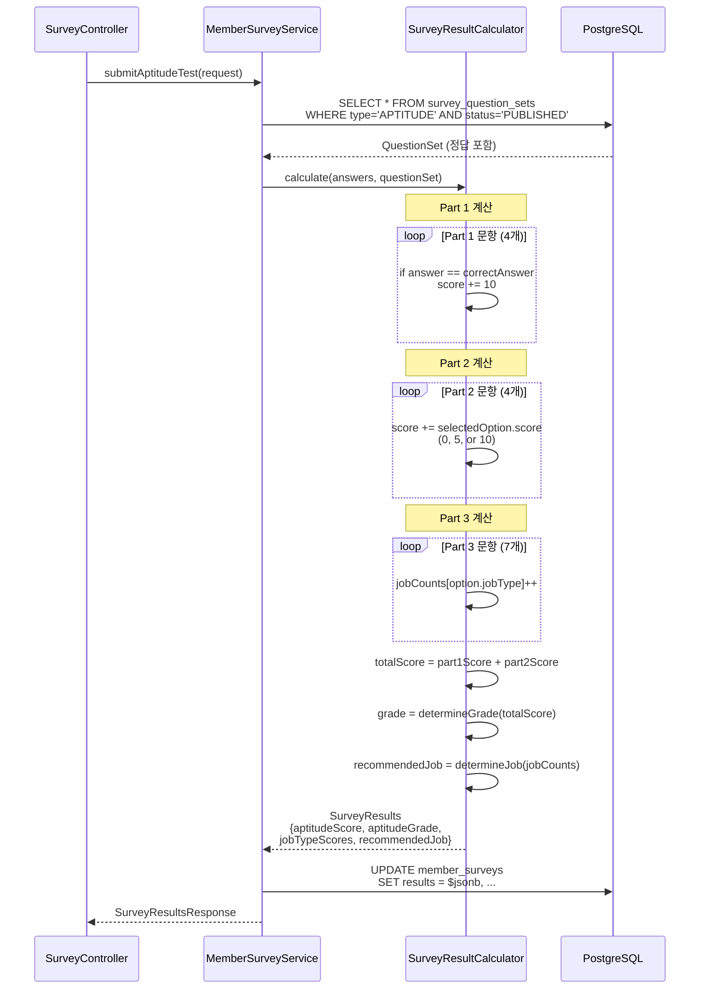

### 4.2 추천 직무 결정 (사용자에게 표시)

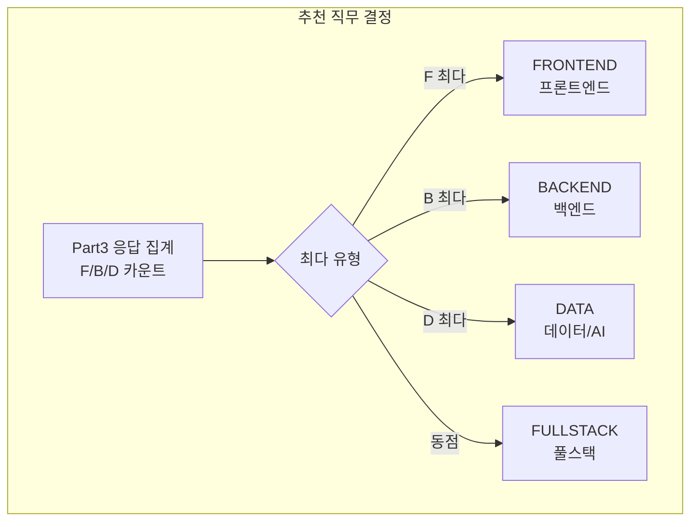

### 4.3 적성 점수 계산 (내부 활용 - AI 추천용)

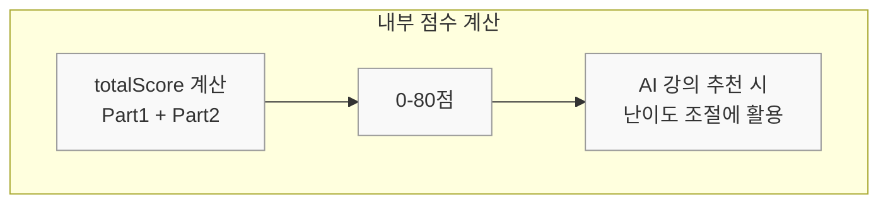

> **Note**: 적성 점수/등급은 사용자에게 노출하지 않습니다. AI 강의 추천 시 난이도 조절에만 내부적으로 활용됩니다.
