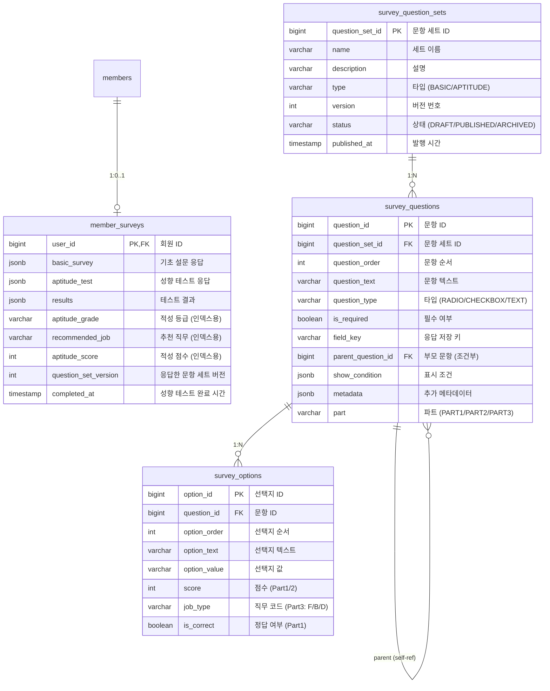

# 설문조사 (Survey) Spec

## 설계 결정

### 왜 JSONB 컬럼인가?

기존 시스템은 6개의 고정 컬럼(`major`, `bootcamp_completed`, `wanted_jobs`, `licenses`, `has_gov_card`, `affordable_amount`)으로 설문 응답을 저장했습니다.

**문제점**:
- 문항 추가/수정 시 DB 스키마 변경 필요
- 어드민 문항 관리 기능 구현 불가
- 조건부 문항 처리 어려움

**결정**: `basic_survey`, `aptitude_test`, `results`를 JSONB 컬럼으로 저장

**이점**:
- 문항 변경 시 스키마 변경 불필요
- 유연한 데이터 구조
- PostgreSQL JSONB 인덱싱 지원

**트레이드오프**:
- 중요 필드(`aptitude_grade`, `recommended_job`, `aptitude_score`)는 별도 컬럼으로 추출하여 인덱싱 (AI 추천 쿼리 성능)

---

### 왜 문항 세트 버전 관리인가?

어드민에서 문항을 수정할 수 있어야 합니다.

**문제점**:
- 기존 응답 데이터와 문항 일관성 유지 필요
- 발행된 문항 직접 수정 시 데이터 무결성 훼손

**결정**: DRAFT → PUBLISHED → ARCHIVED 상태 관리

**규칙**:
- 동일 type에서 PUBLISHED는 항상 1개만 존재
- DRAFT 상태에서만 문항 수정/삭제 가능
- 응답 저장 시 `question_set_version` 함께 저장
- 새 버전 필요 시 기존 세트 복제 후 수정

---

### 왜 서버 사이드 점수 계산인가?

성향 테스트 Part 1에는 정답이 있습니다.

**보안 요구사항**:
- Part 1 정답은 사용자에게 노출되면 안 됨
- 점수 조작 방지

**결정**: 모든 점수 계산은 서버에서 수행

**구현 방식**:
- 사용자 API 응답에서 `is_correct` 필드 제외
- 어드민 API에서만 정답 조회/설정 가능
- 클라이언트는 응답만 전송, 결과는 서버에서 반환

---

### 점수 체계 상세

#### Part별 점수 구조

| Part | 문항 수 | 점수 방식 | 가능한 점수 | 최대 점수 |
|------|--------|----------|------------|----------|
| Part 1 | 4문항 | 정답 시 10점, 오답 시 0점 | 0, 10, 20, 30, 40 | 40점 |
| Part 2 | 4문항 | 선택지별 0/5/10점 | 0, 5, 10, 15, 20, 25, 30, 35, 40 | 40점 |
| **총점** | 8문항 | Part 1 + Part 2 | 5점 단위 | 80점 |

#### 달성 가능한 총점

점수는 **5점 단위**로만 달성 가능합니다:

```
0, 5, 10, 15, 20, 25, 30, 35, 40, 45, 50, 55, 60, 65, 70, 75, 80
```

#### 등급별 실제 달성 가능 점수

| 등급 | 정의 범위 | 실제 가능 점수 |
|------|----------|---------------|
| RECONSIDER | 0-20점 | 0, 5, 10, 15, 20 |
| EXPLORING | 21-40점 | 25, 30, 35, 40 |
| DILIGENT | 41-60점 | 45, 50, 55, 60 |
| TALENTED | 61-80점 | 65, 70, 75, 80 |

> **참고**: 등급 경계값(21, 41, 61점)은 5점 단위 특성상 달성 불가능하지만, 모든 가능한 점수는 정확히 하나의 등급에 매핑되므로 기능상 문제 없음. 등급은 사용자에게 노출하지 않고 AI 추천에만 내부 활용.

---

### 왜 Step 방식 UI인가?

기초 설문(5문항) + 성향 테스트(15문항) = 총 20문항

**UX 고려사항**:
- 한 화면에 20문항은 사용자 이탈 유발
- 성향 테스트는 선택적
- 진행 상황 시각화 필요

**결정**: Step 1 (기초) → Step 2 (성향, 선택) → 결과

**AI 추천 연동**:
- Step 1 완료 시 기본 AI 추천 활성화
- Step 2 건너뛰기 옵션 제공
- Step 2 완료 시 정밀 AI 추천 활성화

---

### 왜 적성 점수/등급을 사용자에게 보여주지 않는가?

Part 1 + Part 2 점수를 합산해 등급(재능형, 노력형, 탐색형, 재고형)을 매기는 방식이 기존 기획이었습니다.

**문제점**:
- "재고형 - 냉정하게 다시 생각해 보세요"는 사용자에게 부정적 판단
- 이 서비스의 목적은 **강의 추천**인데, "개발 적성 없음"이라고 판단하면 이탈 유발
- 15문항으로 개발자 적성을 평가하는 것 자체가 타당한지 의문
- 등급명을 긍정적으로 바꿔도 점수 기반 서열화 구조는 그대로

**핵심 인사이트**: 이 테스트의 목적은 **"평가"가 아니라 "분류"**여야 함

**결정**:
- 적성 점수/등급은 사용자에게 노출하지 않음
- Part 3 기반 **추천 직무**만 사용자에게 표시
- 점수는 AI 추천 시 강의 난이도 조절에 내부적으로만 활용

**효과**:
- 사용자는 부정적 판단 없이 직무 추천만 받음

**적성 점수 내부 활용 방식**:
- AI 프롬프트에 참고 정보로 전달 (강제 필터링 아님)
- 점수가 낮은 편이면 멘토링 지원 강한 강의를 살짝 더 추천
- 비슷한 조건일 때 가중치 부여 정도, 강의 배제/강제 없음

---

### 왜 성향 테스트 임시 저장은 localStorage인가?

성향 테스트는 15문항으로, 중간 이탈 가능성이 있습니다.

**검토한 옵션**:
1. 한 번에 제출 - 중간 이탈 시 처음부터 다시
2. Part별 서버 저장 - 불완전 데이터 처리 복잡, API 추가 필요
3. localStorage 임시 저장 - 클라이언트에서 관리, 서버는 완전한 데이터만 수신

**결정**: localStorage 임시 저장

**이유**:
- 서버에 불완전한 데이터 저장 불필요
- 구현 단순 (클라이언트만 변경)
- 새로고침/브라우저 종료 후 복구 가능
- 제출은 한 번에 (점수 계산 로직 단순)

**한계**:
- 기기 변경 시 임시 데이터 유실 (허용 가능한 트레이드오프)

---

### 왜 기존 데이터를 삭제하는가?

**배경**: 기존 6개 컬럼 구조에서 JSONB 구조로 전환

**검토한 옵션**:
1. 기존 데이터 마이그레이션 - 문항 구조가 완전히 다름, 매핑 불가
2. 기존 데이터 삭제 - 깔끔한 시작

**결정**: 기존 응답 데이터 삭제

**이유**:
- 기존 6문항과 새 20문항은 구조/목적이 다름
- AI 추천 정확도를 위해 새 설문으로 재작성 유도
- 사용자 수가 적은 초기 단계

---

## ERD (Entity Relationship Diagram)



### 테이블 설명

| 테이블 | 설명 |
|--------|------|
| `member_surveys` | 회원별 설문 응답. JSONB로 유연한 응답 저장, 중요 필드는 별도 컬럼으로 추출하여 인덱싱 |
| `survey_question_sets` | 문항 세트. 타입별(BASIC/APTITUDE) 버전 관리, 동일 타입에 PUBLISHED는 1개만 |
| `survey_questions` | 개별 문항. 성향 테스트는 PART1(정답형), PART2(점수형), PART3(직무성향) 구분 |
| `survey_options` | 문항별 선택지. Part별로 점수/정답/직무코드 등 다르게 활용 |

### JSONB 컬럼 구조

**basic_survey** (기초 설문):
```json
{
  "majorInfo": { "hasMajor": true, "majorName": "컴퓨터공학" },
  "programmingExperience": { "hasExperience": true, "bootcampName": "삼성 SW" },
  "preferredLearningMethod": "OFFLINE",
  "desiredJobs": ["BACKEND", "DATA"],
  "affordableBudgetRange": "RANGE_100_200"
}
```

**aptitude_test** (성향 테스트 응답):
```json
{
  "part1Answers": { "q1": 2, "q2": 1, "q3": 2, "q4": 3 },
  "part2Answers": { "q5": 3, "q6": 2, "q7": 2, "q8": 3 },
  "part3Answers": { "q9": "B", "q10": "B", "q11": "D", ... }
}
```

**results** (테스트 결과):
```json
{
  "aptitudeScore": 65,
  "aptitudeGrade": "TALENTED",
  "jobTypeScores": { "B": 5, "F": 1, "D": 1 },
  "recommendedJob": "BACKEND"
}
```

---

## 구현 노트

### 2026-01-17 - JSONB 기반 설문조사 리팩토링 [Server][Client]

- 배경: 고정 컬럼 구조에서 유연한 문항 관리가 필요
- 변경:
  - JSONB 컬럼으로 설문 데이터 저장 구조 변경 (`basic_survey`, `aptitude_test`, `results`)
  - 문항 세트 버전 관리 (DRAFT → PUBLISHED → ARCHIVED)
  - 동일 type에서 PUBLISHED는 항상 1개만 존재
- 관련: `MemberSurveyEntity.java`, `V8__refactor_member_surveys.sql`
- PR: Server #425

### 2026-01-17 - 성향 테스트 동적 검증 [Server][Client]

- 배경: 하드코딩된 문항 수(Part1=4, Part2=4, Part3=7) 대신 발행된 문항 세트 기반 검증 필요
- 변경:
  - Server: `MemberSurveyService.validateAptitudeTestAnswers()` 동적 검증 로직 추가
  - Server: `InvalidAptitudeTestAnswersException` 예외 클래스 추가
  - Client: `usePublishedQuestionSetQuery` 훅으로 문항 수 동적 조회
  - Client: Part3 < 5개 시 발행 경고 메시지 표시
- 관련: `MemberSurveyService.java`, `QuestionSetDetailModal.tsx`
- PR: Server #425, Client #217

### 2026-01-17 - 버전 기반 문항 검증 [Server][Client]

- 배경: 테스트 도중 관리자가 문항을 변경하면 응답 수 불일치 발생
- 변경:
  - Server: 제출 시 `questionSetVersion` 파라미터로 해당 버전의 문항 세트 검증
  - Server: `findByTypeAndVersionWithQuestions()` 메서드 추가
  - Client: 테스트 시작 시 버전을 localStorage에 저장
  - Client: 저장된 버전과 현재 발행 버전 불일치 시 진행 상황 초기화 + 토스트 알림
- 관련: `SurveyQuestionSetRepository.java`, `AptitudeTestStep.tsx`
- PR: Server #425, Client #217
