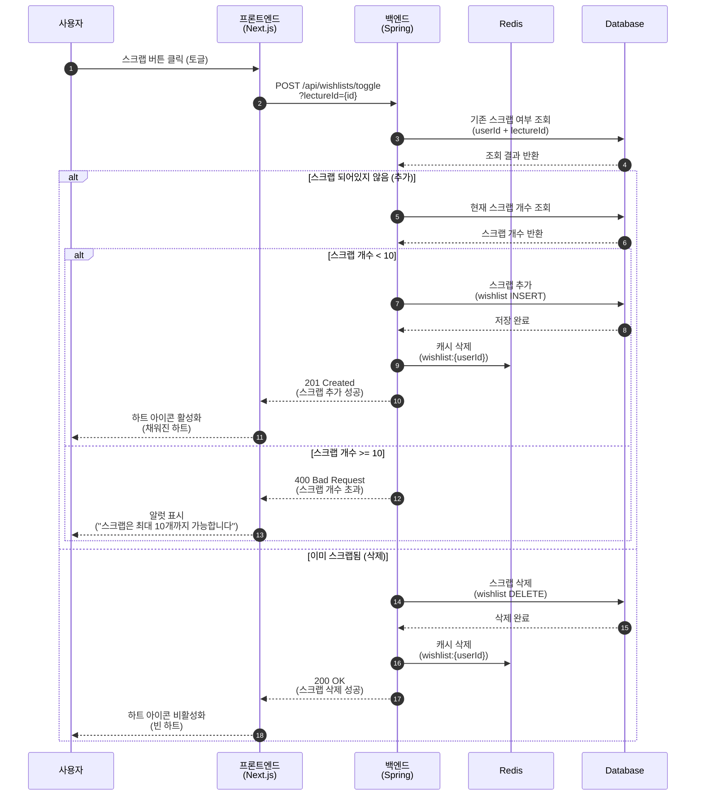
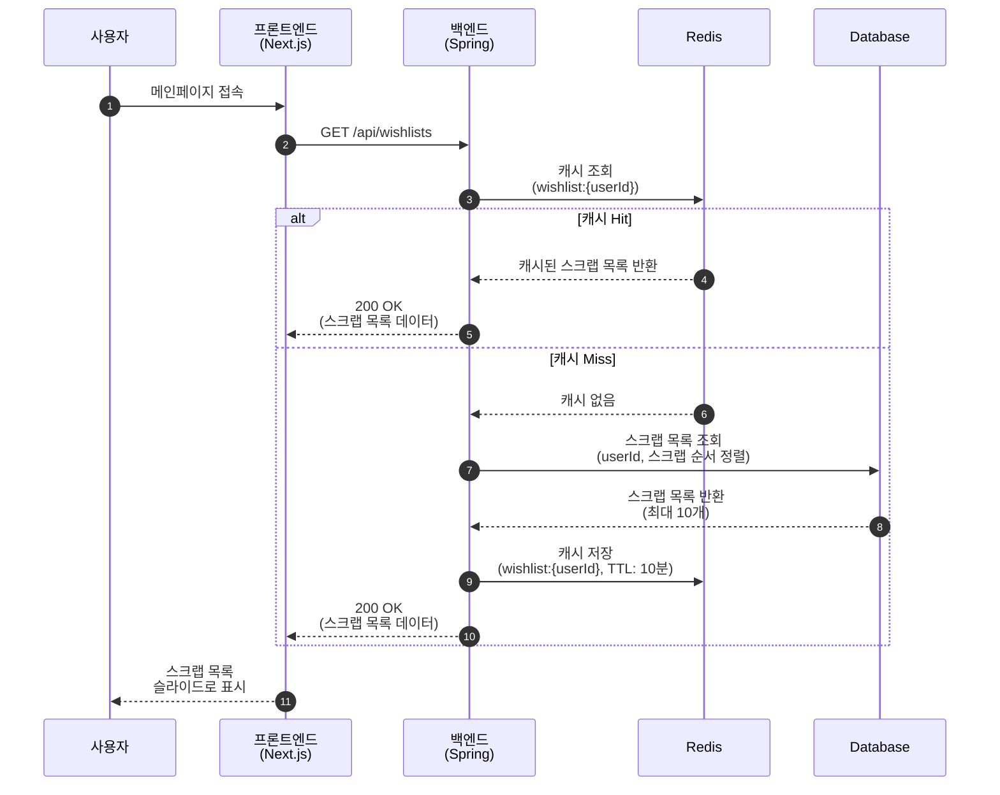
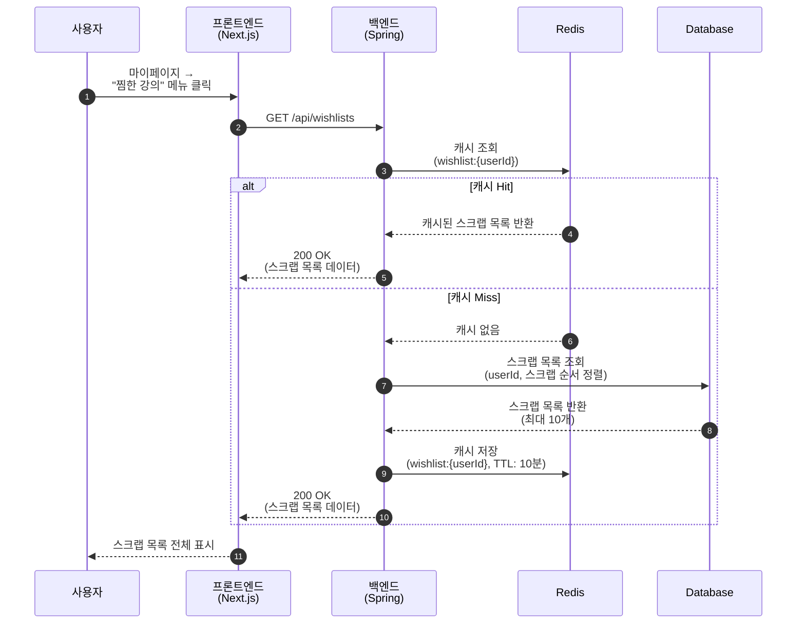
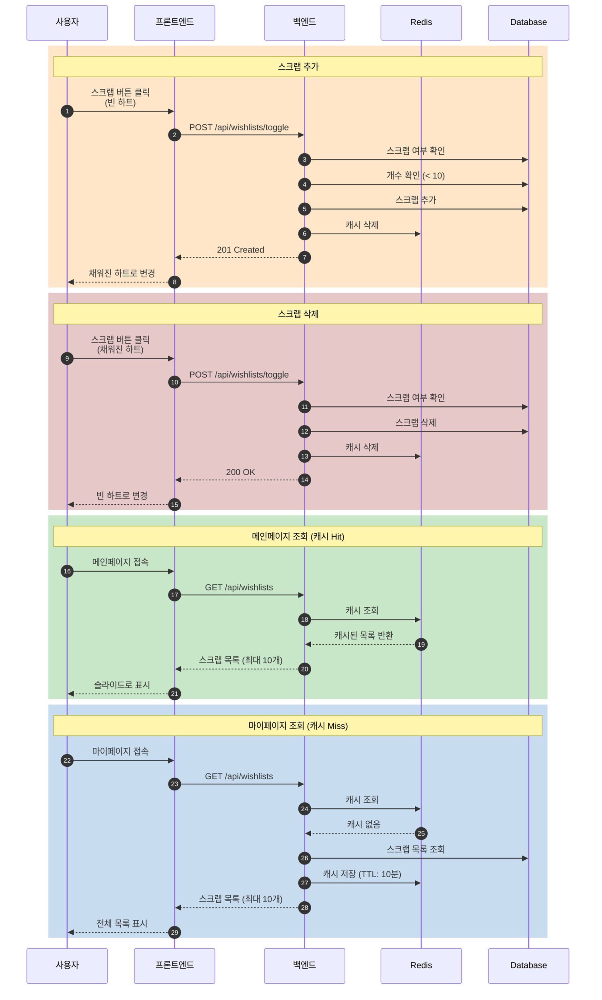

# LECTURE 스크랩 (찜) Sequence Diagrams

## 1. 스크랩 추가/삭제 (토글)

**접근 경로:**
- 강의 목록 페이지 → 스크랩 버튼 (하트 아이콘)
- 강의 상세 페이지 → 스크랩 버튼 (하트 아이콘)

---

## 2. 스크랩 목록 조회 (메인페이지)

---

## 3. 스크랩 목록 조회 (마이페이지)

---

## 4. 전체 스크랩 흐름 요약

