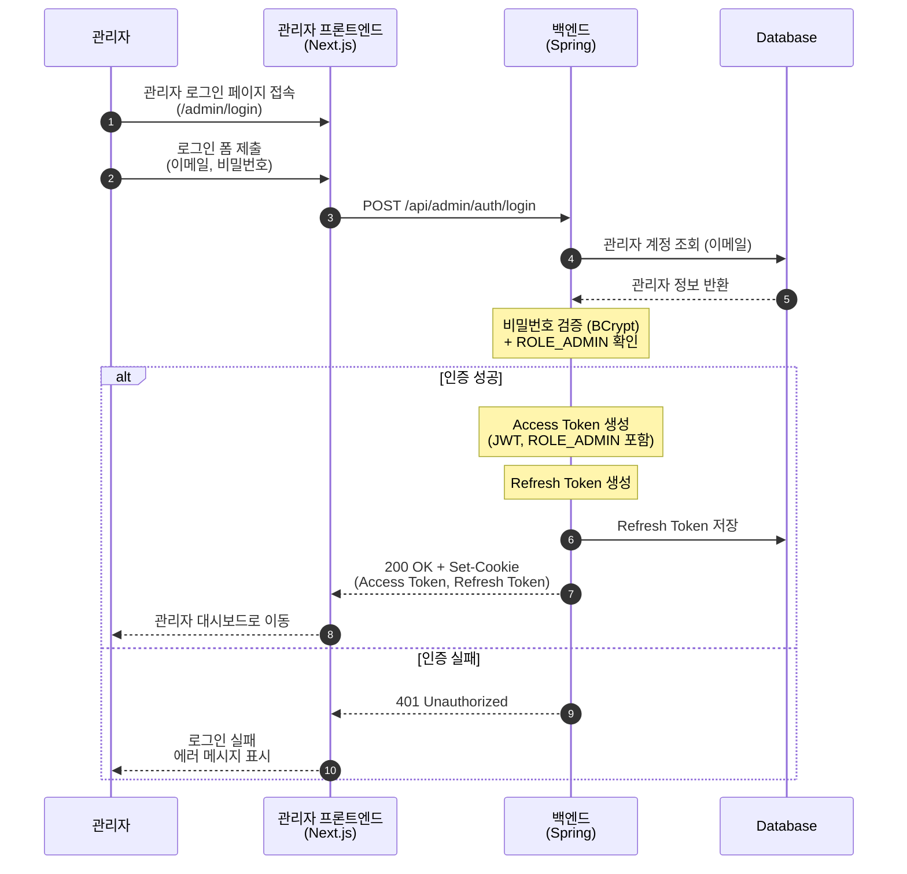
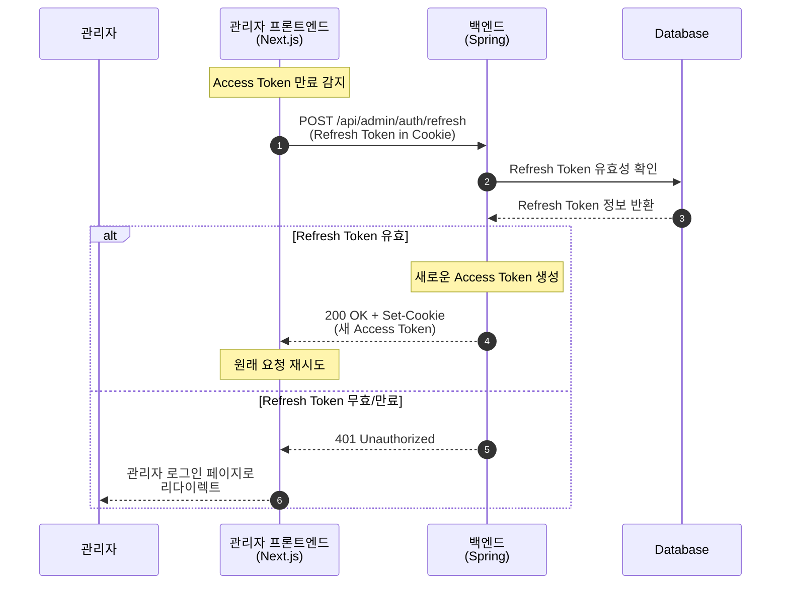
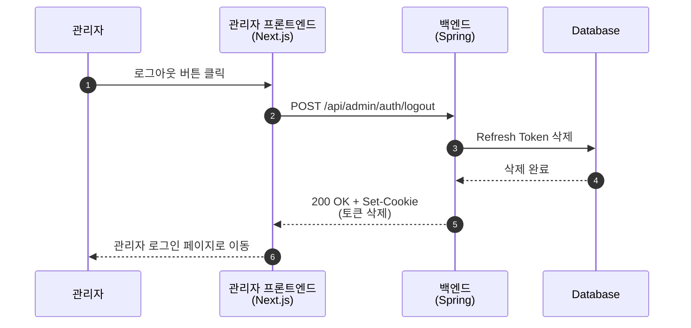
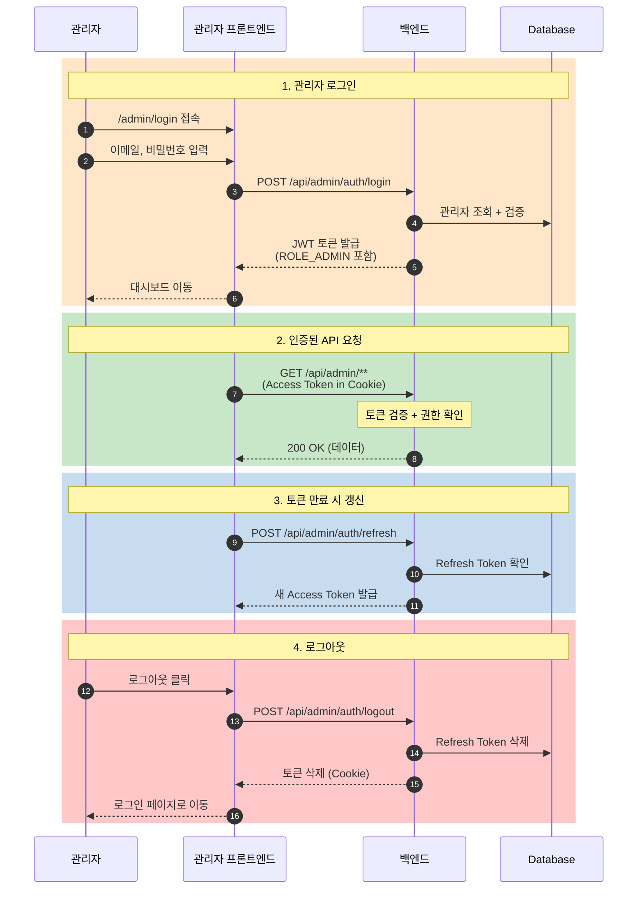

# 관리자 로그인 Sequence Diagrams

## 1. 관리자 로그인

```mermaid
sequenceDiagram
    autonumber
    participant Admin as 관리자
    participant AdminFE as 관리자 프론트엔드<br/>(Next.js)
    participant Backend as 백엔드<br/>(Spring)
    participant DB as Database

    Admin->>AdminFE: 관리자 로그인 페이지 접속<br/>(/admin/login)
    Admin->>AdminFE: 로그인 폼 제출<br/>(이메일, 비밀번호)
    AdminFE->>Backend: POST /api/admin/auth/login
    Backend->>DB: 관리자 계정 조회 (이메일)
    DB-->>Backend: 관리자 정보 반환

    Note over Backend: 비밀번호 검증 (BCrypt)<br/>+ ROLE_ADMIN 확인

    alt 인증 성공
        Note over Backend: Access Token 생성<br/>(JWT, ROLE_ADMIN 포함)
        Note over Backend: Refresh Token 생성
        Backend->>DB: Refresh Token 저장
        Backend-->>AdminFE: 200 OK + Set-Cookie<br/>(Access Token, Refresh Token)
        AdminFE-->>Admin: 관리자 대시보드로 이동
    else 인증 실패
        Backend-->>AdminFE: 401 Unauthorized
        AdminFE-->>Admin: 로그인 실패<br/>에러 메시지 표시
    end
```

---

## 2. 관리자 토큰 갱신

```mermaid
sequenceDiagram
    autonumber
    participant Admin as 관리자
    participant AdminFE as 관리자 프론트엔드<br/>(Next.js)
    participant Backend as 백엔드<br/>(Spring)
    participant DB as Database

    Note over AdminFE: Access Token 만료 감지

    AdminFE->>Backend: POST /api/admin/auth/refresh<br/>(Refresh Token in Cookie)
    Backend->>DB: Refresh Token 유효성 확인
    DB-->>Backend: Refresh Token 정보 반환

    alt Refresh Token 유효
        Note over Backend: 새로운 Access Token 생성
        Backend-->>AdminFE: 200 OK + Set-Cookie<br/>(새 Access Token)
        Note over AdminFE: 원래 요청 재시도
    else Refresh Token 무효/만료
        Backend-->>AdminFE: 401 Unauthorized
        AdminFE-->>Admin: 관리자 로그인 페이지로<br/>리다이렉트
    end
```

---

## 3. 관리자 로그아웃

```mermaid
sequenceDiagram
    autonumber
    participant Admin as 관리자
    participant AdminFE as 관리자 프론트엔드<br/>(Next.js)
    participant Backend as 백엔드<br/>(Spring)
    participant DB as Database

    Admin->>AdminFE: 로그아웃 버튼 클릭
    AdminFE->>Backend: POST /api/admin/auth/logout
    Backend->>DB: Refresh Token 삭제
    DB-->>Backend: 삭제 완료
    Backend-->>AdminFE: 200 OK + Set-Cookie<br/>(토큰 삭제)
    AdminFE-->>Admin: 관리자 로그인 페이지로 이동
```

---

## 4. 전체 관리자 인증 흐름 요약

```mermaid
sequenceDiagram
    autonumber
    participant Admin as 관리자
    participant AdminFE as 관리자 프론트엔드
    participant Backend as 백엔드
    participant DB as Database

    rect rgb(255, 230, 200)
        Note over Admin, DB: 1. 관리자 로그인
        Admin->>AdminFE: /admin/login 접속
        Admin->>AdminFE: 이메일, 비밀번호 입력
        AdminFE->>Backend: POST /api/admin/auth/login
        Backend->>DB: 관리자 조회 + 검증
        Backend-->>AdminFE: JWT 토큰 발급<br/>(ROLE_ADMIN 포함)
        AdminFE-->>Admin: 대시보드 이동
    end

    rect rgb(200, 230, 200)
        Note over Admin, DB: 2. 인증된 API 요청
        AdminFE->>Backend: GET /api/admin/**<br/>(Access Token in Cookie)
        Note over Backend: 토큰 검증 + 권한 확인
        Backend-->>AdminFE: 200 OK (데이터)
    end

    rect rgb(200, 220, 240)
        Note over Admin, DB: 3. 토큰 만료 시 갱신
        AdminFE->>Backend: POST /api/admin/auth/refresh
        Backend->>DB: Refresh Token 확인
        Backend-->>AdminFE: 새 Access Token 발급
    end

    rect rgb(255, 200, 200)
        Note over Admin, DB: 4. 로그아웃
        Admin->>AdminFE: 로그아웃 클릭
        AdminFE->>Backend: POST /api/admin/auth/logout
        Backend->>DB: Refresh Token 삭제
        Backend-->>AdminFE: 토큰 삭제 (Cookie)
        AdminFE-->>Admin: 로그인 페이지로 이동
    end
```
