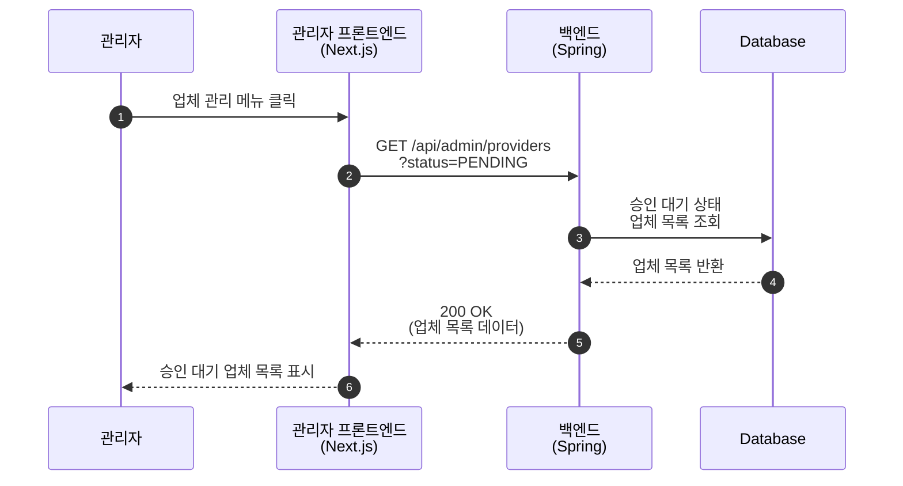
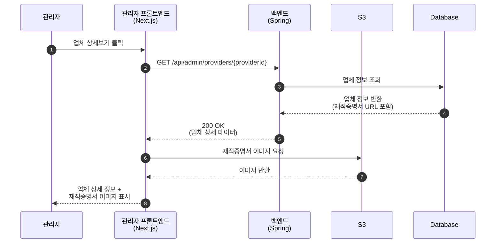
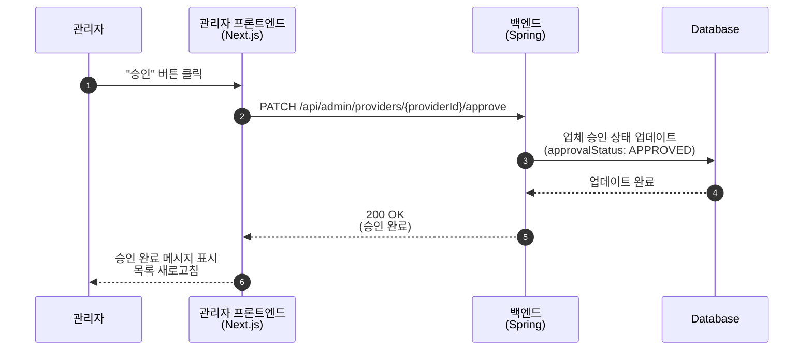
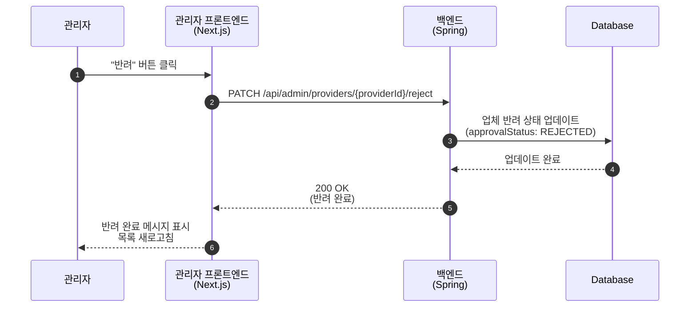
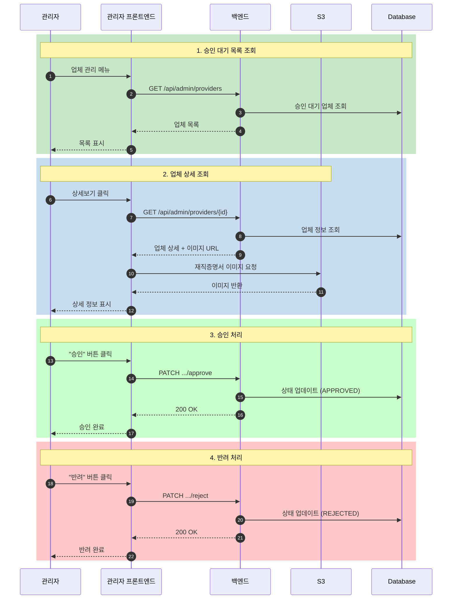

# 관리자 - 업체 승인 Sequence Diagrams

> **Note**: 관리자 로그인은 별도 로그인 페이지를 사용합니다. `admin_login_diagram.md` 참조

## 1. 승인 대기 업체 목록 조회

---

## 2. 업체 상세 정보 및 재직증명서 조회

---

## 3. 업체 승인

---

## 4. 업체 반려

---

## 5. 전체 업체 승인 흐름 요약

