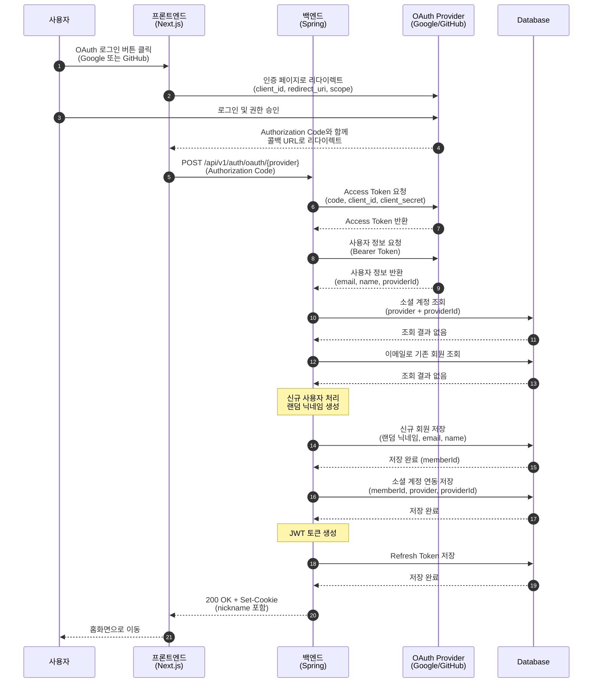
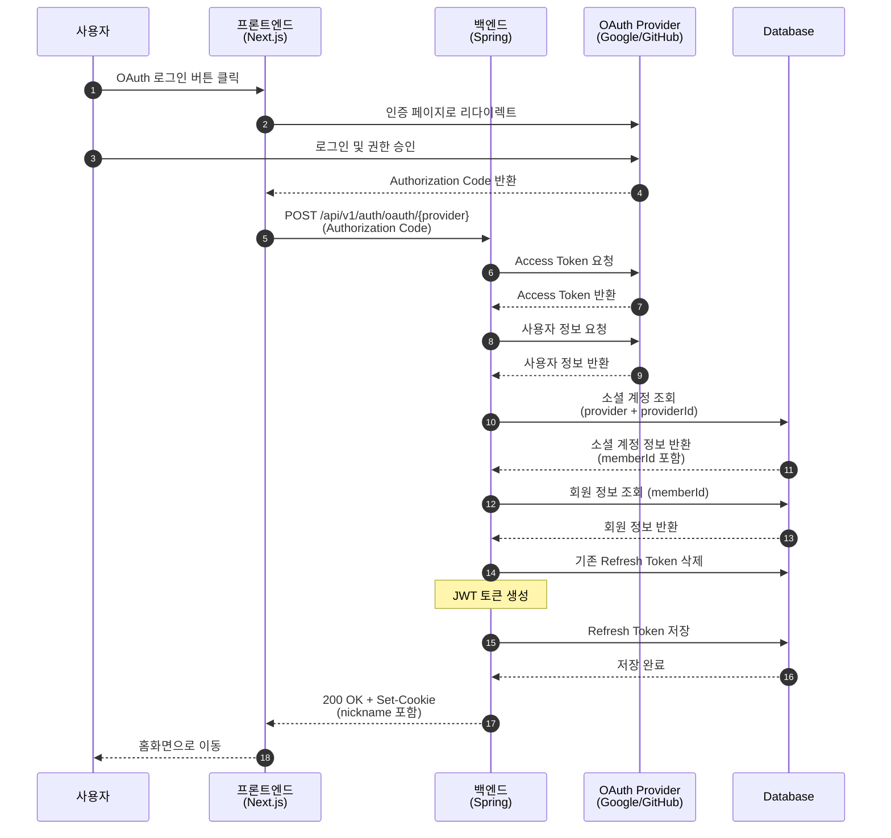
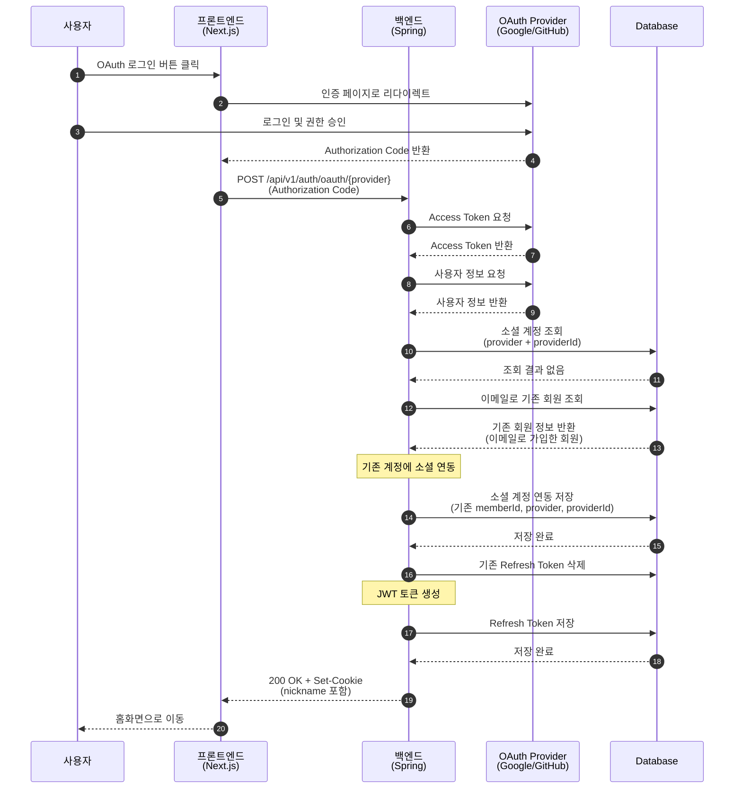
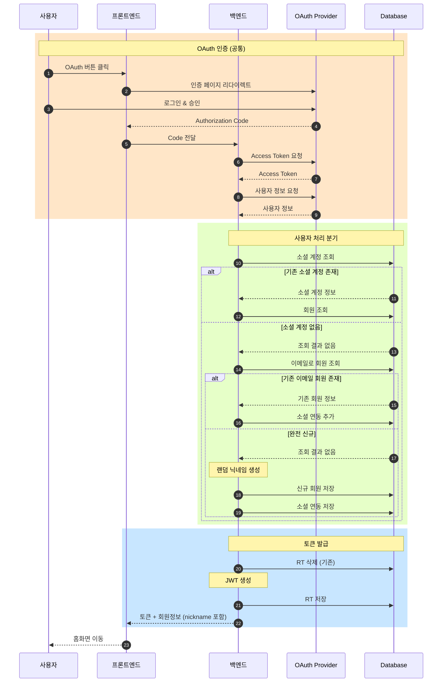
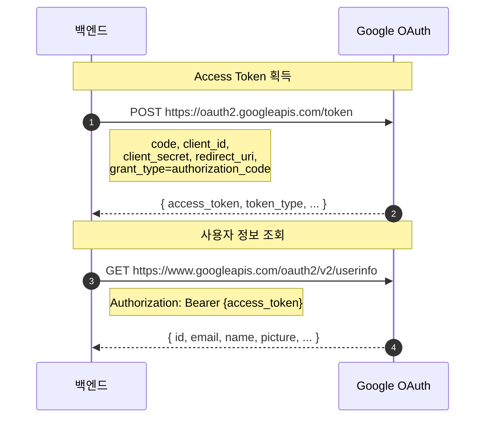
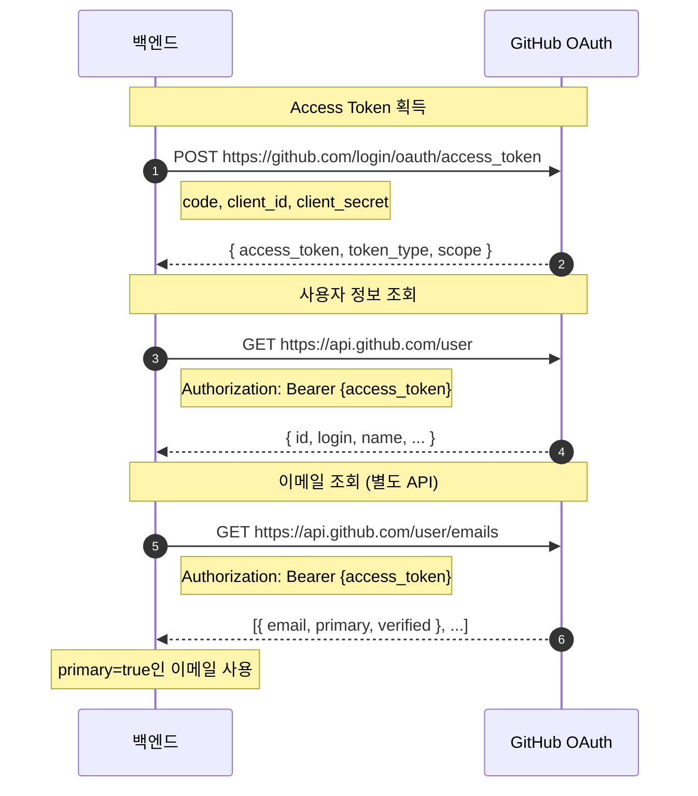

# OAuth 인증 시스템 Sequence Diagrams

## 1. OAuth 로그인 (신규 사용자)

---

## 2. OAuth 로그인 (기존 OAuth 사용자)

---

## 3. OAuth 로그인 (기존 이메일 사용자 - 소셜 연동)

---

## 4. 전체 OAuth 흐름 요약

---

## 5. OAuth Provider별 상세 흐름

### 5-1. Google OAuth

### 5-2. GitHub OAuth

