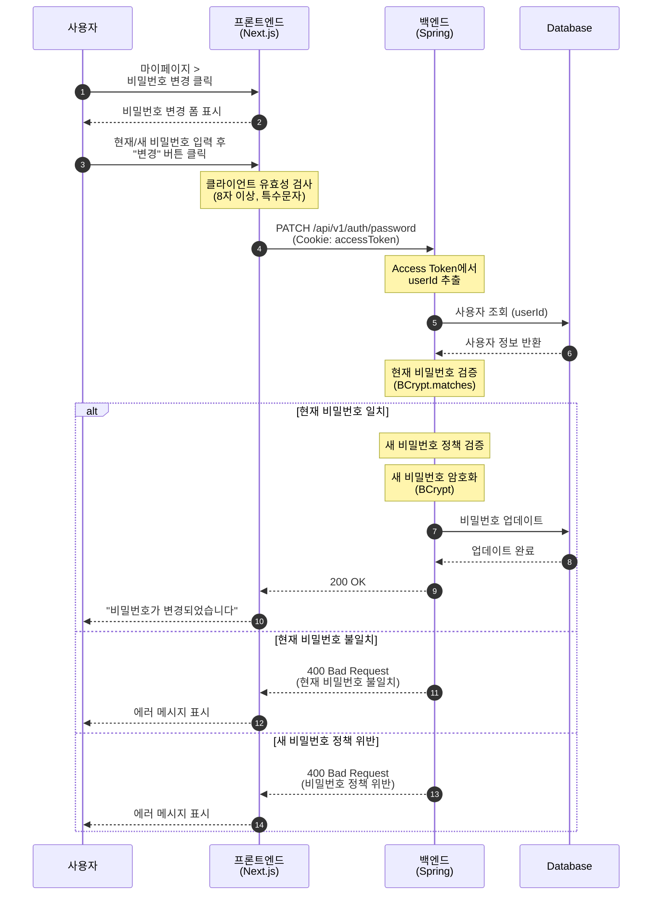
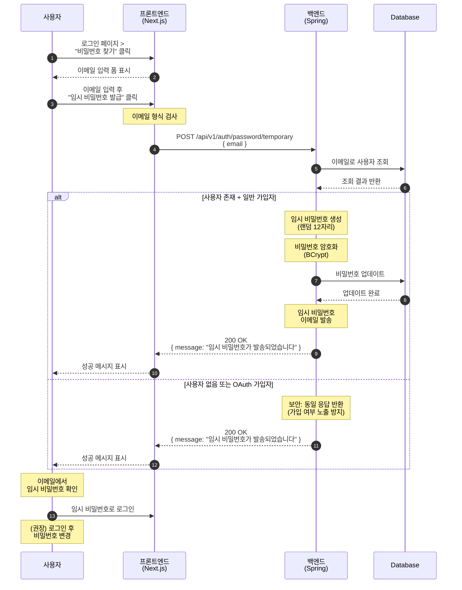
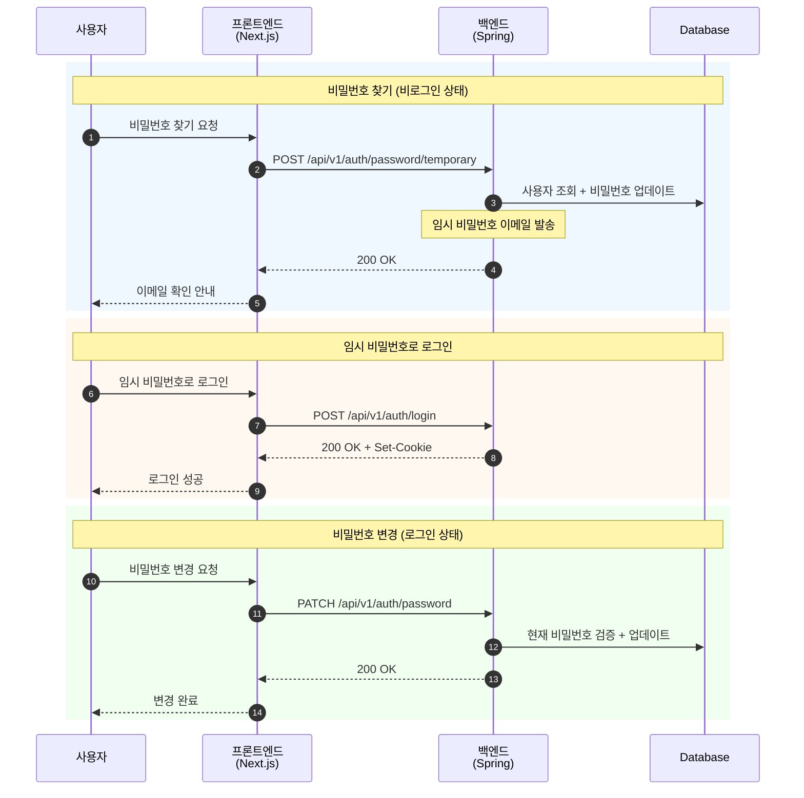
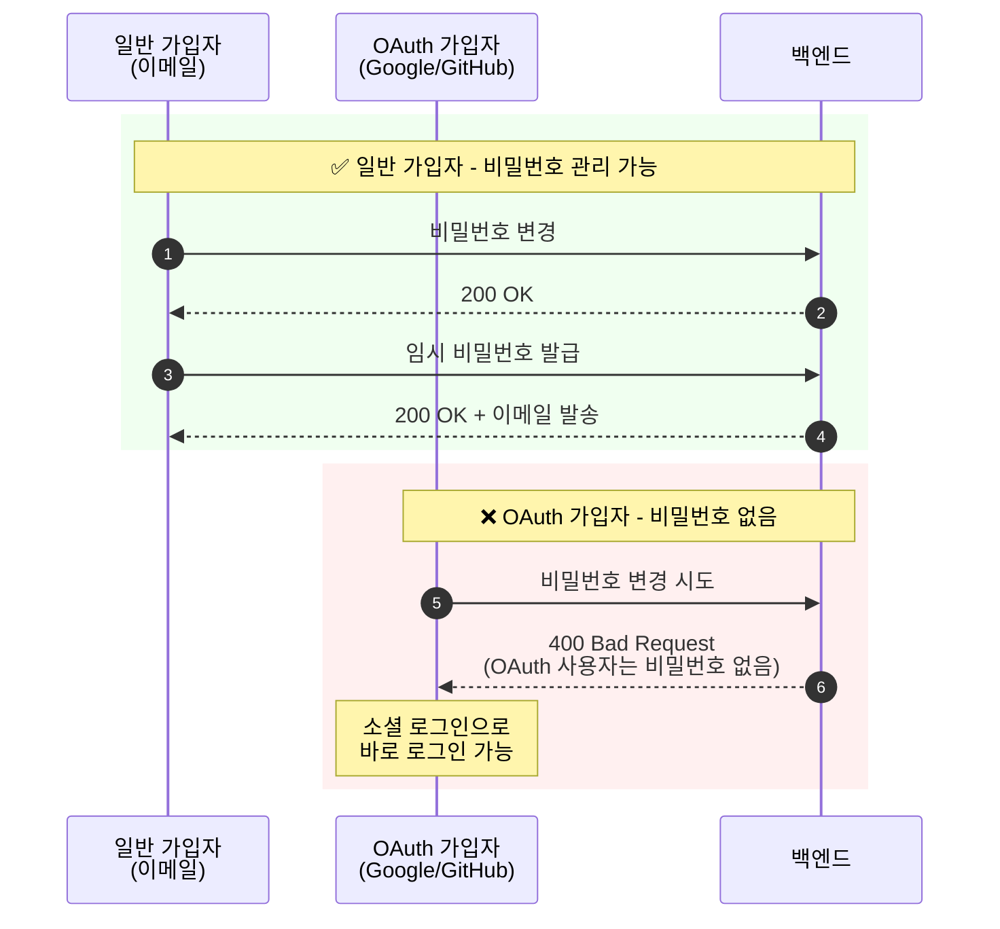

# 비밀번호 관리 Sequence Diagrams

## 1. 비밀번호 변경 (로그인 상태)

```mermaid
sequenceDiagram
    autonumber
    participant User as 사용자
    participant Frontend as 프론트엔드<br/>(Next.js)
    participant Backend as 백엔드<br/>(Spring)
    participant DB as Database

    User->>Frontend: 마이페이지 ><br/>비밀번호 변경 클릭
    Frontend-->>User: 비밀번호 변경 폼 표시

    User->>Frontend: 현재/새 비밀번호 입력 후<br/>"변경" 버튼 클릭
    
    Note over Frontend: 클라이언트 유효성 검사<br/>(8자 이상, 특수문자)

    Frontend->>Backend: PATCH /api/v1/auth/password<br/>(Cookie: accessToken)

    Note over Backend: Access Token에서<br/>userId 추출

    Backend->>DB: 사용자 조회 (userId)
    DB-->>Backend: 사용자 정보 반환

    Note over Backend: 현재 비밀번호 검증<br/>(BCrypt.matches)

    alt 현재 비밀번호 일치
        Note over Backend: 새 비밀번호 정책 검증
        Note over Backend: 새 비밀번호 암호화<br/>(BCrypt)
        
        Backend->>DB: 비밀번호 업데이트
        DB-->>Backend: 업데이트 완료
        Backend-->>Frontend: 200 OK
        Frontend-->>User: "비밀번호가 변경되었습니다"

    else 현재 비밀번호 불일치
        Backend-->>Frontend: 400 Bad Request<br/>(현재 비밀번호 불일치)
        Frontend-->>User: 에러 메시지 표시

    else 새 비밀번호 정책 위반
        Backend-->>Frontend: 400 Bad Request<br/>(비밀번호 정책 위반)
        Frontend-->>User: 에러 메시지 표시
    end
```

---

## 2. 임시 비밀번호 발급 (비밀번호 찾기)

```mermaid
sequenceDiagram
    autonumber
    participant User as 사용자
    participant Frontend as 프론트엔드<br/>(Next.js)
    participant Backend as 백엔드<br/>(Spring)
    participant DB as Database

    User->>Frontend: 로그인 페이지 ><br/>"비밀번호 찾기" 클릭
    Frontend-->>User: 이메일 입력 폼 표시

    User->>Frontend: 이메일 입력 후<br/>"임시 비밀번호 발급" 클릭
    
    Note over Frontend: 이메일 형식 검사

    Frontend->>Backend: POST /api/v1/auth/password/temporary<br/>{ email }

    Backend->>DB: 이메일로 사용자 조회
    DB-->>Backend: 조회 결과 반환

    alt 사용자 존재 + 일반 가입자
        Note over Backend: 임시 비밀번호 생성<br/>(랜덤 12자리)
        Note over Backend: 비밀번호 암호화<br/>(BCrypt)
        
        Backend->>DB: 비밀번호 업데이트
        DB-->>Backend: 업데이트 완료
        
        Note over Backend: 임시 비밀번호<br/>이메일 발송

        Backend-->>Frontend: 200 OK<br/>{ message: "임시 비밀번호가 발송되었습니다" }
        Frontend-->>User: 성공 메시지 표시

    else 사용자 없음 또는 OAuth 가입자
        Note over Backend: 보안: 동일 응답 반환<br/>(가입 여부 노출 방지)
        Backend-->>Frontend: 200 OK<br/>{ message: "임시 비밀번호가 발송되었습니다" }
        Frontend-->>User: 성공 메시지 표시
    end

    Note over User: 이메일에서<br/>임시 비밀번호 확인
    
    User->>Frontend: 임시 비밀번호로 로그인
    
    Note over User: (권장) 로그인 후<br/>비밀번호 변경
```

---

## 3. 전체 비밀번호 관리 흐름 요약

```mermaid
sequenceDiagram
    autonumber
    participant User as 사용자
    participant Frontend as 프론트엔드<br/>(Next.js)
    participant Backend as 백엔드<br/>(Spring)
    participant DB as Database

    rect rgb(240, 248, 255)
        Note over User,DB: 비밀번호 찾기 (비로그인 상태)
        User->>Frontend: 비밀번호 찾기 요청
        Frontend->>Backend: POST /api/v1/auth/password/temporary
        Backend->>DB: 사용자 조회 + 비밀번호 업데이트
        Note over Backend: 임시 비밀번호 이메일 발송
        Backend-->>Frontend: 200 OK
        Frontend-->>User: 이메일 확인 안내
    end

    rect rgb(255, 248, 240)
        Note over User,DB: 임시 비밀번호로 로그인
        User->>Frontend: 임시 비밀번호로 로그인
        Frontend->>Backend: POST /api/v1/auth/login
        Backend-->>Frontend: 200 OK + Set-Cookie
        Frontend-->>User: 로그인 성공
    end

    rect rgb(240, 255, 240)
        Note over User,DB: 비밀번호 변경 (로그인 상태)
        User->>Frontend: 비밀번호 변경 요청
        Frontend->>Backend: PATCH /api/v1/auth/password
        Backend->>DB: 현재 비밀번호 검증 + 업데이트
        Backend-->>Frontend: 200 OK
        Frontend-->>User: 변경 완료
    end
```

---

## 4. 적용 대상

```mermaid
sequenceDiagram
    autonumber
    participant EmailUser as 일반 가입자<br/>(이메일)
    participant OAuthUser as OAuth 가입자<br/>(Google/GitHub)
    participant Backend as 백엔드

    rect rgb(240, 255, 240)
        Note over EmailUser,Backend: ✅ 일반 가입자 - 비밀번호 관리 가능
        EmailUser->>Backend: 비밀번호 변경
        Backend-->>EmailUser: 200 OK
        EmailUser->>Backend: 임시 비밀번호 발급
        Backend-->>EmailUser: 200 OK + 이메일 발송
    end

    rect rgb(255, 240, 240)
        Note over OAuthUser,Backend: ❌ OAuth 가입자 - 비밀번호 없음
        OAuthUser->>Backend: 비밀번호 변경 시도
        Backend-->>OAuthUser: 400 Bad Request<br/>(OAuth 사용자는 비밀번호 없음)
        Note over OAuthUser: 소셜 로그인으로<br/>바로 로그인 가능
    end
```
