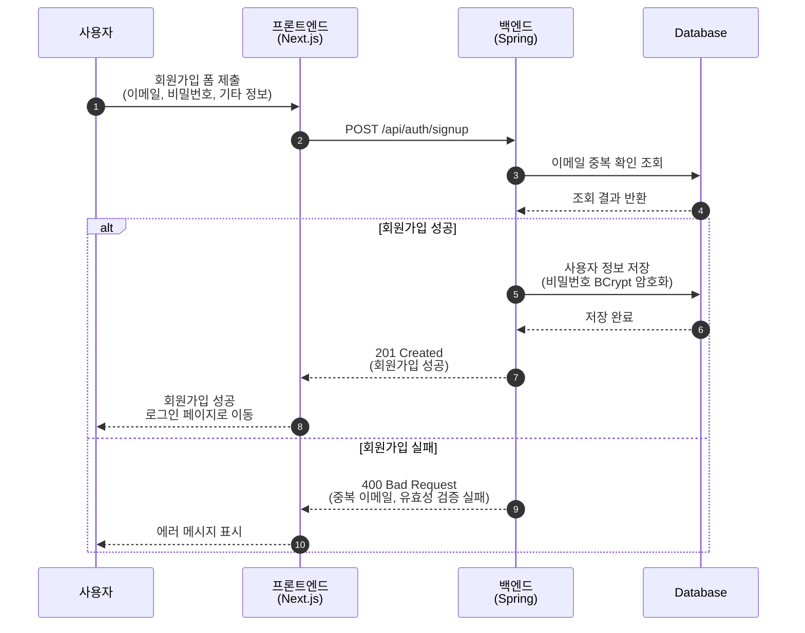
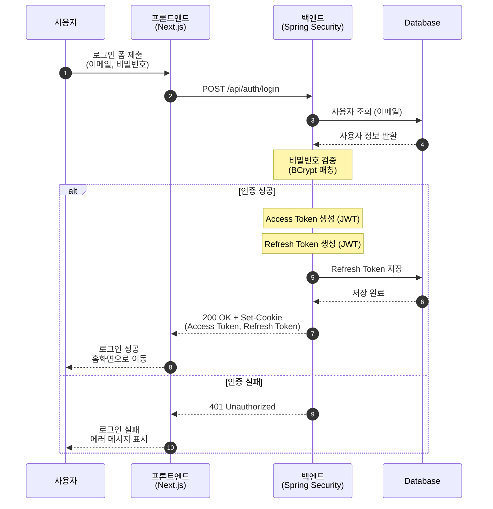
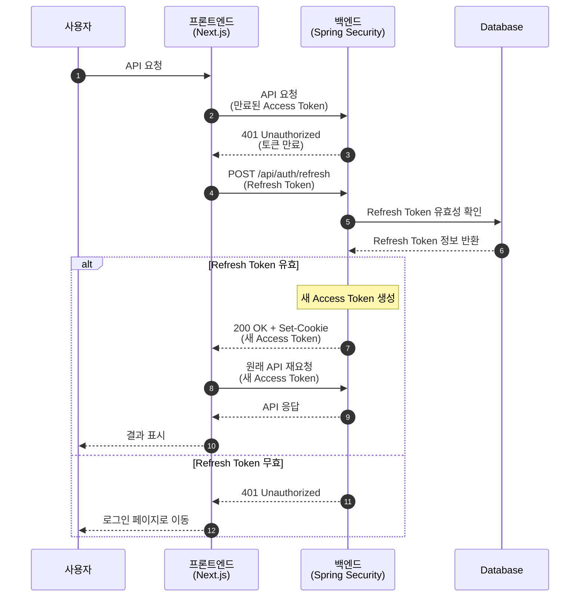
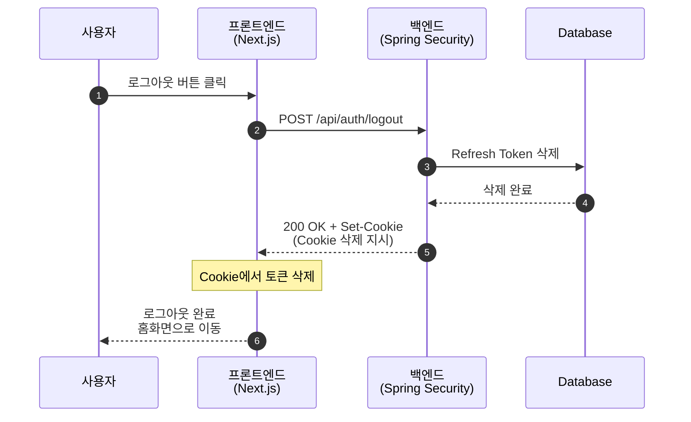
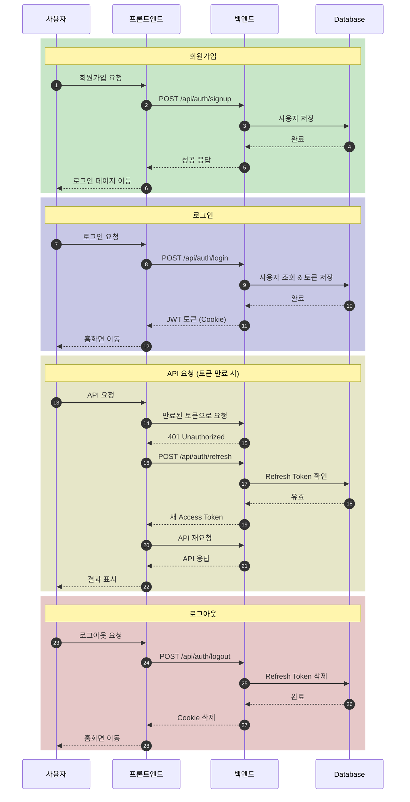

# 인증 시스템 Sequence Diagrams

## 1. 회원가입 (Sign Up)

```mermaid
sequenceDiagram
    autonumber
    participant User as 사용자
    participant Frontend as 프론트엔드<br/>(Next.js)
    participant Backend as 백엔드<br/>(Spring)
    participant DB as Database

    User->>Frontend: 회원가입 폼 제출<br/>(이메일, 비밀번호, 기타 정보)
    Frontend->>Backend: POST /api/auth/signup
    Backend->>DB: 이메일 중복 확인 조회
    DB-->>Backend: 조회 결과 반환

    alt 회원가입 성공
        Backend->>DB: 사용자 정보 저장<br/>(비밀번호 BCrypt 암호화)
        DB-->>Backend: 저장 완료
        Backend-->>Frontend: 201 Created<br/>(회원가입 성공)
        Frontend-->>User: 회원가입 성공<br/>로그인 페이지로 이동
    else 회원가입 실패
        Backend-->>Frontend: 400 Bad Request<br/>(중복 이메일, 유효성 검증 실패)
        Frontend-->>User: 에러 메시지 표시
    end
```

---

## 2. 로그인 (Login)

```mermaid
sequenceDiagram
    autonumber
    participant User as 사용자
    participant Frontend as 프론트엔드<br/>(Next.js)
    participant Backend as 백엔드<br/>(Spring Security)
    participant DB as Database

    User->>Frontend: 로그인 폼 제출<br/>(이메일, 비밀번호)
    Frontend->>Backend: POST /api/auth/login
    Backend->>DB: 사용자 조회 (이메일)
    DB-->>Backend: 사용자 정보 반환
    
    Note over Backend: 비밀번호 검증<br/>(BCrypt 매칭)

    alt 인증 성공
        Note over Backend: Access Token 생성 (JWT)
        Note over Backend: Refresh Token 생성 (JWT)
        Backend->>DB: Refresh Token 저장
        DB-->>Backend: 저장 완료
        Backend-->>Frontend: 200 OK + Set-Cookie<br/>(Access Token, Refresh Token)
        Frontend-->>User: 로그인 성공<br/>홈화면으로 이동
    else 인증 실패
        Backend-->>Frontend: 401 Unauthorized
        Frontend-->>User: 로그인 실패<br/>에러 메시지 표시
    end
```

---

## 3. 토큰 갱신 (Token Refresh)

```mermaid
sequenceDiagram
    autonumber
    participant User as 사용자
    participant Frontend as 프론트엔드<br/>(Next.js)
    participant Backend as 백엔드<br/>(Spring Security)
    participant DB as Database

    User->>Frontend: API 요청
    Frontend->>Backend: API 요청<br/>(만료된 Access Token)
    Backend-->>Frontend: 401 Unauthorized<br/>(토큰 만료)
    
    Frontend->>Backend: POST /api/auth/refresh<br/>(Refresh Token)
    Backend->>DB: Refresh Token 유효성 확인
    DB-->>Backend: Refresh Token 정보 반환

    alt Refresh Token 유효
        Note over Backend: 새 Access Token 생성
        Backend-->>Frontend: 200 OK + Set-Cookie<br/>(새 Access Token)
        Frontend->>Backend: 원래 API 재요청<br/>(새 Access Token)
        Backend-->>Frontend: API 응답
        Frontend-->>User: 결과 표시
    else Refresh Token 무효
        Backend-->>Frontend: 401 Unauthorized
        Frontend-->>User: 로그인 페이지로 이동
    end
```

---

## 4. 로그아웃 (Logout)

```mermaid
sequenceDiagram
    autonumber
    participant User as 사용자
    participant Frontend as 프론트엔드<br/>(Next.js)
    participant Backend as 백엔드<br/>(Spring Security)
    participant DB as Database

    User->>Frontend: 로그아웃 버튼 클릭
    Frontend->>Backend: POST /api/auth/logout
    Backend->>DB: Refresh Token 삭제
    DB-->>Backend: 삭제 완료
    Backend-->>Frontend: 200 OK + Set-Cookie<br/>(Cookie 삭제 지시)
    
    Note over Frontend: Cookie에서 토큰 삭제
    
    Frontend-->>User: 로그아웃 완료<br/>홈화면으로 이동
```

---

## 전체 인증 흐름 요약

```mermaid
sequenceDiagram
    autonumber
    participant User as 사용자
    participant Frontend as 프론트엔드
    participant Backend as 백엔드
    participant DB as Database

    rect rgb(200, 230, 200)
        Note over User, DB: 회원가입
        User->>Frontend: 회원가입 요청
        Frontend->>Backend: POST /api/auth/signup
        Backend->>DB: 사용자 저장
        DB-->>Backend: 완료
        Backend-->>Frontend: 성공 응답
        Frontend-->>User: 로그인 페이지 이동
    end

    rect rgb(200, 200, 230)
        Note over User, DB: 로그인
        User->>Frontend: 로그인 요청
        Frontend->>Backend: POST /api/auth/login
        Backend->>DB: 사용자 조회 & 토큰 저장
        DB-->>Backend: 완료
        Backend-->>Frontend: JWT 토큰 (Cookie)
        Frontend-->>User: 홈화면 이동
    end

    rect rgb(230, 230, 200)
        Note over User, DB: API 요청 (토큰 만료 시)
        User->>Frontend: API 요청
        Frontend->>Backend: 만료된 토큰으로 요청
        Backend-->>Frontend: 401 Unauthorized
        Frontend->>Backend: POST /api/auth/refresh
        Backend->>DB: Refresh Token 확인
        DB-->>Backend: 유효
        Backend-->>Frontend: 새 Access Token
        Frontend->>Backend: API 재요청
        Backend-->>Frontend: API 응답
        Frontend-->>User: 결과 표시
    end

    rect rgb(230, 200, 200)
        Note over User, DB: 로그아웃
        User->>Frontend: 로그아웃 요청
        Frontend->>Backend: POST /api/auth/logout
        Backend->>DB: Refresh Token 삭제
        DB-->>Backend: 완료
        Backend-->>Frontend: Cookie 삭제
        Frontend-->>User: 홈화면 이동
    end
```
