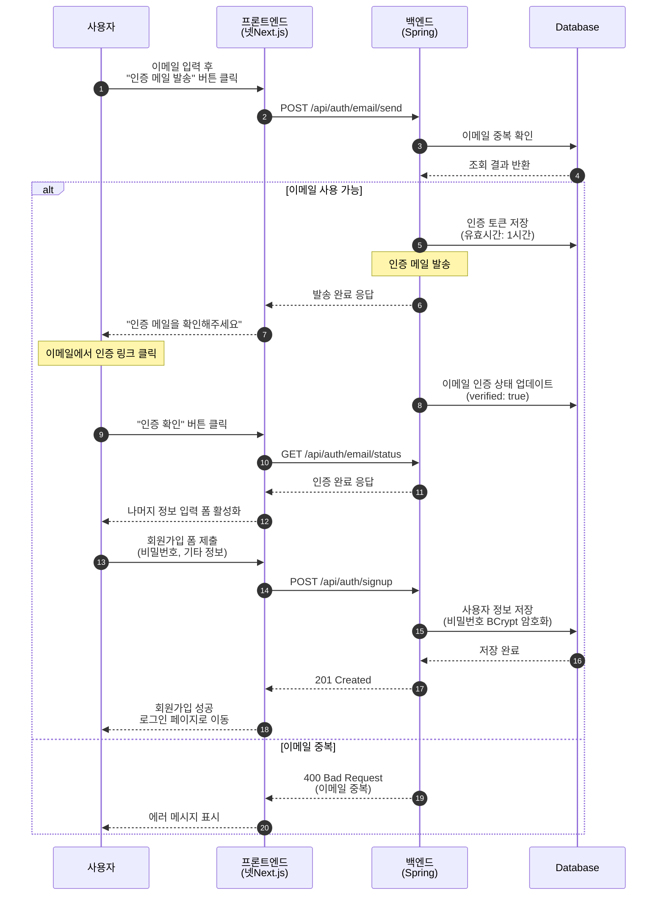
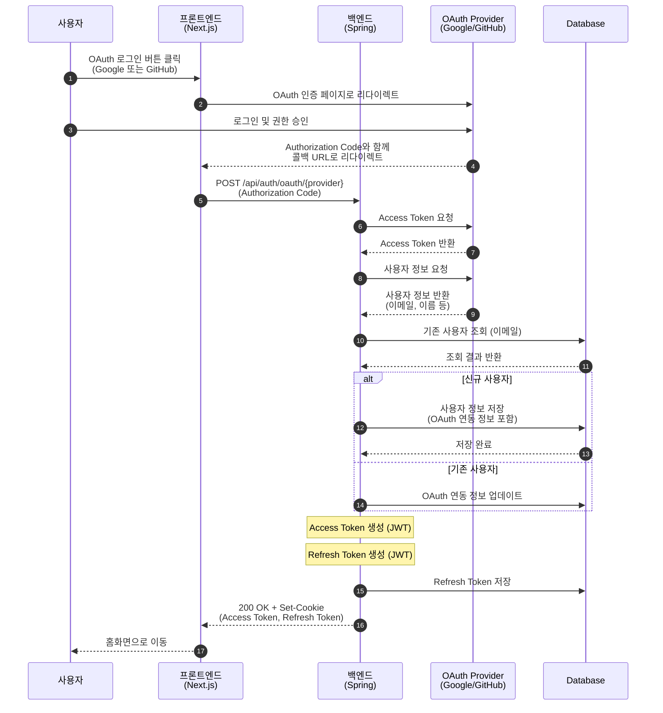
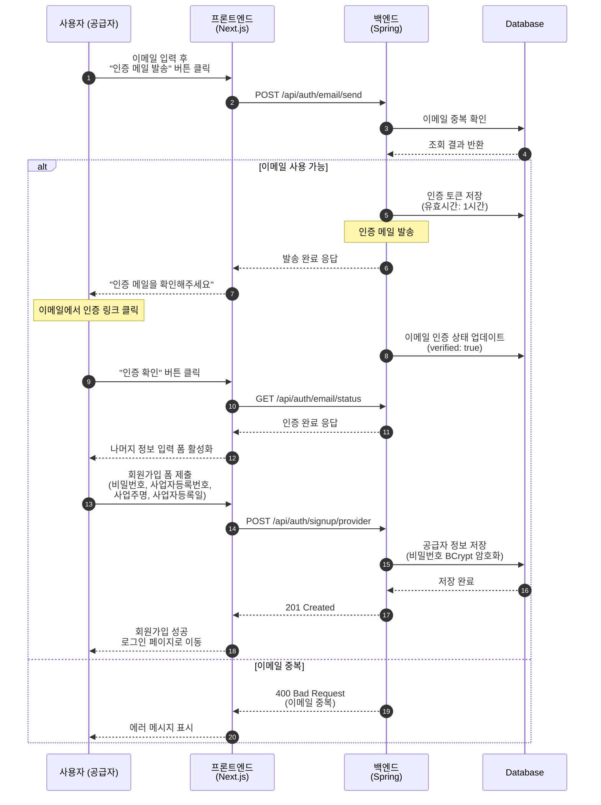
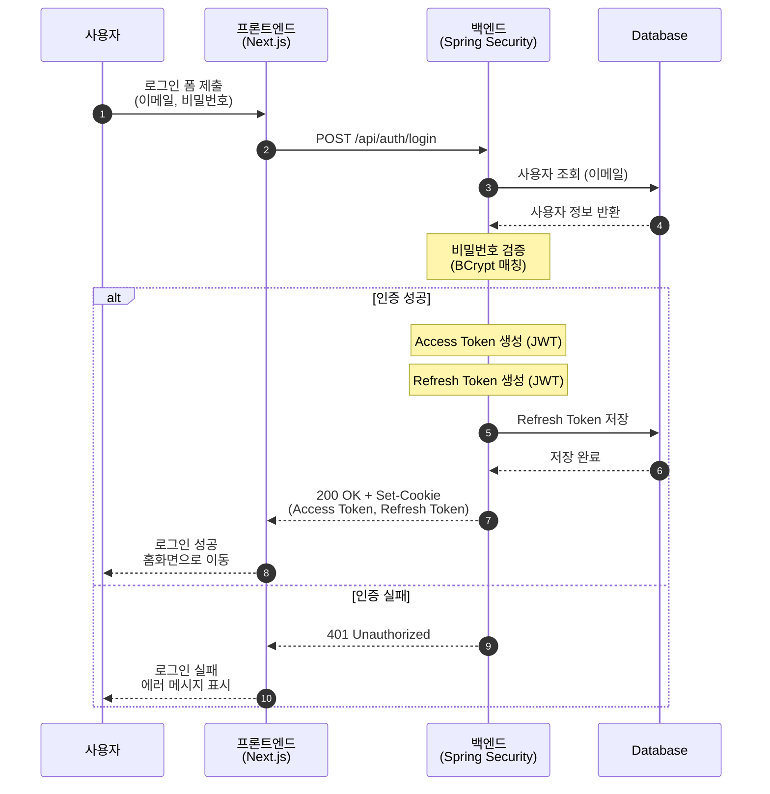
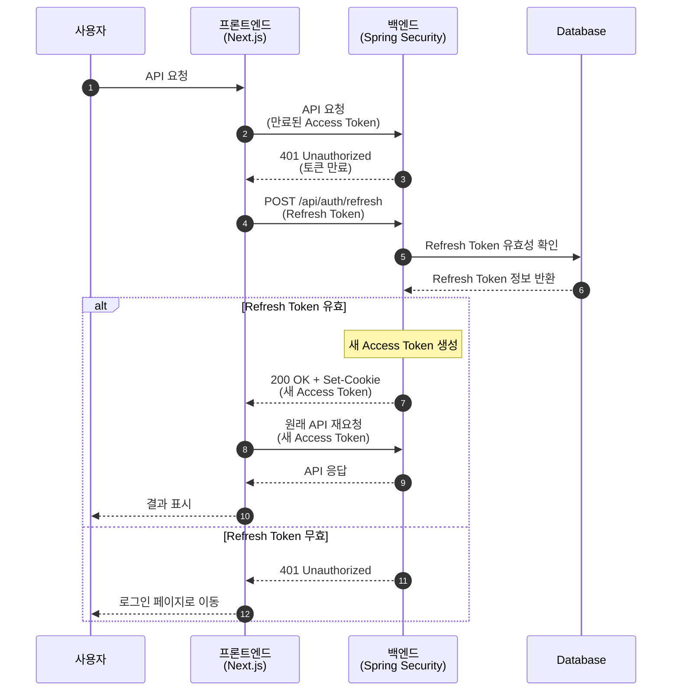
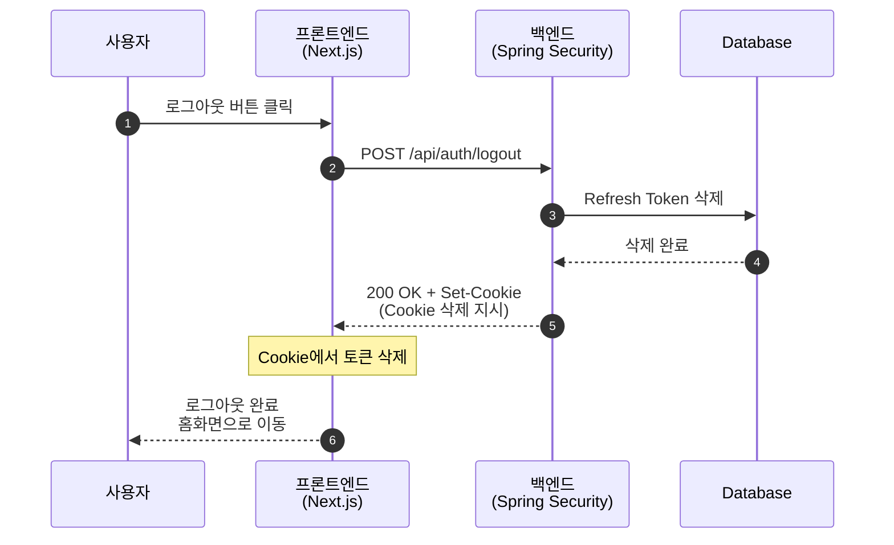
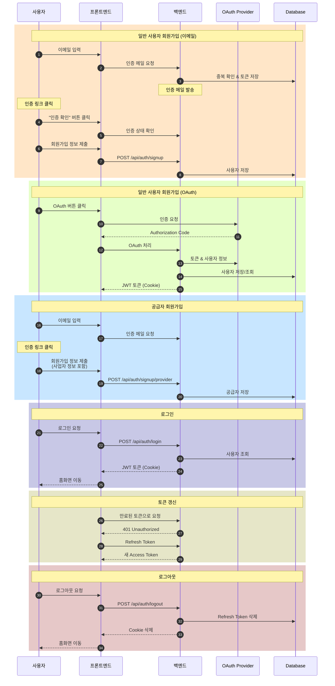

# 인증 시스템 Sequence Diagrams

## 1. 일반 사용자 회원가입 (이메일)

---

## 2. 일반 사용자 회원가입 (OAuth - Google, GitHub)

---

## 3. 공급자(Provider) 회원가입

---

## 4. 로그인 (Login)

---

## 5. 토큰 갱신 (Token Refresh)

---

## 6. 로그아웃 (Logout)

---

## 전체 인증 흐름 요약

