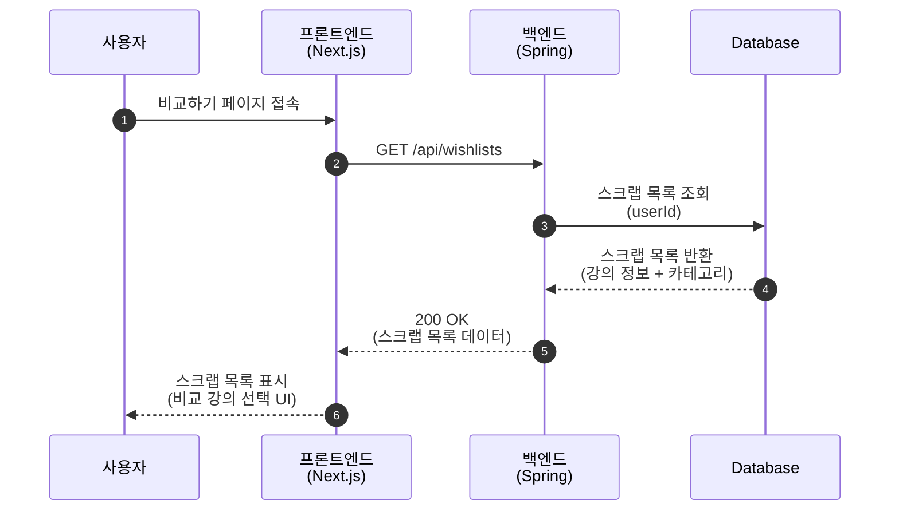
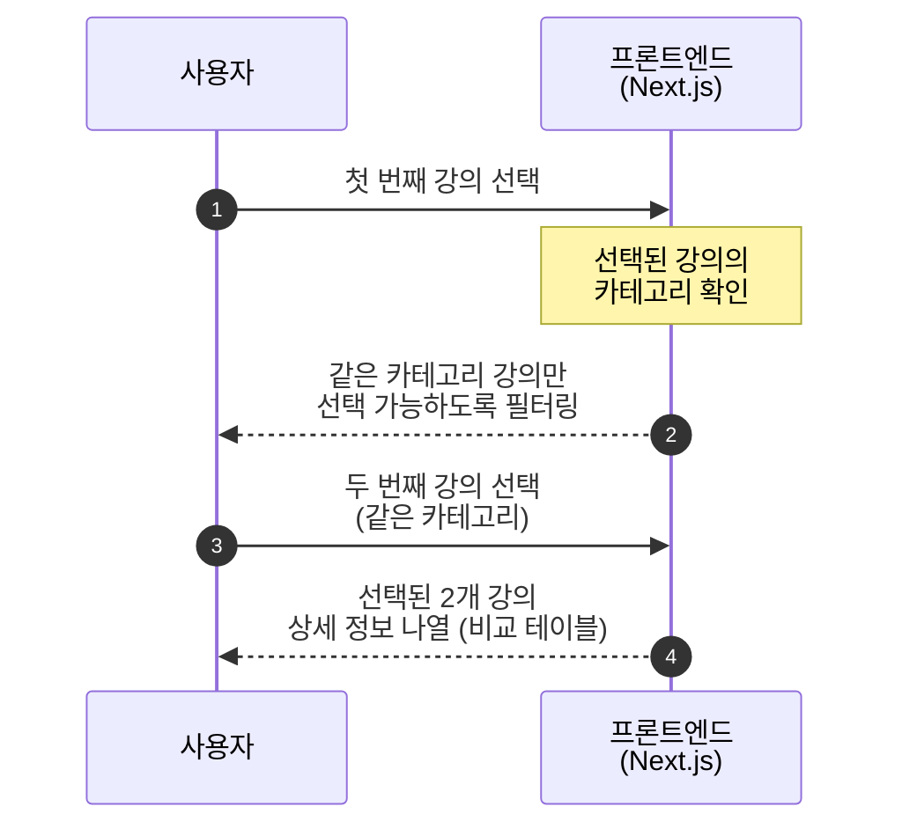
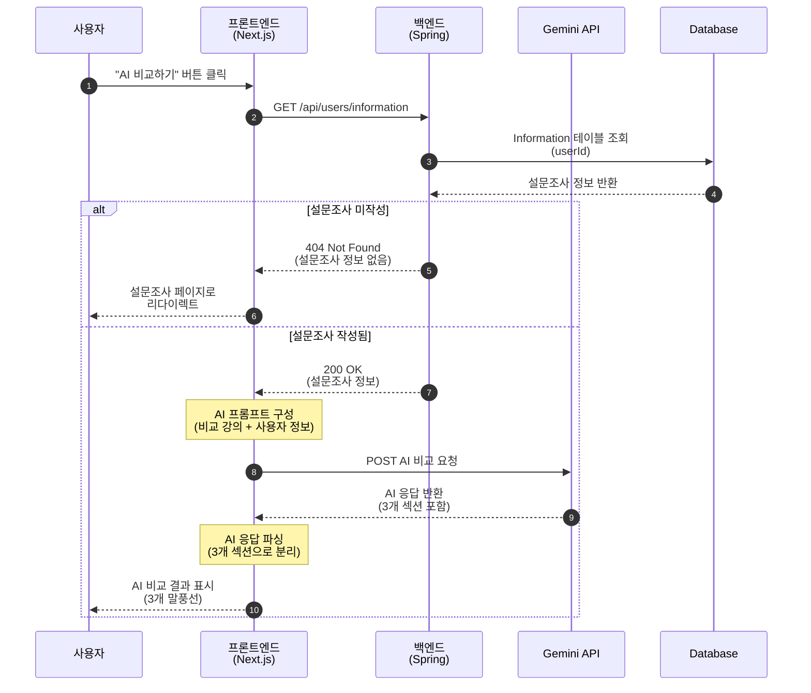
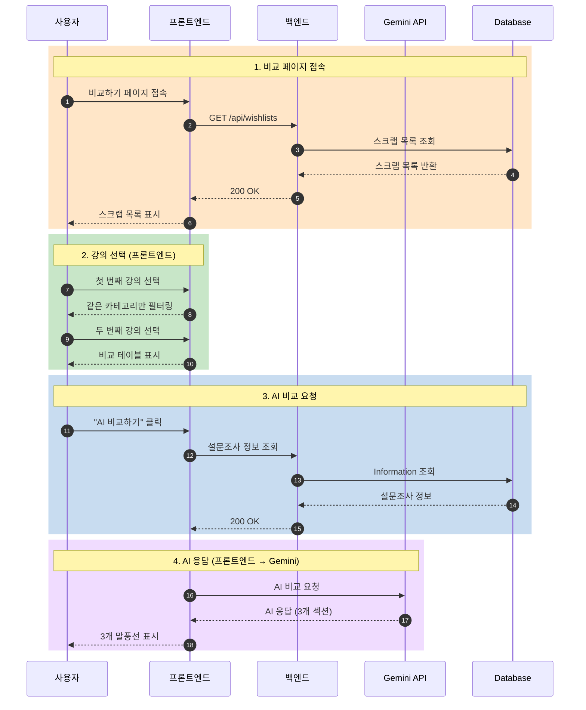
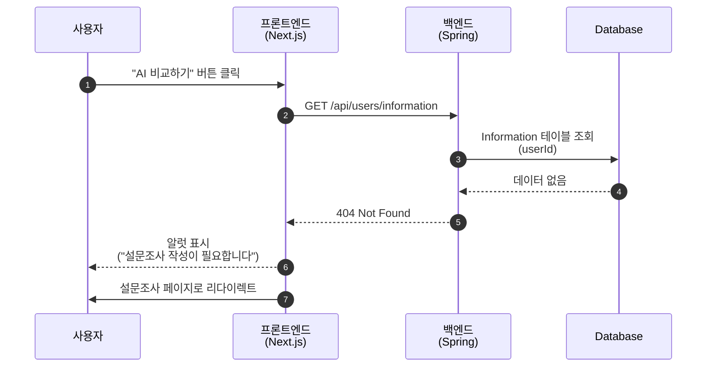

# 강의 비교 Sequence Diagrams

## 1. 비교 페이지 접속

```mermaid
sequenceDiagram
    autonumber
    participant User as 사용자
    participant Frontend as 프론트엔드<br/>(Next.js)
    participant Backend as 백엔드<br/>(Spring)
    participant DB as Database

    User->>Frontend: 비교하기 페이지 접속
    Frontend->>Backend: GET /api/wishlists
    Backend->>DB: 스크랩 목록 조회<br/>(userId)
    DB-->>Backend: 스크랩 목록 반환<br/>(강의 정보 + 카테고리)
    Backend-->>Frontend: 200 OK<br/>(스크랩 목록 데이터)
    Frontend-->>User: 스크랩 목록 표시<br/>(비교 강의 선택 UI)
```

> ※ 스크랩 목록 조회의 캐싱 로직은 wishlist 시퀀스 참고

---

## 2. 비교 강의 선택 (카테고리 필터링)

```mermaid
sequenceDiagram
    autonumber
    participant User as 사용자
    participant Frontend as 프론트엔드<br/>(Next.js)

    User->>Frontend: 첫 번째 강의 선택
    
    Note over Frontend: 선택된 강의의<br/>카테고리 확인
    
    Frontend-->>User: 같은 카테고리 강의만<br/>선택 가능하도록 필터링
    
    User->>Frontend: 두 번째 강의 선택<br/>(같은 카테고리)
    
    Frontend-->>User: 선택된 2개 강의<br/>상세 정보 나열 (비교 테이블)
```

---

## 3. AI 비교 요청

```mermaid
sequenceDiagram
    autonumber
    participant User as 사용자
    participant Frontend as 프론트엔드<br/>(Next.js)
    participant Backend as 백엔드<br/>(Spring)
    participant Gemini as Gemini API
    participant DB as Database

    User->>Frontend: "AI 비교하기" 버튼 클릭
    Frontend->>Backend: GET /api/users/information
    Backend->>DB: Information 테이블 조회<br/>(userId)
    DB-->>Backend: 설문조사 정보 반환

    alt 설문조사 미작성
        Backend-->>Frontend: 404 Not Found<br/>(설문조사 정보 없음)
        Frontend-->>User: 설문조사 페이지로<br/>리다이렉트
    else 설문조사 작성됨
        Backend-->>Frontend: 200 OK<br/>(설문조사 정보)
        
        Note over Frontend: AI 프롬프트 구성<br/>(비교 강의 + 사용자 정보)
        
        Frontend->>Gemini: POST AI 비교 요청
        Gemini-->>Frontend: AI 응답 반환<br/>(3개 섹션 포함)
        
        Note over Frontend: AI 응답 파싱<br/>(3개 섹션으로 분리)
        
        Frontend-->>User: AI 비교 결과 표시<br/>(3개 말풍선)
    end
```

---

## 4. 전체 비교 흐름 요약

```mermaid
sequenceDiagram
    autonumber
    participant User as 사용자
    participant Frontend as 프론트엔드
    participant Backend as 백엔드
    participant Gemini as Gemini API
    participant DB as Database

    rect rgb(255, 230, 200)
        Note over User, DB: 1. 비교 페이지 접속
        User->>Frontend: 비교하기 페이지 접속
        Frontend->>Backend: GET /api/wishlists
        Backend->>DB: 스크랩 목록 조회
        DB-->>Backend: 스크랩 목록 반환
        Backend-->>Frontend: 200 OK
        Frontend-->>User: 스크랩 목록 표시
    end

    rect rgb(200, 230, 200)
        Note over User, Frontend: 2. 강의 선택 (프론트엔드)
        User->>Frontend: 첫 번째 강의 선택
        Frontend-->>User: 같은 카테고리만 필터링
        User->>Frontend: 두 번째 강의 선택
        Frontend-->>User: 비교 테이블 표시
    end

    rect rgb(200, 220, 240)
        Note over User, DB: 3. AI 비교 요청
        User->>Frontend: "AI 비교하기" 클릭
        Frontend->>Backend: 설문조사 정보 조회
        Backend->>DB: Information 조회
        DB-->>Backend: 설문조사 정보
        Backend-->>Frontend: 200 OK
    end

    rect rgb(240, 220, 255)
        Note over User, Gemini: 4. AI 응답 (프론트엔드 → Gemini)
        Frontend->>Gemini: AI 비교 요청
        Gemini-->>Frontend: AI 응답 (3개 섹션)
        Frontend-->>User: 3개 말풍선 표시
    end
```

---

## 5. 설문조사 미작성 시 흐름

```mermaid
sequenceDiagram
    autonumber
    participant User as 사용자
    participant Frontend as 프론트엔드<br/>(Next.js)
    participant Backend as 백엔드<br/>(Spring)
    participant DB as Database

    User->>Frontend: "AI 비교하기" 버튼 클릭
    Frontend->>Backend: GET /api/users/information
    Backend->>DB: Information 테이블 조회<br/>(userId)
    DB-->>Backend: 데이터 없음

    Backend-->>Frontend: 404 Not Found
    Frontend-->>User: 알럿 표시<br/>("설문조사 작성이 필요합니다")
    Frontend->>User: 설문조사 페이지로 리다이렉트
```
