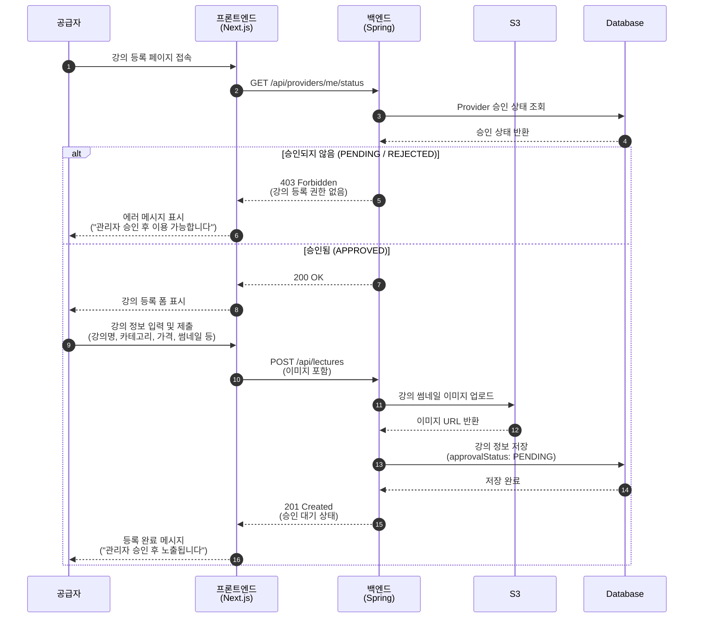
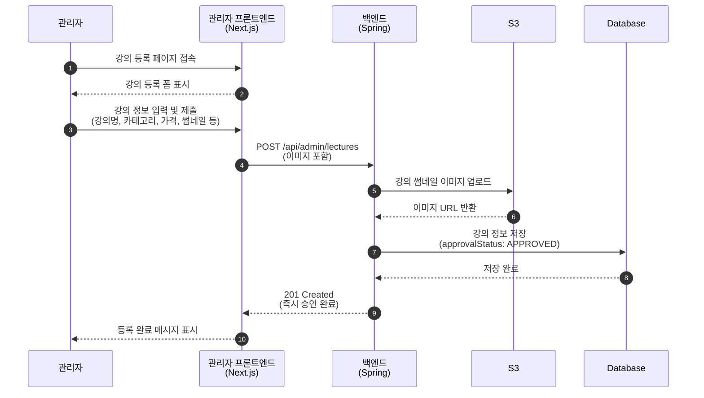
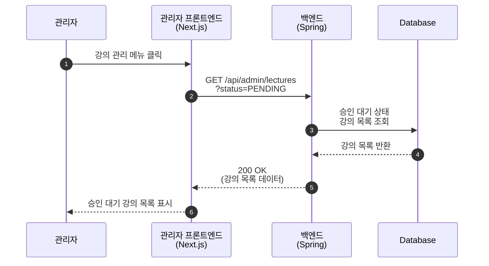
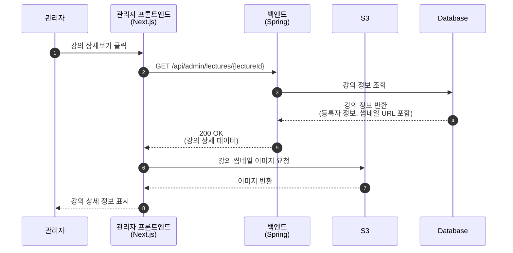
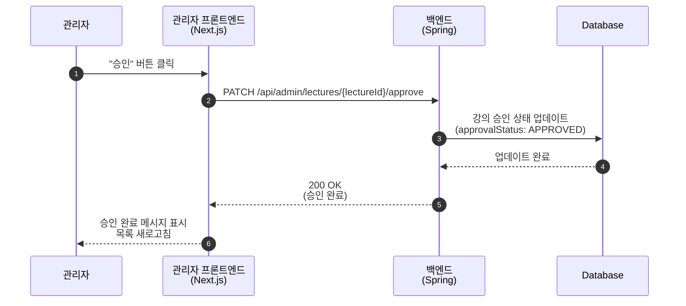
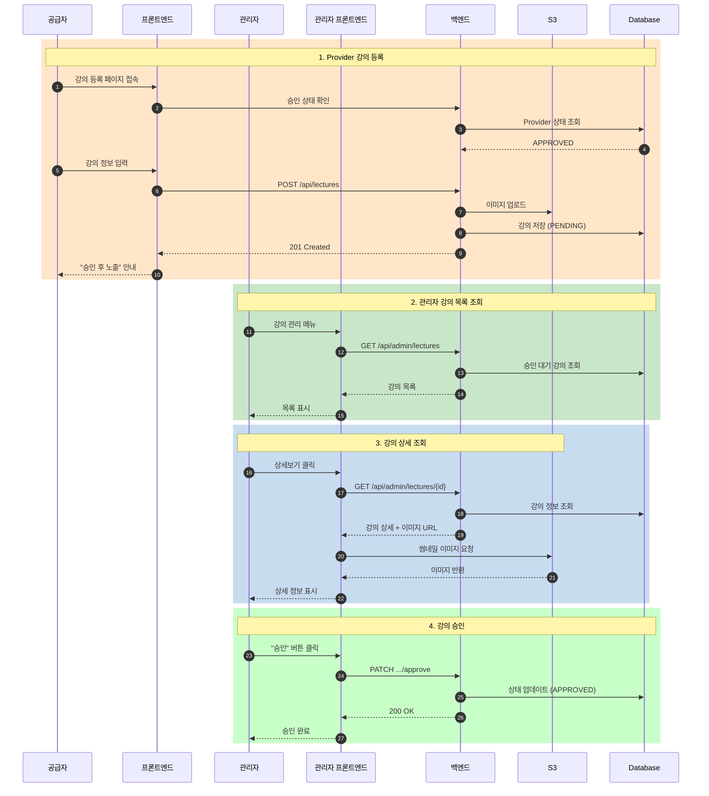

# 관리자 - 강의 등록 및 승인 Sequence Diagrams

## 1. Provider 강의 등록

```mermaid
sequenceDiagram
    autonumber
    participant Provider as 공급자
    participant Frontend as 프론트엔드<br/>(Next.js)
    participant Backend as 백엔드<br/>(Spring)
    participant S3 as S3
    participant DB as Database

    Provider->>Frontend: 강의 등록 페이지 접속
    Frontend->>Backend: GET /api/providers/me/status
    Backend->>DB: Provider 승인 상태 조회
    DB-->>Backend: 승인 상태 반환

    alt 승인되지 않음 (PENDING / REJECTED)
        Backend-->>Frontend: 403 Forbidden<br/>(강의 등록 권한 없음)
        Frontend-->>Provider: 에러 메시지 표시<br/>("관리자 승인 후 이용 가능합니다")
    else 승인됨 (APPROVED)
        Backend-->>Frontend: 200 OK
        Frontend-->>Provider: 강의 등록 폼 표시
        Provider->>Frontend: 강의 정보 입력 및 제출<br/>(강의명, 카테고리, 가격, 썸네일 등)
        Frontend->>Backend: POST /api/lectures<br/>(이미지 포함)
        Backend->>S3: 강의 썸네일 이미지 업로드
        S3-->>Backend: 이미지 URL 반환
        Backend->>DB: 강의 정보 저장<br/>(approvalStatus: PENDING)
        DB-->>Backend: 저장 완료
        Backend-->>Frontend: 201 Created<br/>(승인 대기 상태)
        Frontend-->>Provider: 등록 완료 메시지<br/>("관리자 승인 후 노출됩니다")
    end
```

---

## 2. 관리자 강의 등록

```mermaid
sequenceDiagram
    autonumber
    participant Admin as 관리자
    participant AdminFE as 관리자 프론트엔드<br/>(Next.js)
    participant Backend as 백엔드<br/>(Spring)
    participant S3 as S3
    participant DB as Database

    Admin->>AdminFE: 강의 등록 페이지 접속
    AdminFE-->>Admin: 강의 등록 폼 표시
    Admin->>AdminFE: 강의 정보 입력 및 제출<br/>(강의명, 카테고리, 가격, 썸네일 등)
    AdminFE->>Backend: POST /api/admin/lectures<br/>(이미지 포함)
    Backend->>S3: 강의 썸네일 이미지 업로드
    S3-->>Backend: 이미지 URL 반환
    Backend->>DB: 강의 정보 저장<br/>(approvalStatus: APPROVED)
    DB-->>Backend: 저장 완료
    Backend-->>AdminFE: 201 Created<br/>(즉시 승인 완료)
    AdminFE-->>Admin: 등록 완료 메시지 표시
```

---

## 3. 승인 대기 강의 목록 조회

```mermaid
sequenceDiagram
    autonumber
    participant Admin as 관리자
    participant AdminFE as 관리자 프론트엔드<br/>(Next.js)
    participant Backend as 백엔드<br/>(Spring)
    participant DB as Database

    Admin->>AdminFE: 강의 관리 메뉴 클릭
    AdminFE->>Backend: GET /api/admin/lectures<br/>?status=PENDING
    Backend->>DB: 승인 대기 상태<br/>강의 목록 조회
    DB-->>Backend: 강의 목록 반환
    Backend-->>AdminFE: 200 OK<br/>(강의 목록 데이터)
    AdminFE-->>Admin: 승인 대기 강의 목록 표시
```

---

## 4. 강의 상세 정보 조회

```mermaid
sequenceDiagram
    autonumber
    participant Admin as 관리자
    participant AdminFE as 관리자 프론트엔드<br/>(Next.js)
    participant Backend as 백엔드<br/>(Spring)
    participant S3 as S3
    participant DB as Database

    Admin->>AdminFE: 강의 상세보기 클릭
    AdminFE->>Backend: GET /api/admin/lectures/{lectureId}
    Backend->>DB: 강의 정보 조회
    DB-->>Backend: 강의 정보 반환<br/>(등록자 정보, 썸네일 URL 포함)
    Backend-->>AdminFE: 200 OK<br/>(강의 상세 데이터)
    AdminFE->>S3: 강의 썸네일 이미지 요청
    S3-->>AdminFE: 이미지 반환
    AdminFE-->>Admin: 강의 상세 정보 표시
```

---

## 5. 강의 승인

```mermaid
sequenceDiagram
    autonumber
    participant Admin as 관리자
    participant AdminFE as 관리자 프론트엔드<br/>(Next.js)
    participant Backend as 백엔드<br/>(Spring)
    participant DB as Database

    Admin->>AdminFE: "승인" 버튼 클릭
    AdminFE->>Backend: PATCH /api/admin/lectures/{lectureId}/approve
    Backend->>DB: 강의 승인 상태 업데이트<br/>(approvalStatus: APPROVED)
    DB-->>Backend: 업데이트 완료
    Backend-->>AdminFE: 200 OK<br/>(승인 완료)
    AdminFE-->>Admin: 승인 완료 메시지 표시<br/>목록 새로고침
```

---

## 6. 전체 강의 등록/승인 흐름 요약

```mermaid
sequenceDiagram
    autonumber
    participant Provider as 공급자
    participant Frontend as 프론트엔드
    participant Admin as 관리자
    participant AdminFE as 관리자 프론트엔드
    participant Backend as 백엔드
    participant S3 as S3
    participant DB as Database

    rect rgb(255, 230, 200)
        Note over Provider, DB: 1. Provider 강의 등록
        Provider->>Frontend: 강의 등록 페이지 접속
        Frontend->>Backend: 승인 상태 확인
        Backend->>DB: Provider 상태 조회
        DB-->>Backend: APPROVED
        Provider->>Frontend: 강의 정보 입력
        Frontend->>Backend: POST /api/lectures
        Backend->>S3: 이미지 업로드
        Backend->>DB: 강의 저장 (PENDING)
        Backend-->>Frontend: 201 Created
        Frontend-->>Provider: "승인 후 노출" 안내
    end

    rect rgb(200, 230, 200)
        Note over Admin, DB: 2. 관리자 강의 목록 조회
        Admin->>AdminFE: 강의 관리 메뉴
        AdminFE->>Backend: GET /api/admin/lectures
        Backend->>DB: 승인 대기 강의 조회
        Backend-->>AdminFE: 강의 목록
        AdminFE-->>Admin: 목록 표시
    end

    rect rgb(200, 220, 240)
        Note over Admin, S3: 3. 강의 상세 조회
        Admin->>AdminFE: 상세보기 클릭
        AdminFE->>Backend: GET /api/admin/lectures/{id}
        Backend->>DB: 강의 정보 조회
        Backend-->>AdminFE: 강의 상세 + 이미지 URL
        AdminFE->>S3: 썸네일 이미지 요청
        S3-->>AdminFE: 이미지 반환
        AdminFE-->>Admin: 상세 정보 표시
    end

    rect rgb(200, 255, 200)
        Note over Admin, DB: 4. 강의 승인
        Admin->>AdminFE: "승인" 버튼 클릭
        AdminFE->>Backend: PATCH .../approve
        Backend->>DB: 상태 업데이트 (APPROVED)
        Backend-->>AdminFE: 200 OK
        AdminFE-->>Admin: 승인 완료
    end
```
