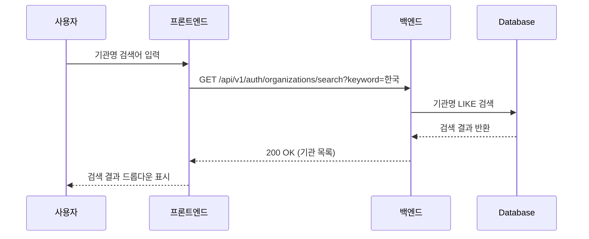
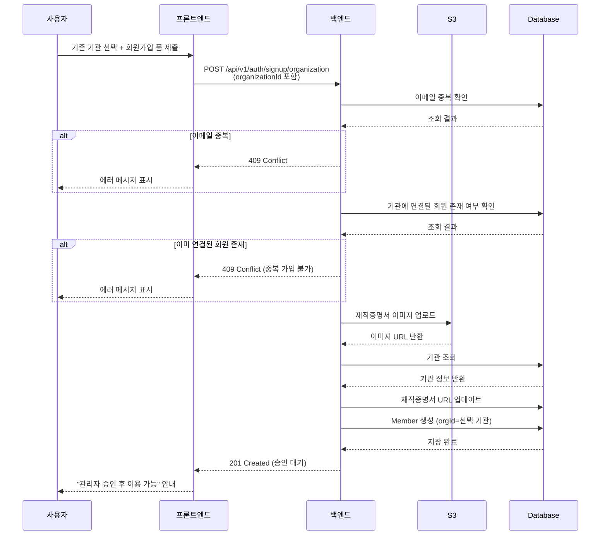
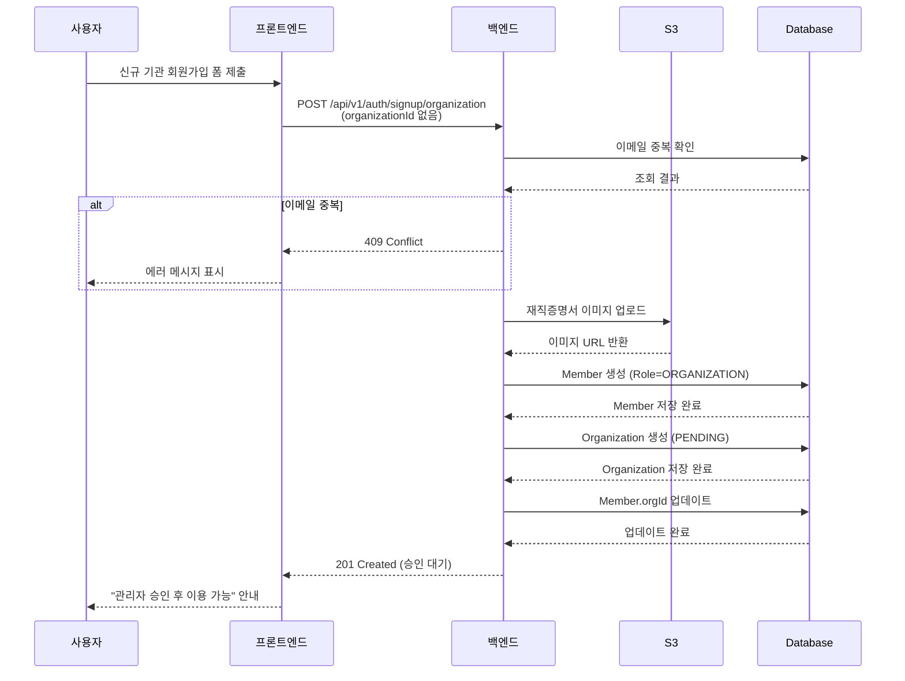
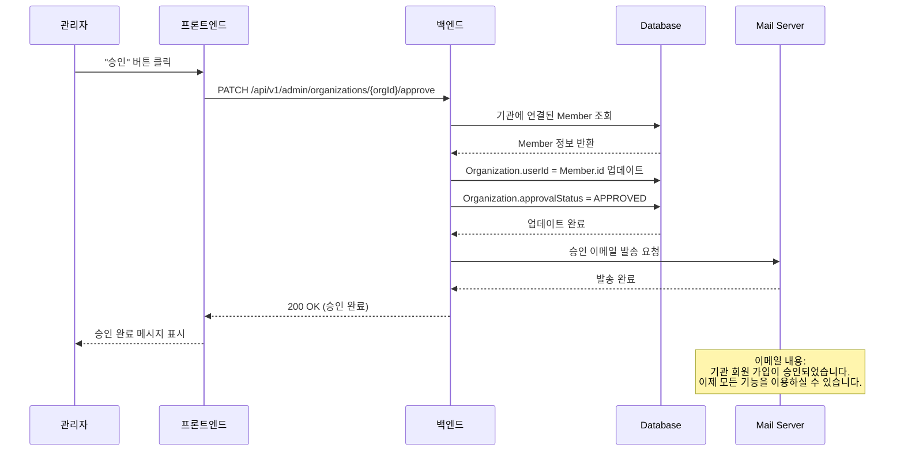
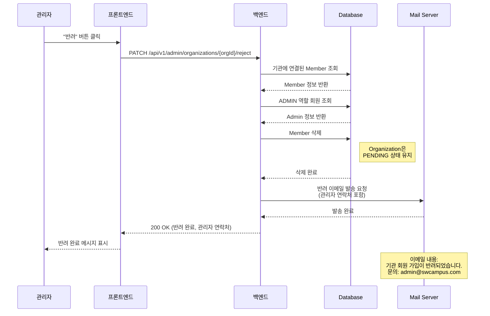
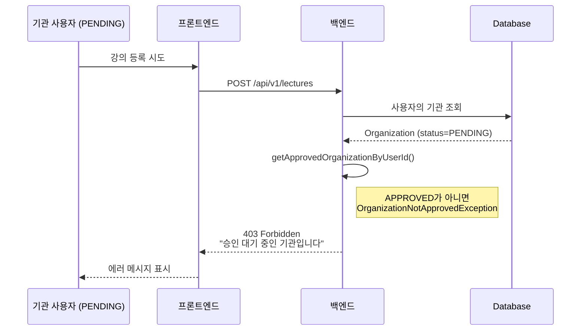
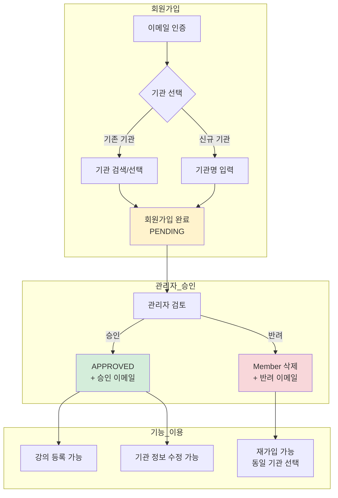

# 기관 회원가입 리팩토링 - 시퀀스 다이어그램

## 1. 기관 검색 흐름



---

## 2. 기존 기관 선택 회원가입 흐름



---

## 3. 신규 기관 회원가입 흐름



---

## 4. 관리자 승인 흐름



---

## 5. 관리자 반려 흐름



---

## 6. PENDING 상태 기능 제한 흐름



---

## 7. 전체 흐름 개요



---

## 8. 데이터 상태 변화

```mermaid
stateDiagram-v2
    [*] --> 회원가입요청

    state 회원가입요청 {
        [*] --> Member생성
        Member생성 --> Organization연결: orgId 설정
    }

    회원가입요청 --> PENDING: 가입 완료

    PENDING --> APPROVED: 관리자 승인
    PENDING --> Member삭제: 관리자 반려

    APPROVED --> [*]: 정상 이용

    Member삭제 --> 재가입가능: Organization 유지
    재가입가능 --> 회원가입요청: 동일 기관 선택 가능

    note right of PENDING
        - 로그인 가능
        - 강의 등록 불가
        - 기관 정보 수정 불가
    end note

    note right of APPROVED
        - 모든 기능 이용 가능
        - Organization.userId 매핑 완료
    end note
```
