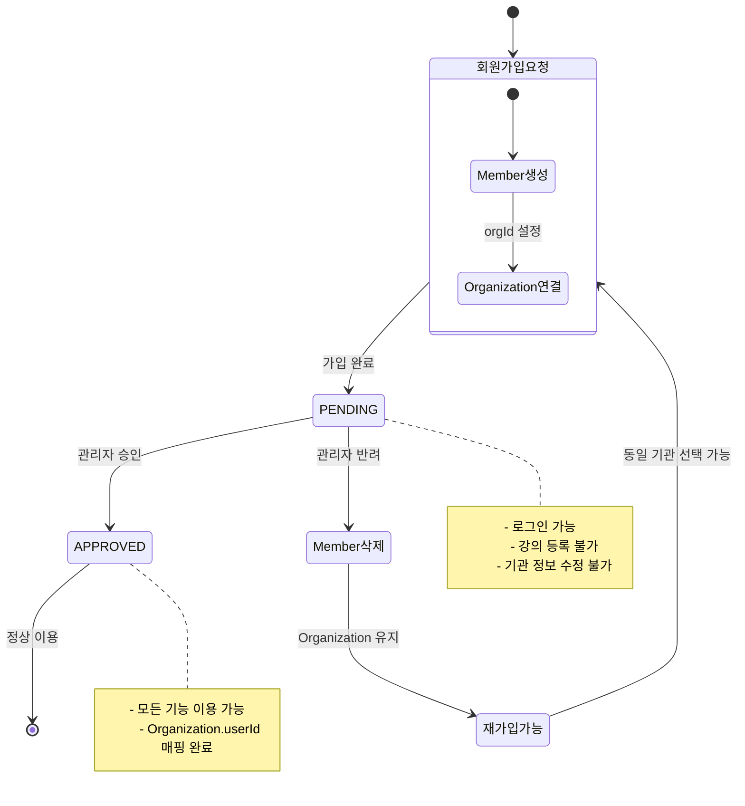

# 기관 회원가입 리팩토링 - 시퀀스 다이어그램

## 1. 기관 검색 흐름

---

## 2. 기존 기관 선택 회원가입 흐름

---

## 3. 신규 기관 회원가입 흐름

---

## 4. 관리자 승인 흐름

---

## 5. 관리자 반려 흐름

---

## 6. PENDING 상태 기능 제한 흐름

---

## 7. 전체 흐름 개요

---

## 8. 데이터 상태 변화

