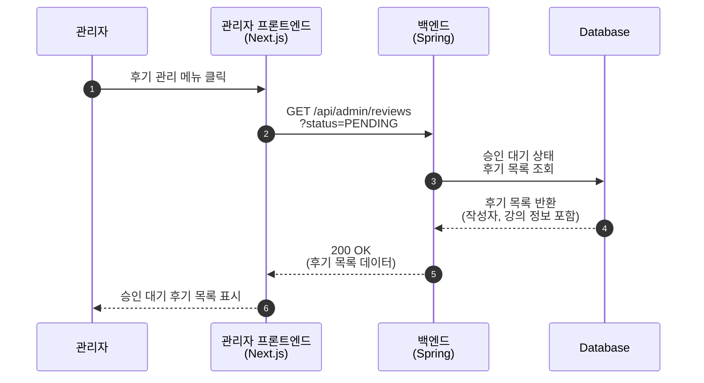
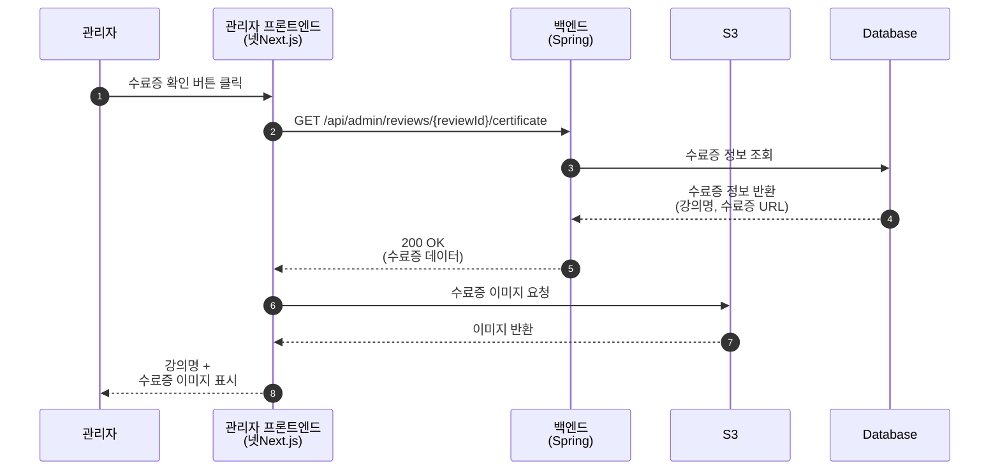
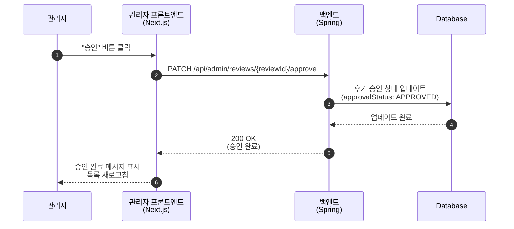
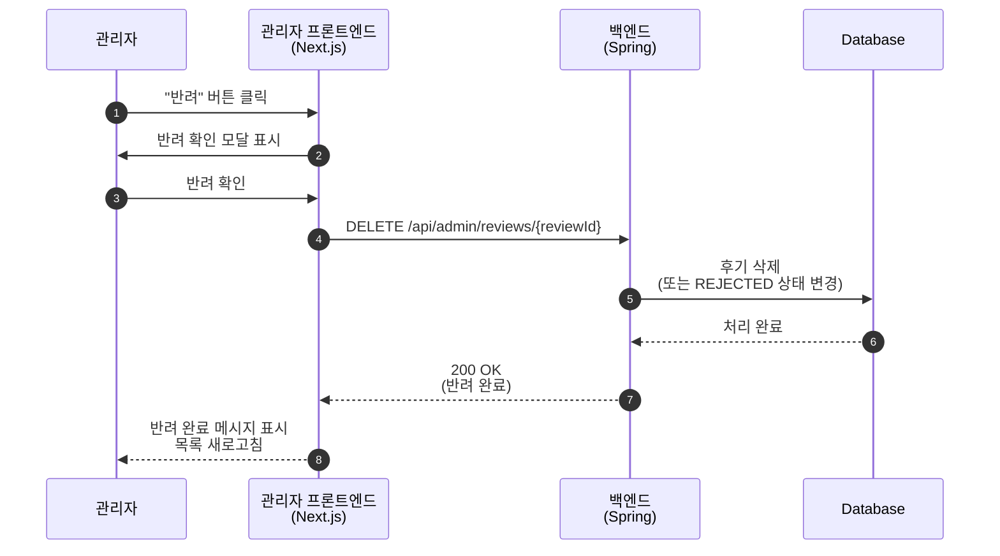
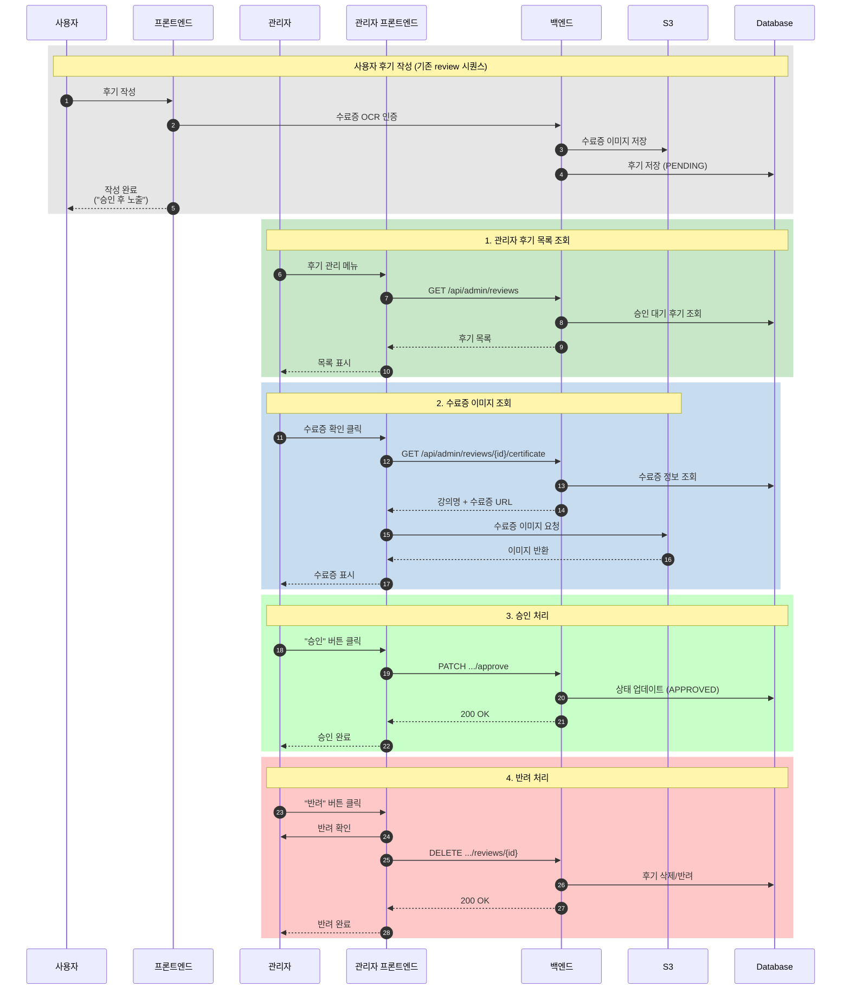
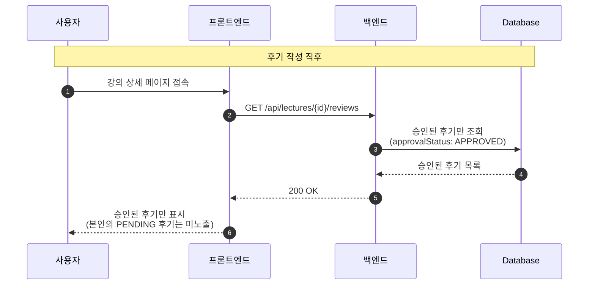

# 관리자 - 수료증 승인 Sequence Diagrams

> ※ 사용자의 후기 작성 흐름은 기존 review 시퀀스 참고
> ※ 사용자는 OCR 통과 후 바로 후기 작성 가능 (관리자 사후 검토 방식)
> ※ 관리자는 후기 내용을 확인하지 않고, 수료증 이미지만 확인하여 승인/반려 처리

## 1. 승인 대기 후기 목록 조회

---

## 2. 수료증 이미지 조회

---

## 3. 후기 승인

---

## 4. 후기 반려 (삭제)

---

## 5. 전체 수료증 검증 흐름 요약

---

## 6. 사용자 후기 노출 상태 흐름

