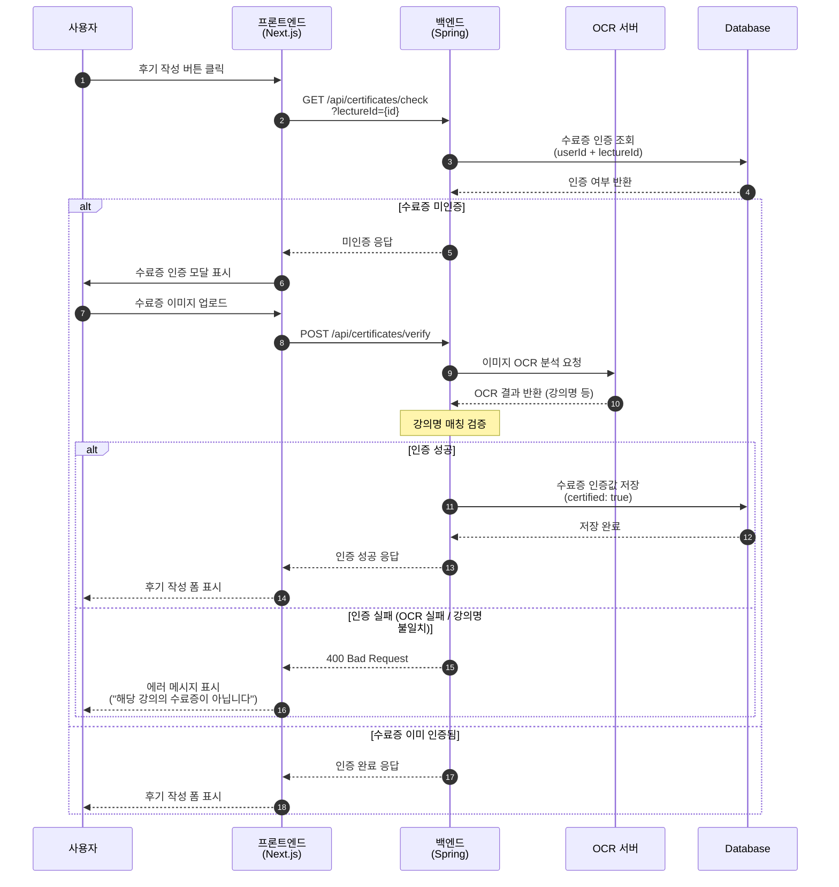
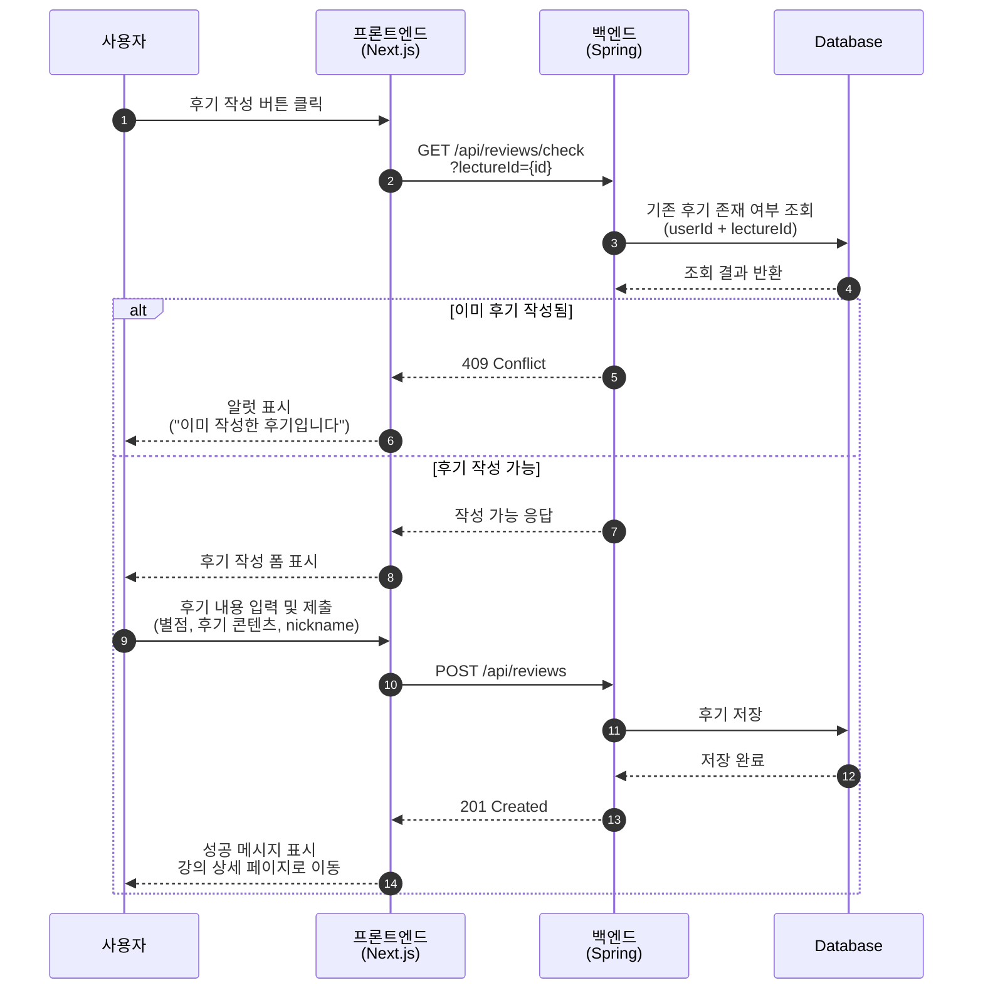
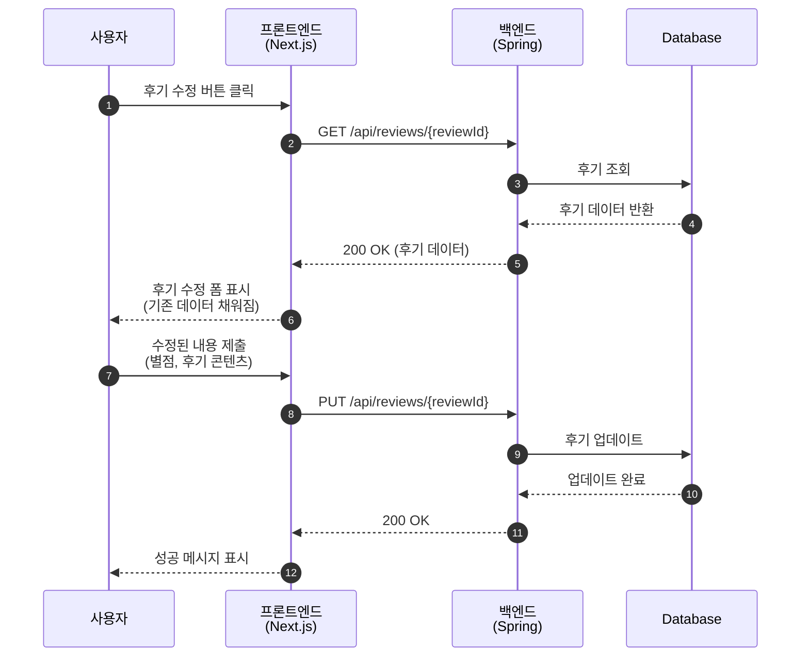
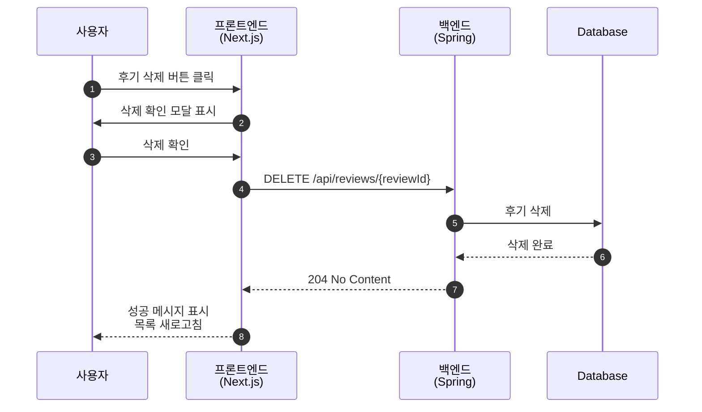
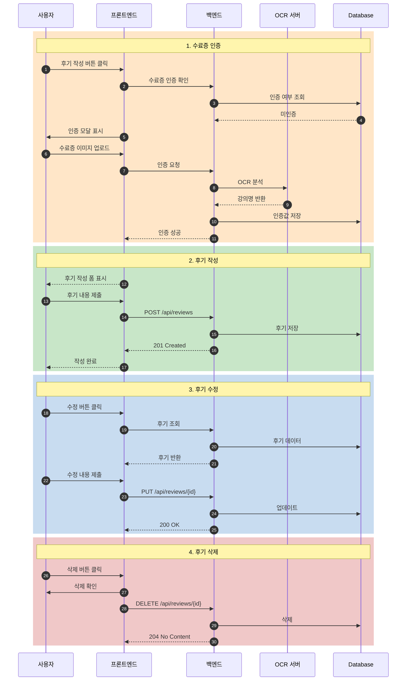

# 강의 후기 Sequence Diagrams

## 1. 수료증 인증

```mermaid
sequenceDiagram
    autonumber
    participant User as 사용자
    participant Frontend as 프론트엔드<br/>(Next.js)
    participant Backend as 백엔드<br/>(Spring)
    participant OCR as OCR 서버
    participant DB as Database

    User->>Frontend: 후기 작성 버튼 클릭
    Frontend->>Backend: GET /api/certificates/check<br/>?lectureId={id}
    Backend->>DB: 수료증 인증 조회<br/>(userId + lectureId)
    DB-->>Backend: 인증 여부 반환

    alt 수료증 미인증
        Backend-->>Frontend: 미인증 응답
        Frontend->>User: 수료증 인증 모달 표시
        User->>Frontend: 수료증 이미지 업로드
        Frontend->>Backend: POST /api/certificates/verify
        Backend->>OCR: 이미지 OCR 분석 요청
        OCR-->>Backend: OCR 결과 반환 (강의명 등)
        
        Note over Backend: 강의명 매칭 검증

        alt 인증 성공
            Backend->>DB: 수료증 인증값 저장<br/>(certified: true)
            DB-->>Backend: 저장 완료
            Backend-->>Frontend: 인증 성공 응답
            Frontend-->>User: 후기 작성 폼 표시
        else 인증 실패 (OCR 실패 / 강의명 불일치)
            Backend-->>Frontend: 400 Bad Request
            Frontend-->>User: 에러 메시지 표시<br/>("해당 강의의 수료증이 아닙니다")
        end

    else 수료증 이미 인증됨
        Backend-->>Frontend: 인증 완료 응답
        Frontend-->>User: 후기 작성 폼 표시
    end
```

---

## 2. 후기 작성

```mermaid
sequenceDiagram
    autonumber
    participant User as 사용자
    participant Frontend as 프론트엔드<br/>(Next.js)
    participant Backend as 백엔드<br/>(Spring)
    participant DB as Database

    User->>Frontend: 후기 작성 버튼 클릭
    Frontend->>Backend: GET /api/reviews/check<br/>?lectureId={id}
    Backend->>DB: 기존 후기 존재 여부 조회<br/>(userId + lectureId)
    DB-->>Backend: 조회 결과 반환

    alt 이미 후기 작성됨
        Backend-->>Frontend: 409 Conflict
        Frontend-->>User: 알럿 표시<br/>("이미 작성한 후기입니다")
    else 후기 작성 가능
        Backend-->>Frontend: 작성 가능 응답
        Frontend-->>User: 후기 작성 폼 표시
        User->>Frontend: 후기 내용 입력 및 제출<br/>(별점, 후기 콘텐츠, nickname)
        Frontend->>Backend: POST /api/reviews
        Backend->>DB: 후기 저장
        DB-->>Backend: 저장 완료
        Backend-->>Frontend: 201 Created
        Frontend-->>User: 성공 메시지 표시<br/>강의 상세 페이지로 이동
    end
```

---

## 3. 후기 수정

**접근 경로:**
- 강의 상세 페이지 → 본인 후기의 "수정" 버튼
- 마이페이지 → "내가 작성한 후기" → "수정" 버튼

```mermaid
sequenceDiagram
    autonumber
    participant User as 사용자
    participant Frontend as 프론트엔드<br/>(Next.js)
    participant Backend as 백엔드<br/>(Spring)
    participant DB as Database

    User->>Frontend: 후기 수정 버튼 클릭
    Frontend->>Backend: GET /api/reviews/{reviewId}
    Backend->>DB: 후기 조회
    DB-->>Backend: 후기 데이터 반환
    Backend-->>Frontend: 200 OK (후기 데이터)
    Frontend-->>User: 후기 수정 폼 표시<br/>(기존 데이터 채워짐)
    
    User->>Frontend: 수정된 내용 제출<br/>(별점, 후기 콘텐츠)
    Frontend->>Backend: PUT /api/reviews/{reviewId}
    Backend->>DB: 후기 업데이트
    DB-->>Backend: 업데이트 완료
    Backend-->>Frontend: 200 OK
    Frontend-->>User: 성공 메시지 표시
```

---

## 4. 후기 삭제

```mermaid
sequenceDiagram
    autonumber
    participant User as 사용자
    participant Frontend as 프론트엔드<br/>(Next.js)
    participant Backend as 백엔드<br/>(Spring)
    participant DB as Database

    User->>Frontend: 후기 삭제 버튼 클릭
    Frontend->>User: 삭제 확인 모달 표시
    User->>Frontend: 삭제 확인
    Frontend->>Backend: DELETE /api/reviews/{reviewId}
    Backend->>DB: 후기 삭제
    DB-->>Backend: 삭제 완료
    Backend-->>Frontend: 204 No Content
    Frontend-->>User: 성공 메시지 표시<br/>목록 새로고침
```

---

## 5. 전체 후기 흐름 요약

```mermaid
sequenceDiagram
    autonumber
    participant User as 사용자
    participant Frontend as 프론트엔드
    participant Backend as 백엔드
    participant OCR as OCR 서버
    participant DB as Database

    rect rgb(255, 230, 200)
        Note over User, DB: 1. 수료증 인증
        User->>Frontend: 후기 작성 버튼 클릭
        Frontend->>Backend: 수료증 인증 확인
        Backend->>DB: 인증 여부 조회
        DB-->>Backend: 미인증
        Frontend->>User: 인증 모달 표시
        User->>Frontend: 수료증 이미지 업로드
        Frontend->>Backend: 인증 요청
        Backend->>OCR: OCR 분석
        OCR-->>Backend: 강의명 반환
        Backend->>DB: 인증값 저장
        Backend-->>Frontend: 인증 성공
    end

    rect rgb(200, 230, 200)
        Note over User, DB: 2. 후기 작성
        Frontend-->>User: 후기 작성 폼 표시
        User->>Frontend: 후기 내용 제출
        Frontend->>Backend: POST /api/reviews
        Backend->>DB: 후기 저장
        Backend-->>Frontend: 201 Created
        Frontend-->>User: 작성 완료
    end

    rect rgb(200, 220, 240)
        Note over User, DB: 3. 후기 수정
        User->>Frontend: 수정 버튼 클릭
        Frontend->>Backend: 후기 조회
        Backend->>DB: 후기 데이터
        Backend-->>Frontend: 후기 반환
        User->>Frontend: 수정 내용 제출
        Frontend->>Backend: PUT /api/reviews/{id}
        Backend->>DB: 업데이트
        Backend-->>Frontend: 200 OK
    end

    rect rgb(240, 200, 200)
        Note over User, DB: 4. 후기 삭제
        User->>Frontend: 삭제 버튼 클릭
        Frontend->>User: 삭제 확인
        Frontend->>Backend: DELETE /api/reviews/{id}
        Backend->>DB: 삭제
        Backend-->>Frontend: 204 No Content
    end
```
