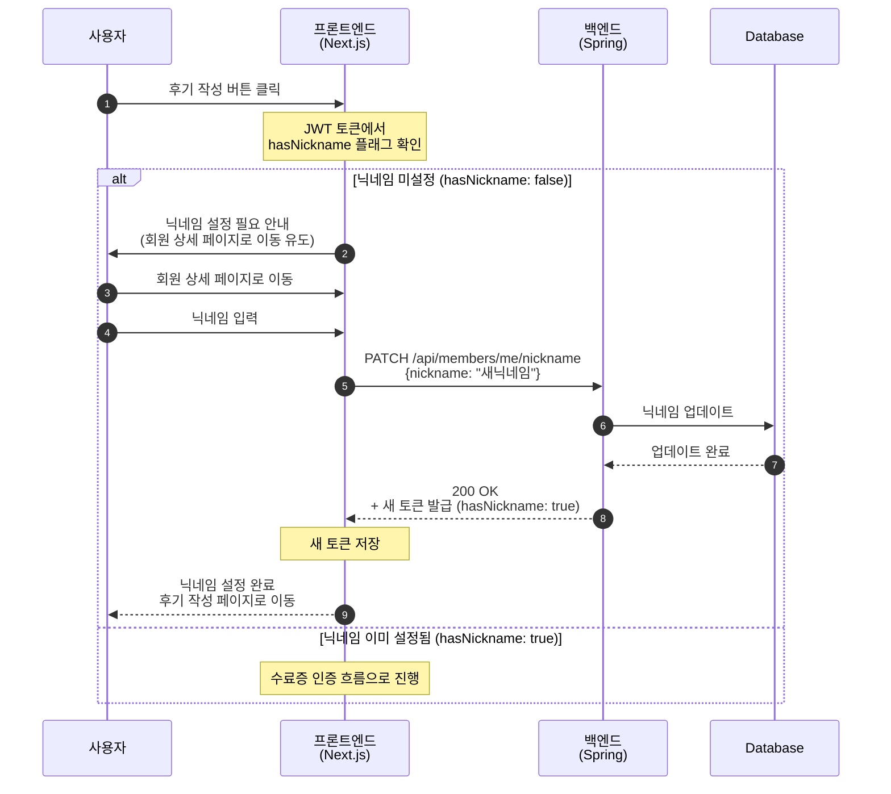
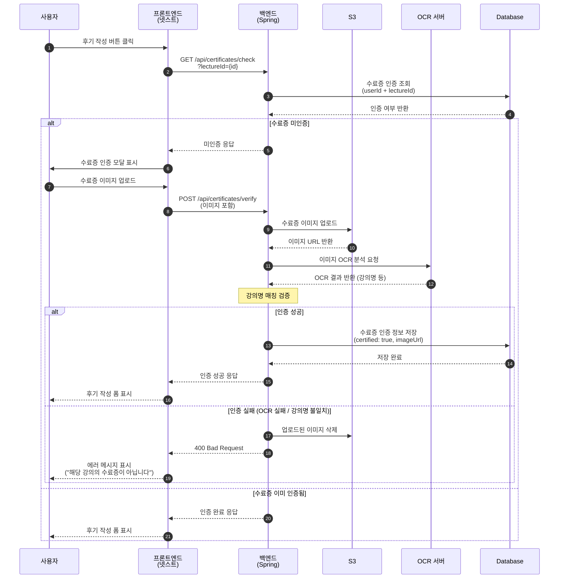
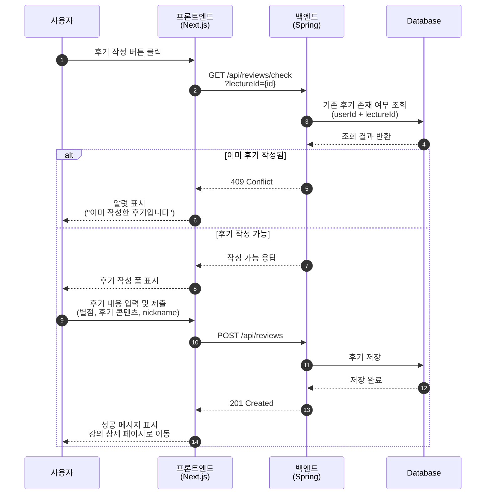
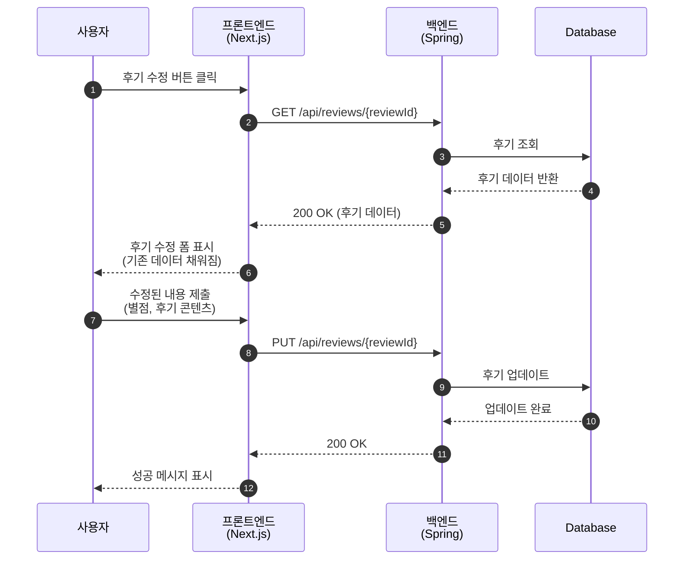
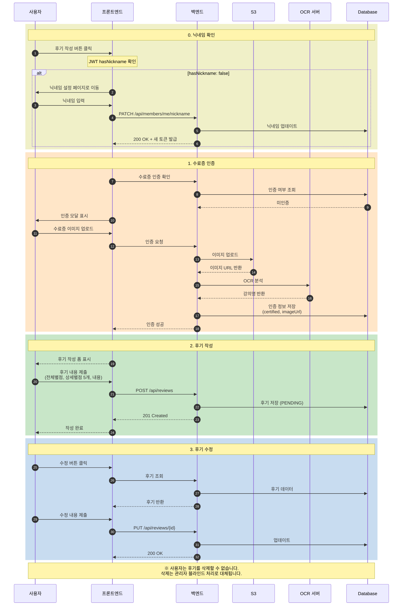

# 강의 후기 Sequence Diagrams

## 0. 닉네임 확인 (후기 작성 진입 시)

---

## 1. 수료증 인증

---

## 2. 후기 작성

---

## 3. 후기 수정

**접근 경로:**
- 강의 상세 페이지 → 본인 후기의 "수정" 버튼
- 마이페이지 → "내가 작성한 후기" → "수정" 버튼

---

## 4. 사용자 후기 삭제

> **Note**: 사용자는 후기를 삭제할 수 없습니다. 수정만 가능합니다.
> 데이터 삭제는 관리자의 블라인드(BLURRED) 처리로 대체됩니다.

---

## 5. 전체 후기 흐름 요약

