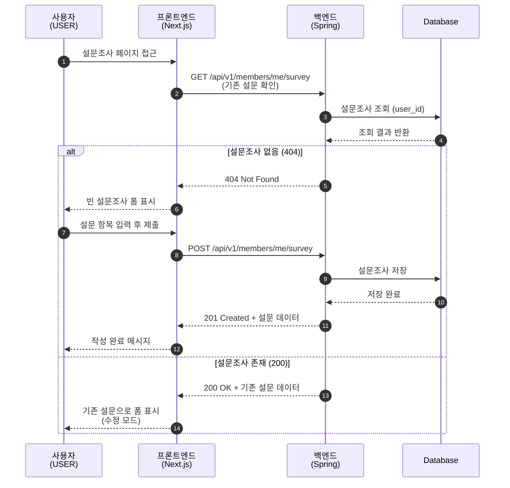
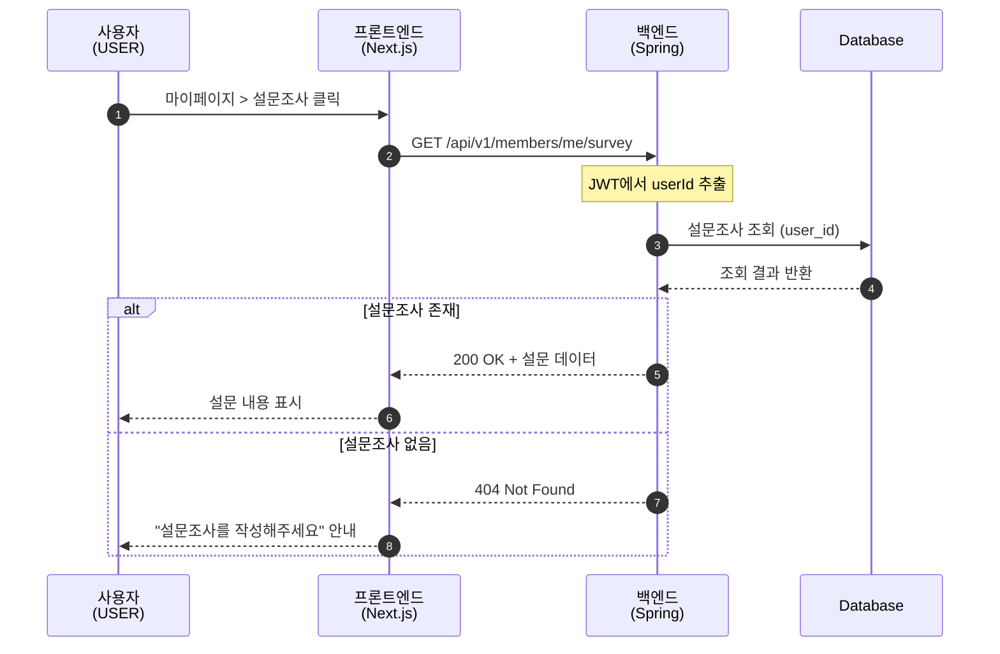
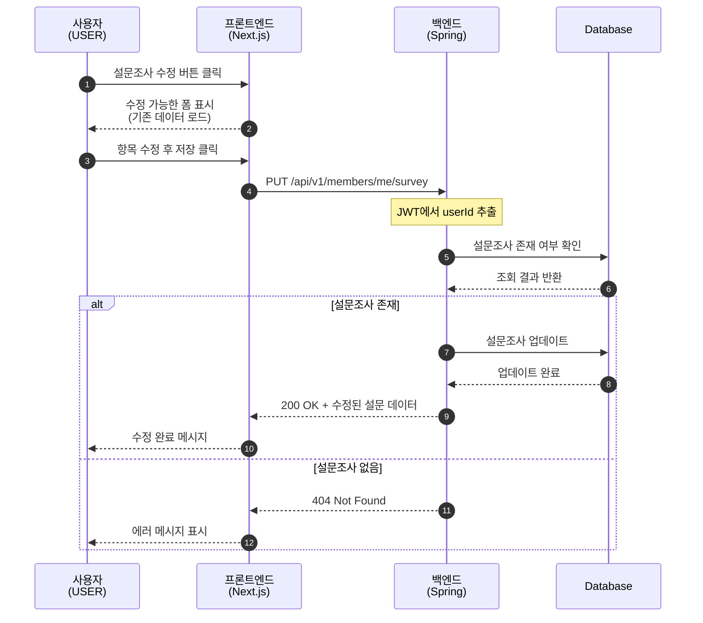
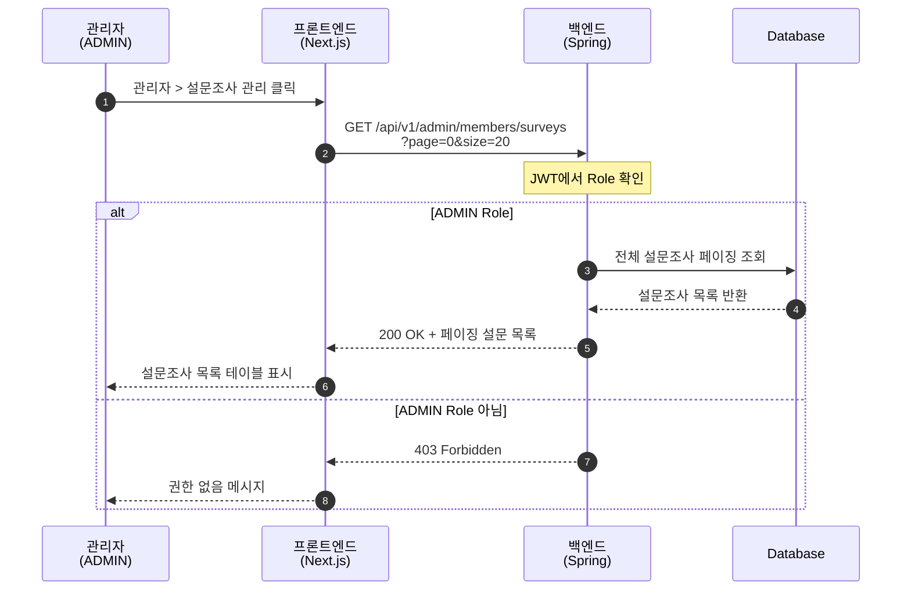
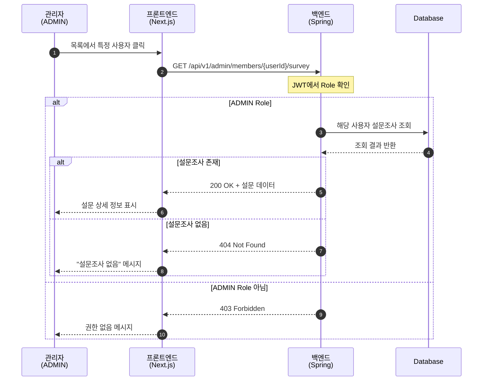
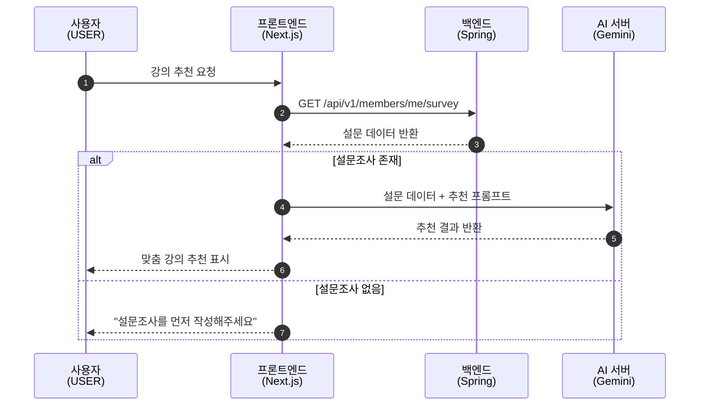

# 설문조사 시퀀스 다이어그램

## 1. 설문조사 작성

---

## 2. 설문조사 조회 (본인)

---

## 3. 설문조사 수정

---

## 4. 관리자 - 설문조사 목록 조회

---

## 5. 관리자 - 특정 사용자 설문조사 조회

---

## 6. LLM 추천 연동 (참고)

---

## 관련 문서

- [설문조사 시퀀스 설명](./survey_description.md)
- [Tech Spec](../../features/survey/tech-spec.md)
- [PRD](../../features/survey/prd.md)
